# process-design — Process Specification

> Meta-application: this spec describes the **process-design skill itself**, derived from first principles, with the existing SKILL.md as the ingested source description. The visual flowchart is the primary deliverable; this markdown is the audit trail.

## Output

**PRIMARY:** Rendered flowchart (image file on disk, surfaced explicitly in the agent response) of the user's process.

**SECONDARY:** Markdown spec supporting the flowchart — frontmatter, sections, metrics map, verification record. The spec is the audit trail; the flowchart is the deliverable.

**Success criterion:** User can look at the rendered image and understand the procedure at a glance — every step, decision, gate, owner, and terminal state visible. Spec passes verification.

**Measurable success bar:** post-handoff clarification rate (% of build-agent runs that come back asking for spec clarification) ≤ 10% over rolling 20-run window. Tracked as `post_handoff_clarification` telemetry event.

**Failure modes:**
1. Flowchart unreadable — too dense, missing labels, layout broken.
2. Flowchart and spec drift — Mermaid edited but spec sections not updated, or vice versa.
3. Flowchart visible but design wrong — caught at Step 2 Review hard gate.
4. Spec promoted to verified but build agent returns with questions — caught downstream as `post_handoff_clarification` event; routed to DMAIC.

**Consumers:**
1. Build agent (primary) — Claude Code, Claude Design, Python, Lambda, manual implementer
2. DMAIC review (secondary) — measurable improvement of the design over time
3. Re-implementer in non-Claude runtime (tertiary) — implementation-agnostic

## Inputs

| Input | Source | Controllable | Validation |
|---|---|---|---|
| User's process intent | User dialogue | Yes | Concrete output noun + ≥1 input named, OR explicit "derive from blank slate" consent. "Concrete" = singular common noun, consumer-namable. "Data" fails; "approval decision" passes. |
| Working directory | User CWD | Yes | Writable; no silent clobber on existing files |
| Build target | User answer at Step 1 close | Yes | One of: claude-code, claude-design, python, lambda, n8n, manual, audit, existing-skill-audit-and-dmaic-feed, other |
| Existing description (optional) | User upload or path | Yes | Parseable as text; if image, transcribed and confirmed before proceeding. Cross-check: does not contradict named build target. |

**Degradation conditions (not inputs, but probed at runtime):**
- `Task` subagent capability — fallback to inline 4.1–4.4 if unavailable
- `qa-agents` skill reachability — fallback to inline_simulation in Phase 7
- Mermaid renderer (`mmdc`) availability — fallback to fenced markdown for Obsidian-style render
- Telemetry destination writable — best-effort; spec ships with `telemetry: degraded` flag if unreachable

## Constraints

- **Time:** 30–50 minutes of dialogue for Steps 1–2; Steps 3–7 mostly mechanical given clean Step 2 confirmation.
- **Cost:** ~$1–5 per run depending on process complexity. Currently unmeasured beyond order-of-magnitude.
- **Quality bar:** Step 6 blocking assertions are blocking. No spec ships at `status: verified` with any blocking assertion failed.
- **Soft-fail budget:** 3 before user surfacing; 6 before re-surface.

## Procedure

```mermaid
%%{init: {'flowchart': {'htmlLabels': true, 'curve': 'basis'}}}%%
flowchart TD
    Start([User invokes /process-design with intent])

    Q0{{"Existing description<br/>supplied?"}}
    Step0["<b>Step 0: Ingest</b><br/>parse, transcribe, confirm<br/><sub><i>req: agent / breaks: source-spec drift</i></sub>"]

    Step1A["<b>Step 1A: Output anchored</b><br/>concrete noun, success/failure, consumers<br/><sub><i>req: user+agent / breaks: P1 — no design possible</i></sub>"]
    Step1B["<b>Step 1B: Inputs declared</b><br/>validated, sourced, controllability marked<br/><sub><i>req: user+agent / breaks: garbage-in</i></sub>"]
    Step1C["<b>Step 1C: Transitions named</b><br/>steps, decisions, gates, terminals<br/><sub><i>req: agent+user / breaks: no procedure</i></sub>"]
    Step1D["<b>Step 1D: Failure modes specified</b><br/>per-step failure + recovery<br/><sub><i>req: agent+user / breaks: P3 — silent prod failure</i></sub>"]

    GapProbe["<b>Step 1 exit: Gap-probe fan-out</b><br/>4 sub-agents (input / decision / failure / missing)<br/><sub><i>req: Task subagent runtime / breaks: single-perspective escape</i></sub>"]

    Q1{{"All 4 sub-agents<br/>returned valid?"}}
    Fallback["retry missing / inline_simulation<br/>log mode in Verification Record"]

    Step2["<b>Step 2: Render</b><br/>Mermaid → image, validate post-render<br/><sub><i>req: mmdc CLI / breaks: no visual deliverable</i></sub>"]

    Q2{{"<b>Step 2 Review</b><br/>HARD GATE"}}
    Reject1["reject + named target<br/>(loop)"]
    Reject2["reject without target<br/>→ default to Step 1A"]

    Step3["<b>Step 3: Final pruning</b><br/>concentrated Elon pass against visualized procedure<br/><sub><i>req: agent+user / breaks: P2 — bloat ships</i></sub>"]
    Step4["<b>Step 4: Metrics design</b><br/>output / controllable input / agent / health<br/><sub><i>req: agent+user / breaks: P4 — unmeasurable</i></sub>"]
    Step5["<b>Step 5: Review cadence + DMAIC + telemetry dest</b><br/><sub><i>req: agent+user / breaks: P5 — no improvement loop</i></sub>"]
    Step6["<b>Step 6: Verify</b><br/>verify_spec.py + qa-agents or inline_simulation<br/>(includes image_freshness assertion)<br/><sub><i>req: scripts + qa-agents skill / breaks: defects escape</i></sub>"]

    Q3{{"Blocking assertion<br/>fails?"}}
    Demote["demote to draft<br/>loop per assertion table"]

    Step7["<b>Step 7: Handoff</b><br/>build prompt + image path + spec path<br/><sub><i>req: agent / breaks: build agent confusion</i></sub>"]

    Step8["<b>Step 8: Reconcile</b> <i>(conditional: only if Step 0 fired)</i><br/>surface drift, user names canonical<br/><sub><i>req: user / breaks: silent source↔spec divergence</i></sub>"]

    EndNode([spec status:verified<br/>+ flowchart image<br/>+ build prompt])

    Start --> Q0
    Q0 -->|yes| Step0
    Q0 -->|no| Step1A
    Step0 --> Step1A
    Step1A --> Step1B
    Step1B --> Step1C
    Step1C --> Step1D
    Step1D --> GapProbe
    GapProbe --> Q1
    Q1 -->|no| Fallback
    Fallback --> Step2
    Q1 -->|yes| Step2
    Step2 --> Q2
    Q2 -->|confirm| Step3
    Q2 -->|reject + named| Reject1
    Q2 -->|reject silent| Reject2
    Reject1 -.->|to named step| Step1A
    Reject2 -.-> Step1A
    Step3 --> Step4
    Step4 --> Step5
    Step5 --> Step6
    Step6 --> Q3
    Q3 -->|yes| Demote
    Demote -.->|loop per table| Step1A
    Q3 -->|no| Step7
    Step7 --> Step8
    Step8 --> EndNode

    classDef start       fill:#dff5e1,stroke:#1f8a4c,stroke-width:1.5px,color:#0e3a1d,font-weight:600;
    classDef step        fill:#d0e7ff,stroke:#3b82c9,stroke-width:1.5px,color:#0b3d6b,font-weight:600;
    classDef gate        fill:#fff3cd,stroke:#a07b00,stroke-width:1.2px,color:#5a4500;
    classDef hardgate    fill:#ffe0e0,stroke:#c80000,stroke-width:2.5px,color:#5a1414,font-weight:600;
    classDef termGood    fill:#c8f1d6,stroke:#1f8a4c,stroke-width:1.5px,color:#0e3a1d,font-weight:600;
    classDef termBad     fill:#f9d6d6,stroke:#a83232,stroke-width:1.5px,color:#5a1414,font-weight:600;
    classDef termNeutral fill:#e8e8e8,stroke:#888,stroke-width:1px,color:#222;
    classDef fallback    fill:#f0f0f0,stroke:#888,stroke-width:1px,stroke-dasharray:5 3,color:#333;

    class Start start
    class Q0,Q1,Q3 gate
    class Q2 hardgate
    class EndNode termGood
    class Step0,Step1A,Step1B,Step1C,Step1D,GapProbe,Step2,Step3,Step4,Step5,Step6,Step7,Step8 step
    class Fallback,Reject1,Reject2,Demote fallback
```

### Step-by-step

**Step 0 — Ingest** *(conditional: fires only if user supplies existing description)*
- Parse text or transcribe image
- Confirm transcription with user before proceeding
- Set `step_0_fired = true` flag (consumed by Step 8)
- Owner: agent. Breaks: source-spec drift.
- Failure: unparseable description → ask user to retype/restate; if image, surface OCR uncertainty.

**Step 1A — Output anchored**
- Concrete output noun + success/failure criteria + consumers
- Distributed deletion check: minimum-viable output statement
- Owner: user (states intent) + agent (challenges concreteness). Breaks: no defined output → no design possible (P1 violation).
- Exit gate: noun is singular common noun, consumer-namable. "Data" fails; "approval decision" passes.

**Step 1B — Inputs declared**
- For each input: source, controllability, validation, behavior on missing
- Distributed deletion check: each input justified
- Cross-check: existing description (Step 0 output, if any) must not name a runtime contradicting build target
- Owner: user + agent. Breaks: garbage-in.

**Step 1C — Transitions named**
- Steps, decisions, gates, terminal states
- Distributed deletion check: each transition justified by trace test
- Owner: agent (proposes) + user (confirms). Breaks: no procedure.

**Step 1D — Failure modes specified**
- Per-step failure + recovery
- Distributed deletion check: don't specify failures we won't actually handle
- Owner: agent (probes) + user (confirms). Breaks: P3 — silent prod failure.

**Step 1 exit — Gap-probe fan-out**
- 4 sub-agents in parallel: input stress / decision stress / failure probe / missing-step probe
- Each returns categorized findings; main agent routes to upstream phases via the existing routing table
- Owner: 4 Task subagents (or sequential inline if Task unavailable). Breaks: single-perspective escape.
- Completion gate: all 4 returned valid output (parseable severity-tagged finding list). Partial → retry missing OR fallback to inline_simulation for the missing slots, log mode.

**Step 2 — Render**
- Generate Mermaid → image file via `mmdc` CLI; fallback to Obsidian-rendered fenced markdown if no renderer
- Post-render validation: file size > 1KB AND exit code 0 AND Mermaid roundtrip parses
- Surface image path explicitly in agent response (foregrounding requirement)
- Owner: agent + mmdc CLI. Breaks: no visual deliverable.

**Step 2 Review — HARD GATE**
- User reviews rendered visual
- Three outcomes:
  - `confirm` → proceed to Step 3
  - `reject + <step-name>` → loop to user-named step
  - `reject` (silent) → default to Step 1A
- Partial-confirm ("yes but…") treated as `reject + <step user names in clarification>`
- Owner: user. Breaks: wrong procedure gets metrics wired up.

**Step 3 — Final pruning**
- Concentrated Elon pass against the now-visualized procedure
- For each step: trace test + owner test + metrics test
- Add-back ratio gate: if (re-added / proposed) ≥ 0.30, surface to user, undo recent deletions. Zero deletions → ratio = 0 (vacuous, gate passes).
- Owner: agent (proposes) + user (confirms). Breaks: P2 — bloat ships.

**Step 4 — Metrics design**
- Four categories: output / controllable input / agent / health
- Per Metrics Map below
- Owner: agent + user. Breaks: P4 — unmeasurable.

**Step 5 — Review cadence + DMAIC + telemetry destination**
- Cadence, quorum, trigger, output (per Review Cadence section below)
- Telemetry destination: `$PROCESS_DESIGN_LOG_DIR/<YYYY-MM-DD>-<process-slug>.jsonl`, default `~/.claude/process-design-sessions/`
- Owner: agent + user. Breaks: P5 — no improvement loop.

**Step 6 — Verify**
- Run `verify_spec.py` (deterministic structural layer)
- Invoke `qa-agents` skill (semantic adversarial layer) — falls back to inline_simulation if unreachable
- New blocking assertion folded in from deleted Step 5.5: `image_freshness` (image mtime ≥ spec mtime). On fail, re-render before re-running other assertions.
- `verify_spec.py` exit codes: 0 = passed, 1 = failed-and-known, ≥2 = uncaught exception (hard fail, not pass)
- Owner: scripts + qa-agents skill. Breaks: defects escape.

**Step 7 — Handoff**
- Generate build prompt for the named build target
- Surface image path AND spec path explicitly
- Owner: agent. Breaks: build agent confusion.

**Step 8 — Reconcile** *(conditional: fires only if step_0_fired)*
- Diff produced spec against ingested source description
- Surface drift items to user
- User names canonical (spec / source / merge)
- Owner: user. Breaks: silent source↔spec divergence.

## Metrics Map

### Output metrics
- `output.session_completion_rate` — % runs reaching `status: verified`
- `output.review_first_pass_rate` — % of Step 2 Reviews resulting in confirm without reject
- `output.post_handoff_clarification_rate` — % of build-agent runs returning with spec questions (rolling 20-run window). **Headline output metric.**
- `output.qa_findings_severity_score` — sum of qa-agents severity points per spec at status:verified

### Controllable input metrics
- `input.intent_articulation_quality` — Step 1A exit-gate retry count
- `input.description_present` — Step 0 fired (boolean)
- `input.description_transcription_confirmed_latency` — when Step 0 fires
- `input.build_target_clarity` — single-pass vs. ambiguous
- `input.workdir_is_vault` — boolean

### Agent performance metrics (per-step)
Standard set on every step: `latency`, `retry_count`, `soft_fail_count`, `clarification_requests`, `failures`, `unexpected_paths`.

Step-specific additions:
- Step 0: `transcription_confidence`
- Step 1A–D: `exit_gate_failures_per_substep`
- GapProbe: `subagents_returning_valid` (out of 4), `mode` (task_fanout | inline_simulation)
- Step 2: `render_path` (mmdc | fallback), `validation_passes`, `re_render_count`
- Step 2 Review: `time_to_confirm_seconds`, `reject_count`
- Step 3: `deletions_proposed`, `deletions_accepted`, `add_back_ratio`
- Step 6: `blocking_assertions_failed`, `qa_findings_count`, `qa_findings_severity`, `mode` (skill_invocation | inline_simulation)
- Step 7: `clarification_round_trips_post_handoff` (the headline)
- Step 8: `drift_items_surfaced`, `user_chose_canonical`

### Process health metrics
- `health.cycle_time_seconds` — invocation to status:verified
- `health.cost_tokens` — per-step breakdown + total
- `health.throughput_per_week` — completed runs
- `health.soft_fail_threshold_3_rate` — % sessions hitting first surfacing
- `health.threshold_6_rate` — % sessions hitting second surfacing
- `health.mode_distribution` — Phase 4 task_fanout vs inline; Phase 7 skill_invocation vs inline

### Anecdote / exception capture
Detailed log written for any of:
- Step 2 Review reject (full state at gate, reason, named target, time-to-resolution)
- Step 6 blocking assertion failure
- Post-handoff clarification request
- ≥3 soft fails in single session
- Step 8 surface of drift the user did not name canonical for

Logs land at `$PROCESS_DESIGN_LOG_DIR/anecdotes/<YYYY-MM-DD>-<slug>-<event>.jsonl`.

## Review Cadence (DMAIC handoff)

- **Cadence:** monthly, OR on accumulation of 10+ runs, OR on single rare-failure event (post-handoff clarification, qa-agents critical-severity finding repeat across 2+ runs)
- **Quorum:** skill author + ≥1 downstream user
- **Trigger:** any of the above
- **Output:** updates to SKILL.md (procedure deletions / additions), updates to `verify_spec.py` assertion table, telemetry taxonomy adjustments, optionally a new spec version
- **Mechanism:** invoke `Skill(dmaic)` against accumulated telemetry at `$PROCESS_DESIGN_LOG_DIR`

## Verification Record

- Phase 4 mode: task_fanout — 4 parallel Task sub-agents (input stress, decision stress, failure probe, missing-step probe)
- Phase 7 mode: inline_simulation
- **Phase 7 simulation note:** qa-agents skill not invoked in this session; finder/auditor/referee simulated inline. Adversarial isolation collapsed. Treat findings as lower-confidence than a real qa-agents pass; re-run Phase 7 against this spec from a runtime with subagent + skill capability before treating the spec as production-grade. Borderline findings logged to Assumptions and Open Questions.

### Inline Phase 7 findings (simulated, lower-confidence)

| Finding | Type | Severity | Disposition |
|---|---|---|---|
| Output success criterion uses both "at a glance" (qualitative) and "≤10% post-handoff clarification" (quantitative); the qualitative criterion isn't testable | output | medium | Kept both — qualitative is the principle, quantitative is the metric. Spec body is explicit. |
| `input.intent_articulation_quality` measured as "exit-gate retry count" but the gate is partly judgment-based (concreteness) — two agents may not agree on retry vs proceed | metric | medium | Surfaced to Assumptions. DMAIC review-1 candidate. |
| Step 8 (Reconcile) has no failure mode for "user refuses to name canonical" | edge-case | medium | Surfaced to Assumptions. |
| `health.cost_tokens` is named but not specified (per-LLM-call attribution requires external instrumentation) | metric | low | Acknowledged as DMAIC-feed measurement gap. |
| Step 1A "concreteness" check defined as "consumer-namable" — circular if consumers haven't been named yet (success criterion sub-step) | internal-contradiction | medium | Surfaced. Rule: name output noun first, then verify against named consumers in same sub-step. Tightening for SKILL.md update. |

## Assumptions and Open Questions

1. **Concreteness rule needs sharpening** (inline Phase 7 finding) — current rule "consumer-namable" assumes consumers are already known when checking output noun. Resolution: order Step 1A as `noun → consumers → cross-check`, not noun-and-consumer-simultaneously. Defer SKILL.md edit to follow-on.
2. **`intent_articulation_quality` is judgment-laden** — DMAIC review-1 candidate to define stricter operational measure.
3. **Step 8 user refuses to name canonical** — failure mode unspecified. Default proposal: surface to Assumptions section of spec, ship at status:verified with `reconciliation: open`. DMAIC review-1 candidate.
4. **`mmdc` CLI not installed on this user's machine** — current run used Obsidian-rendered fence as fallback. SKILL.md should add bootstrap instructions OR the build agent for SKILL.md update should add automatic install.
5. **Vault path EPERM intermittent** — `~/Documents/Linglepedia/_claude_config/process-design/meta-spec/` Read failed mid-session (iCloud/Drive sync flake). Spec landed at this path on Write but may not be Read-able in the same session.

## Build Notes (Step 7 Handoff)

**Build target:** `existing-skill-audit-and-dmaic-feed`

This is not a greenfield build target. The implementation already exists at `~/.claude/plugins/marketplaces/local-desktop-app-uploads/process-design/`. The build agent's job is two-fold:

### Task 1: Audit drift between SKILL.md and this spec

Compare the existing SKILL.md against this spec. Specifically:

1. **Phase 3 (Algorithm) is dissolved in this spec.** SKILL.md has it as a standalone phase. Spec replaces it with: distributed deletion stance at Step 1A/1B/1C/1D + concentrated Step 3 (Final pruning) AFTER the visual exists. Update SKILL.md.
2. **Render is hoisted to Step 2** with hard-gate review BEFORE metrics design. SKILL.md has render buried inside Phase 6 (Draft). Update SKILL.md.
3. **Step 0 (Ingest) is added.** SKILL.md does not have an explicit ingest step for existing source descriptions. Add to SKILL.md.
4. **Step 8 (Reconcile) is added** (conditional on Step 0). SKILL.md does not have spec↔source reconciliation. Add to SKILL.md.
5. **Step 5.5 (Re-render) was added then folded into Step 6 Verify** as `image_freshness` blocking assertion. SKILL.md needs the assertion added to its Phase 6 / Phase 8 final-assertion table.
6. **Step 2 Review hard gate has 3 outcomes** (confirm / reject-with-named-target / reject-silent-default-to-1A). SKILL.md's review behavior is implicit. Add the three-outcome rule explicitly.
7. **Gap-probe explicit completion gate.** SKILL.md handles "Task unavailable" wholesale; this spec adds a per-agent completion check. Update Phase 4.
8. **Foregrounding requirement on render output.** SKILL.md does not specify that the agent must surface the image path explicitly in the response. Add: "after Step 2 render, the agent's response MUST include the image path on its own line." This was the bug behind the user's "didn't get a flowchart" complaint last run — the visual was in the spec but not surfaced.

### Task 2: Feed this spec into DMAIC for the next review cycle

Invoke `Skill(dmaic)` against accumulated telemetry at `~/.claude/process-design-sessions/`. Identify the three highest-priority improvements based on:
- `output.post_handoff_clarification_rate` trend
- Soft-fail accumulation patterns
- Mode-of-execution distribution (inline_simulation vs task_fanout / skill_invocation — does inline produce more late-stage soft fails?)
- Step-2-Review reject patterns (do users reject for the same reason repeatedly?)

Propose specific updates to SKILL.md, `verify_spec.py` assertion table, and telemetry taxonomy.

### Build Prompt (for the build agent)

> Audit the existing process-design skill at `~/.claude/plugins/marketplaces/local-desktop-app-uploads/process-design/` against the spec at `~/Documents/Linglepedia/_claude_config/process-design/meta-spec/process-design.process-spec.md`. The flowchart for review is at `~/Documents/Linglepedia/process-design-flowchart-review.md` (Obsidian-rendered).
>
> Honor the spec strictly: every named decision rule, edge case, gate, success criterion, and metric is binding. The 8 drift items in the Build Notes section are the specific updates SKILL.md needs.
>
> After SKILL.md is reconciled with the spec, invoke `Skill(dmaic)` against `~/.claude/process-design-sessions/` for the next review cycle. Surface ambiguity rather than papering it over — if any drift item conflicts with existing SKILL.md content in a way that requires user judgment, ask before deviating.
>
> Use deterministic capture for any new telemetry events introduced (e.g., `post_handoff_clarification` is named in this spec but the existing SKILL.md taxonomy does not include it — wire it in).
>
> Before starting, summarize the spec back: which gates run as scripts vs. agents vs. humans, and which of the 8 drift items you intend to handle in this session vs. defer.

## Reconciliation (Step 8 — fired because Step 0 fired)

**Source description:** `~/.claude/plugins/marketplaces/local-desktop-app-uploads/process-design/skills/process-design/SKILL.md`

**Drift items between produced spec and source:**

| # | Item | Spec says | Source says | Canonical |
|---|---|---|---|---|
| 1 | Numbering | Steps 0–8, sub-steps 1A–1D, Step 1 exit | Phases 1–8 | **Spec** (going forward) |
| 2 | Phase 3 / Algorithm | Dissolved into distributed deletion + Step 3 | Standalone phase | **Spec** |
| 3 | Render placement | Step 2 (early, before metrics) | Phase 6 (Draft, after metrics) | **Spec** |
| 4 | Render hard gate | Three-outcome explicit | Implicit | **Spec** |
| 5 | Step 0 Ingest | Present | Absent | **Spec** |
| 6 | Step 8 Reconcile | Present (conditional on Step 0) | Absent | **Spec** |
| 7 | Step 5.5 Re-render | Folded into Step 6 image_freshness assertion | Absent | **Spec** |
| 8 | Foregrounding requirement | Explicit (response must surface image path) | Absent | **Spec** |
| 9 | Gap-probe completion gate | Per-agent valid-return check | Wholesale Task availability check | **Spec** |

**User-named canonical: spec.** SKILL.md to be rewritten in the build-handoff session per Build Notes Task 1.

**Open reconciliation items (no canonical chosen):** none.
