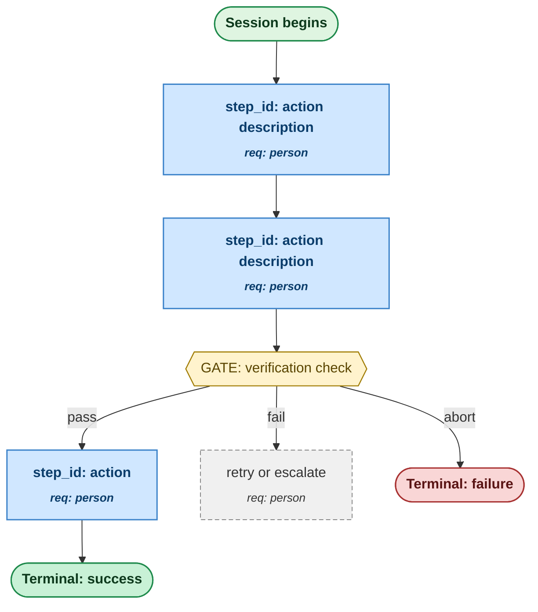

# <Process Name>

<One paragraph: what this process produces, who runs it, and the core idea of how. No more.>

---

## Output (Working Backwards Anchor)

- **Concrete output**: <the artifact, state, or outcome the process produces — be specific>
- **Success criterion**: <how you can verify the output is correct>
- **Failure modes**: <how the output can be wrong, and what happens then>
- **Consumers**: <who or what uses the output downstream>

## Inputs

For each input the process consumes:

- **<input_name>**: <type, source, format>
  - Controllable: <yes / no — can the user/system change this to affect the output?>
  - Required: <yes / no>
  - Validation: <what makes this input valid>
  - Default if missing: <if applicable>

## Preconditions

- <What must be true before the process can start>
- <External dependencies that must be available>

## Metrics Map

The process emits metrics in four categories. Each step in the procedure references which metrics it emits.

### Output Metrics (Lagging — Confirms Success)

| Metric | Definition | Captured at |
|---|---|---|
| <metric_name> | <what is measured> | <step_id or terminal state> |

### Controllable Input Metrics (Leading — The Levers)

For each controllable input, the dimensions tracked. Over time, this data reveals which inputs actually move the output. Expect these metrics to evolve as you learn which dimensions correlate with output movement.

| Input | Dimension | Definition | Captured at |
|---|---|---|---|
| <input_name> | quality / volume / source / recency | <what is measured> | <step_id> |

### Agent Performance Metrics (Per Step — Mandatory)

Every step in the procedure emits the standard set: latency, retry count, confidence/uncertainty signal, clarification requests, failure events, unexpected-path events. The procedure block references this set as "standard performance metrics" rather than restating per step.

Step-specific additions beyond the standard set:

| Step ID | Additional metric | Definition |
|---|---|---|
| <step_id> | <metric> | <what is measured beyond the standard set> |

### Process Health Metrics

| Metric | Definition |
|---|---|
| End-to-end cycle time | Time from process start to terminal state reached |
| Cost per run | <API calls, compute, human time> |
| Throughput | <runs per unit time at steady state> |
| Parallelization efficiency | <if process has fan-out: observed speedup vs theoretical max> |

### Anecdote and Exception Capture

Beyond aggregate metrics, the build agent captures:

- **Anecdotes**: <which executions warrant detailed case logs — e.g., outliers, escalations, novel inputs>
- **Exceptions**: <which conditions trigger detailed logging beyond standard metrics — e.g., latency >Nx p50, retry count >threshold, confidence below threshold>

## Procedure (Canonical)

1. **<step_id>**: <one-line description>
   - Action: <what the executing agent or system does>
   - Inputs: <which named inputs this step uses>
   - Outputs: <what this step produces>
   - Metrics: <"standard performance" + named additions>
   - Successors:
     - if <explicit testable condition>: → <step_id>
     - if <explicit testable condition>: → <step_id>

2. **<step_id>**: ...

## Gates (Verification Decisions in the Process)

Gates are explicit verification points within the executed process. They appear as decision nodes in the diagram because they're decisions, not hidden checks. Each gate names what is verified, how (script vs. judgment), and what happens on failure.

| Gate ID | Location (between steps) | Verifies | Method | On failure |
|---|---|---|---|---|
| <gate_id> | <step_id> → <step_id> | <what condition must hold> | script / agent / human | <retry / escalate / abort> |

## Requirement Owners

| Step ID | Description | Decided by | Failure mode if removed |
|---|---|---|---|
| <step_id> | <description> | <named person> | <what breaks> |

## Decision Rules

For each branch in the procedure, an explicit testable criterion.

**<Decision name>**
- Criterion: <unambiguous rule that resolves on input alone>
- "Yes" branch conditions: <list>
- "No" branch conditions: <list>
- Edge case handling: <what to do when input is at the boundary>

## Edge Cases

| Edge case | Trigger | Handling |
|---|---|---|
| <n> | <input pattern> | <what the process does> |

## Terminal States

- **<terminal_id>**: <what reaching this state means and any final outputs>

## Parallelization

(Include only if the process has fan-out.)

- **Parallel sections**: <which step-groups>
- **Sequential sections**: <which step-groups, and why>
- **Join points**: <where parallel work converges>
- **Shared state**: <what each parallel agent needs in its context>
- **Coordination**: <how races/contention are avoided>

## Diagram (Derived, Human-Readable)

The diagram annotates each step with its requirement owner and shows gates as decision nodes.

**Format convention (canonical).** The diagram differentiates node roles by **shape** and **semantic color**, kept consistent across every spec the skill produces:

| Role | Shape | `classDef` | Color |
|---|---|---|---|
| Process entry | stadium `([...])` | `start` | green |
| Step | rectangle `["..."]` | `step` | blue |
| Decision gate | hexagon `{{"..."}}` | `gate` | amber |
| Hard / critical gate | hexagon `{{"..."}}` | `hardgate` | red border |
| Success terminal | stadium `([...])` | `termGood` | green |
| Failure terminal | stadium `([...])` | `termBad` | red |
| Neutral terminal | stadium `([...])` | `termNeutral` | gray |
| Side / recovery path | rectangle `["..."]` | `fallback` | gray, dashed |

Two rules make it render well everywhere:

1. **Do not lock the Mermaid `theme`.** Omit any `%%{init: {'theme': ...}}%%` so the canvas, edges, and text follow the reader's system light/dark setting (e.g. Obsidian dark mode). The fenced ` ```mermaid ` block renders as **vector (SVG)**, so it scales without quality loss. Tip for readers: install the Obsidian *Diagram Zoom Drag* community plugin to pan/zoom a large diagram in place.
2. **Steps carry the owner annotation; gates and terminals do not** (their accountability lives in the gate's verification method / the terminal being an end state).



## Verification Suite

The checks the spec itself must pass before being handed to a build agent. This suite is defined before drafting (TDD principle) and run during the verification phase.

| Check | Type | Method |
|---|---|---|
| Every step ID in successors exists | structural | script |
| Every step has a requirement owner | structural | script |
| Every input has documented validation | structural | script |
| Mermaid block parses | structural | script |
| Metrics Map covers all four categories | structural | script |
| Decision rules resolve on input alone | semantic | agent |
| Output is concrete (noun, not verb) | semantic | agent |
| Spec matches design conversation intent | semantic | agent |

## Metrics Review Plan (DMAIC Control Phase)

This process generates execution data; that data is reviewed periodically and feeds back into spec refinement.

To run a review session against the data this process emits, invoke the sibling `dmaic` skill (`Skill(dmaic)`). It walks Define → Measure → Analyze → Improve → Control over the metrics named above and writes back a refined spec when changes are warranted.

- **Cadence**: <how often execution data is reviewed — e.g., weekly, after every 50 runs, monthly>
- **Trigger conditions**: <patterns that force a spec revisit before scheduled cadence>
  - Sustained agent confusion at a step (clarification requests > X% over Y runs)
  - Controllable input found to be irrelevant (no correlation with output quality after Z runs)
  - Output quality drift (success rate falls below threshold)
  - Agent retry rate at any step exceeds budget
- **Decision rights**: <who reviews and who decides on spec changes>
- **Review artifact**: <where review session output is captured>
- **Expected variation**: <known noise ranges per metric, so reviews focus on signal not noise>

## Build Notes

Architectural guidance for the implementer. The build agent decides implementation mechanisms based on target environment.

- **Honor strictly**: decision rules, edge case handling, success criterion, gates (with their named verification methods), metrics specifications. Non-negotiable.
- **Use judgment on**: implementation language, library choice, file structure, naming within reason, telemetry storage backend, specific capture mechanism.
- **Ask before deviating**: anything else; default to asking rather than assuming.
- **Telemetry capture**: Use deterministic capture appropriate to the target. Examples: Claude Code → hooks; Python script → decorators or context managers; Lambda → middleware + CloudWatch; n8n → built-in execution data; arbitrary code → structured logging library. The mechanism is your choice; the deterministic property is required.
- **Telemetry storage**: <named data store, file path, or service — to be specified by the user>
- **Graceful degradation**: If telemetry capture fails (storage unreachable, configuration missing), the process completes with output and logs a degraded-mode warning. Output correctness must not depend on telemetry working.
- **Known constraints**: <performance, memory, dependencies, environment>
- **Out of scope**: <what the build agent should NOT do>

## Assumptions and Open Questions

- <Each assumption made during design>
- <Each open question deferred>
- <Each gate that soft-failed during design (logged here rather than blocking)>

## Verification Record

<!--
Replace every <PLACEHOLDER> below before promoting status: verified.
The verifier rejects any <...> placeholder in this section.
Mode lines and (when applicable) the Simulation Note are blocking assertions;
they must reflect what actually ran, not aspirational defaults.

Mode values:
  Phase 4 mode: task_fanout       (four parallel Task subagents ran)
              | inline_simulation (Task tool unavailable; sub-types ran sequentially)
  Phase 7 mode: skill_invocation  (Skill(qa-agents) ran successfully)
              | inline_simulation (qa-agents unreachable; finder/auditor/referee simulated inline)

Simulation Note: drop the entire bullet if Phase 7 mode is skill_invocation;
include it verbatim if Phase 7 mode is inline_simulation.
-->

- QA Agents pattern run on <YYYY-MM-DD> — finder findings: <FINDINGS_COUNT> — auditor disprovals: <DISPROVALS_COUNT> — referee net: <REFEREE_NET>
- Phase 4 mode: <PHASE_4_MODE>
- Phase 7 mode: <PHASE_7_MODE>
- **Simulation Note (only when Phase 7 mode = inline_simulation):** qa-agents skill not reachable; finder/auditor/referee simulated inline. Adversarial isolation collapsed. Treat findings as lower-confidence than a real qa-agents pass; re-run Phase 7 from a runtime with subagent capability before treating the spec as production-grade.
- Path coverage: <PATHS_ENUMERATED> paths enumerated / <PATHS_EXPECTED> expected
- Issues resolved: <ISSUES_RESOLVED>
- Issues deferred to Assumptions: <ISSUES_DEFERRED>

## Change Log

- YYYY-MM-DD: Created via `process-design` skill
