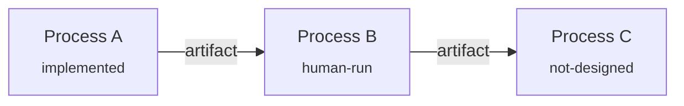

# <System Name> — System Map

<One paragraph: what the system as a whole produces, for whom, and how you can tell
it works. This is the Working Backwards anchor at system altitude.>

## Process Inventory

| Process | Purpose | Owner | Status | Spec |
|---|---|---|---|---|
| <name> | <one line> | <person or agent> | not-designed | — |

Status values: `not-designed | spec-draft | spec-verified | implemented | human-run | external | deleted`

## Contracts

| Artifact | Producer | Consumer(s) | Home | Freshness | If missing/stale |
|---|---|---|---|---|---|
| <noun> | <process> | <process> | <vault path / note type / store> | <cadence> | <block / degrade / alert> |

## Wiring Diagram (derived — regenerate from the tables, never edit directly)

## Deletion Log

- YYYY-MM-DD: <what was deleted or simplified> — <why>. (Add-back is cheap.)

## Depth Log

- YYYY-MM-DD: <box> — kept closed (failed <control | decision | ownership | pain>)
- YYYY-MM-DD: <box> — opened (passed all four)

## Reconciliation Log

- YYYY-MM-DD ↓: <delta found going top-down — map assumption vs spec reality>
- YYYY-MM-DD ↑: <delta found going bottom-up — spec/build change reflected in map>

## Review Cadence

- Reconcile: after every process-design or build-workflow run on a member process.
- Full pass: <weekly / monthly / after N runs>.
- Once live: hand periodic review to `dmaic` (Control).

## Open Questions

- <deferred question>
