# DMAIC Orchestrator Skill (Redesigned)

A Claude Code skill that walks a user through the Six Sigma Define → Measure → Analyze → Improve → Control cycle and writes a verified, vault-aware `dmaic-spec` markdown file. The redesign minimizes SKILL.md tokens, fans out per-metric work in parallel where possible, pushes deterministic assembly into a script, and makes the controllable-vs-external input distinction first-class with explicit causal chains.

---

## Output (Working Backwards Anchor)

- **Concrete output**: A `dmaic-spec` markdown file written to a vault folder (or cwd if no vault), containing YAML frontmatter, five DMAIC sections, an explicit causal-chain block linking output metrics to controllable inputs, an Experiments Log table, and a verified status flag in frontmatter.
- **Success criterion**: `dmaic.py validate --strict` exits 0 AND a fresh reader can answer "to move output metric X, which controllable input do I move?" by reading the Analyze causal-chain block alone, without inferring.
- **Failure modes**: spec ships without a causal chain (vanity metrics escape), spec ships with departments named as owners (no accountability), spec ships without a Control regression guard, spec writes silently overwrite an existing file at the same path, or the orchestrator forgets to invoke `dmaic.py compose` and the user is left with prose but no file.
- **Consumers**: The process owner (primary), downstream `dmaic` review sessions (secondary), the broader `process-design-plugin` telemetry consumer (tertiary).

## Inputs

- **subject**: one-sentence process description, free text (max 240 chars).
  - Controllable: yes
  - Required: yes
  - Validation: non-empty after trim; passes the "verb-and-noun-bearing-an-outcome" rubric (a noun that is a process plus a verb that names an action). Reject pure values, principles, or fuzzy aspirations ("be excellent at X").
  - Default if missing: skill refuses to proceed, returns prompt asking for the subject.
- **owner**: accountable person or named role.
  - Controllable: yes
  - Required: yes (deferrable to "tbd" with explicit user opt-in; logged as soft fail).
  - Validation: must be a person or role (e.g., "VP Customer Ops"), not a department ("operations team"). Auto-rejects bare department names against a small denylist.
  - Default if missing: prompt the user; if user defers, write `owner: "[[TBD — assign by next review]]"` and emit a `soft_fail` event.
- **vault_context**: vault detection JSON from `dmaic.py detect-vault --cwd <pwd>`.
  - Controllable: no
  - Required: yes (the script always returns something; "none" is a valid value).
  - Validation: parses as JSON with `vault_type ∈ {obsidian, linglepedia, none}`.
  - Default if missing: re-run the script; if it fails twice, fall back to writing in cwd with a warning.
- **existing_spec_path**: optional path to a prior `dmaic-spec` markdown file the user wants to iterate on.
  - Controllable: no (once supplied by the user, the orchestrator does not modify it; tracked as `iterate_vs_fresh` in External Input Metrics)
  - Required: no
  - Validation: file exists AND `dmaic.py validate --file <path>` returns at least frontmatter_present=true.
  - Default if missing: enter `fresh` mode; if present, enter `iterate` mode.
- **mike_runtime_capabilities**: the set of capabilities the host runtime exposes to the orchestrator (Skill tool, Task tool, file write).
  - Controllable: no (environment-determined)
  - Required: yes (probed at session start)
  - Validation: at least file-write must be present, otherwise the skill cannot produce its output.
  - Default if missing: the skill aborts with a clear error.

## Preconditions

- Python 3.8+ available on the runtime path (the helper script is stdlib-only).
- The plugin's `dmaic.py` script is reachable at `<plugin-root>/skills/dmaic/scripts/dmaic.py`.
- The user has write permission to the resolved output directory.
- If iterating: the existing spec parses as valid markdown with a YAML frontmatter block.

## Metrics Map

The process emits metrics in five categories. The fifth — **External Input Metrics** — is new for this redesign and is the headline change driven by goal #4. Every step in the procedure references which metrics it emits.

### Output Metrics (Lagging — Confirms Success)

| Metric | Definition | Captured at |
|---|---|---|
| spec_validate_pass_rate | boolean: did `dmaic.py validate --strict` exit 0 on the produced spec | s7_validate |
| causal_chain_completeness | float in [0,1]: fraction of output metrics in Measure that have ≥1 named controllable-input driver in Analyze | s7_validate |
| time_to_spec | wall-clock seconds from session_start event to spec file written | s8_handoff |

### Controllable Input Metrics (Leading — The Levers the Orchestrator Manages)

For each controllable input, the dimensions tracked. Over time, this data reveals which controllable inputs actually move the output metrics. Expect these metrics to evolve.

| Input | Dimension | Definition | Captured at |
|---|---|---|---|
| subject | quality | subject.specificity rubric score 0–3 (0 = aspirational, 3 = verb+noun+observable outcome) | s1_define |
| owner | source | owner.named_personhood: 1 if person/role, 0 if department | s1_define |
| metric_count | volume | integer 2–3 chosen during Measure | s2_measure |
| phase_invocation_mode | source | for each of phases 1–5, whether the per-phase sub-skill was invoked via Skill tool or the orchestrator handled it inline | s1–s5 |
| script_calls_per_session | volume | count of `dmaic.py` subcommand invocations in this session | s8_handoff |
| parallel_fanout_used | source | boolean: did Phase 2/3/4 fan out per-metric work in parallel | s2, s3, s4 |

### External Input Metrics (Context — Affect Output but Not Controllable)

This category is the headline addition. These metrics describe environmental conditions the orchestrator cannot change but that materially affect output quality. Tracking them lets a downstream review session segment results by context (e.g., "causal_chain_completeness in vault sessions vs. cwd sessions").

| External factor | Dimension | Definition | Captured at |
|---|---|---|---|
| vault_present | source | vault_type returned by detect-vault: obsidian / linglepedia / none | s0_kickoff |
| subject_domain_familiarity | source | categorical: matches a known Linglepedia domain folder (GIX/WE/Projects/etc.) yes/no/unknown | s0_kickoff |
| claude_runtime_capabilities | source | set of {skill_tool, task_tool, file_write} actually available | s0_kickoff |
| iterate_vs_fresh | source | "iterate" if existing_spec_path given, "fresh" otherwise | s0_kickoff |

### Agent Performance Metrics (Per Step — Mandatory)

Every step in the procedure emits the standard set: latency, retry count, confidence/uncertainty signal, clarification requests, failure events, unexpected-path events. The procedure block references this set as "standard performance metrics" rather than restating per step.

Step-specific additions beyond the standard set:

| Step ID | Additional metric | Definition |
|---|---|---|
| s2_measure | metric_rejection_count | how many user-proposed metrics were pushed back as vanity before the user landed on the kept set |
| s3_analyze | causal_link_count | total controllable-input → output-metric edges drawn |
| s7_validate | validate_check_failures | list of named validate checks that failed on the first attempt |

### Process Health Metrics

| Metric | Definition |
|---|---|
| End-to-end cycle time | session_start to spec file written |
| Cost per run | total tokens consumed by the orchestrator (proxy for goal #1: minimize SKILL.md cost) |
| Throughput | specs produced per user-hour at steady state |
| Parallelization efficiency | observed wall-clock speedup on Phase 2/3 vs. theoretical sequential baseline (only meaningful when parallel_fanout_used=true) |

### Anecdote and Exception Capture

Beyond aggregate metrics, the build agent captures:

- **Anecdotes**: full transcript of any session where `dmaic.py validate` fails after compose; full transcript of any session where the user rejects ≥1 metric proposal as vanity; full transcript of any session where the orchestrator silently overwrites an existing spec (this should be impossible by spec, so any such occurrence is a bug log).
- **Exceptions**: latency at any step >3x p50; retry count >2 at any step; confidence below 0.5 at the Define gate; any session where causal_chain_completeness <1.0 at promotion.

## Procedure (Canonical)

1. **s0_kickoff**: gather subject, owner, target path; probe runtime; detect vault.
   - Action: run `dmaic.py kickoff --cwd <pwd>` (new subcommand) which (a) detects vault, (b) probes runtime capabilities by checking env hints, (c) returns a JSON envelope with vault_context + capabilities + suggested target folder. The orchestrator then asks the user for subject and owner in one consolidated message, applying the validation rules above.
   - Inputs: subject, owner, vault_context, mike_runtime_capabilities.
   - Outputs: a `kickoff.json` envelope written to a session temp dir.
   - Metrics: standard performance metrics + all four External Input Metrics emitted here.
   - Successors:
     - if subject valid AND owner valid (or deferred with opt-in): → s1_define
     - if subject invalid: → s0_kickoff (retry once, then refuse)
     - if owner invalid AND user did not opt to defer: → s0_kickoff (retry once, then soft fail)

2. **s1_define**: produce the three Define sentences.
   - Action: ask the three Define questions (purpose / success / failure). If `dmaic-define` sub-skill is reachable AND `phase_invocation_mode=skill_tool` is preferred, invoke `Skill(dmaic-define)`; otherwise apply the inline rubric. Run the "is this actually a process?" semantic check before accepting.
   - Inputs: subject from s0_kickoff.
   - Outputs: define_block markdown.
   - Metrics: standard performance metrics + phase_invocation_mode.
   - Successors:
     - if all three sentences pass observability check: → s2_measure
     - if failure sentence is empty or aspirational: → s1_define (retry; soft fail on second miss)

3. **s2_measure**: design 2–3 terminal output metrics with optional per-metric fan-out.
   - Action: elicit candidate output metrics from the user. For each candidate (up to 3), if `task_tool` is available AND parallel_fanout_used=true, spawn one Task subagent per metric to draft (definition, collection, baseline, target). Otherwise, walk them sequentially. Reject vanity metrics inline. Cap at 3.
   - Inputs: define_block.
   - Outputs: measure_block markdown with 2–3 metric subsections.
   - Metrics: standard performance metrics + metric_rejection_count + parallel_fanout_used.
   - Successors:
     - if 2–3 metrics named with all four fields each AND all are output-class (not vanity): → s3_analyze
     - if user insists on a 4th metric: → s2_measure (negotiate composite or move to diagnostic; soft fail on repeated insistence)

4. **s3_analyze**: build the causal chain — for each output metric, name the controllable inputs that move it and the external inputs that affect it but cannot be moved. **This is the headline-change step (goal #4).**
   - Action: for each output metric from s2, draft an Analyze block containing (a) threshold green/yellow/red, (b) 3–5 known failure modes, (c) first action when threshold trips with named owner, AND **(d) a `causal_chain` sub-block** that names the controllable inputs that move this metric (must be ≥1) and the external inputs that condition it (may be 0). If `task_tool` available AND parallel_fanout_used=true, fan out per-metric. Otherwise sequential. Run the script-doable causal_chain_completeness check before exiting this step.
   - Inputs: measure_block, define_block.
   - Outputs: analyze_block markdown including the causal_chain sub-blocks.
   - Metrics: standard performance metrics + causal_link_count + parallel_fanout_used.
   - Successors:
     - if causal_chain_completeness == 1.0: → s4_improve
     - if any output metric has zero controllable-input drivers: → s3_analyze (one retry; if still empty, soft fail and route to Assumptions with explicit warning)

5. **s4_improve**: frame the first improvement as an experiment (or mark "none in flight").
   - Action: if the user has an improvement in mind, structure it as (hypothesis, test plan, success criterion, failure criterion, owner, decision date). If multiple in flight, fan out per-experiment. If none, write a placeholder block noting "experiments will be logged here as they run." Do not let this step block on improvement design — the spec ships either way.
   - Inputs: analyze_block.
   - Outputs: improve_block markdown.
   - Metrics: standard performance metrics + parallel_fanout_used.
   - Successors:
     - always: → s5_control

6. **s5_control**: design the regression guard.
   - Action: capture (monitoring metric + cadence + watcher), (alert trigger + destination + responder + SLA), (recurring spec review schedule). Push back if any of the three is "TBD".
   - Inputs: analyze_block, measure_block.
   - Outputs: control_block markdown.
   - Metrics: standard performance metrics.
   - Successors:
     - if all three control elements named: → s6_compose
     - if any TBD: → s5_control (one retry; soft fail accepts "TBD by next review" with explicit user opt-in)

7. **s6_compose**: assemble the spec via the script.
   - Action: write all five blocks to `/tmp/<slug>-spec.json` with the required keys (process, owner, status="draft", tags, summary, related_extra, define_block, measure_block, analyze_block, improve_block, control_block, notes_block). Run `dmaic.py compose --input <json> --output <resolved-path> --validate-after`. The script handles frontmatter assembly, wikilink wrapping, schema check, and atomic write. **The orchestrator never assembles markdown by string concatenation.**
   - Inputs: all five blocks + kickoff envelope.
   - Outputs: a `dmaic-spec` markdown file written atomically to the resolved path.
   - Metrics: standard performance metrics + script_calls_per_session.
   - Successors:
     - if compose exit code 0 AND validate exit code 0: → s7_validate (formal Gate 6)
     - if compose fails: → s6_compose (retry once; if still failing, surface error to user, log soft fail)

8. **s7_validate**: run the spec validator and the new causal-chain check.
   - Action: re-run `dmaic.py validate --file <path>` and `dmaic.py check-causal-chain --file <path>` (new subcommand that parses the analyze_block and computes causal_chain_completeness). Both must return all_passed=true.
   - Inputs: composed spec file path.
   - Outputs: a validation report JSON; flips frontmatter status from `draft` to `verified` on success.
   - Metrics: standard performance metrics + spec_validate_pass_rate + causal_chain_completeness + validate_check_failures.
   - Successors:
     - if both checks pass: → s8_handoff
     - if any check fails: route back to the phase named in the failed-check routing table (see Gates section)

9. **s8_handoff**: surface the verified spec to the user and emit session_complete telemetry.
   - Action: print the resolved path; if `cowork` runtime detected, also print a `computer://` link; emit `session_complete` event with outcome and total_soft_fails.
   - Inputs: verified spec path.
   - Outputs: human-readable confirmation message.
   - Metrics: standard performance metrics + time_to_spec.
   - Successors:
     - always: → Terminal

## Gates (Verification Decisions in the Process)

Gates are explicit verification points within the executed process. They appear as decision nodes in the diagram because they're decisions, not hidden checks. Each gate names what is verified, how, and what happens on failure.

| Gate ID | Location (between steps) | Verifies | Method | On failure |
|---|---|---|---|---|
| g1_kickoff | s0_kickoff → s1_define | subject specificity ≥2, owner is person/role not department, vault_context parsed | script | retry once, then soft fail; owner deferral allowed with opt-in |
| g2_define | s1_define → s2_measure | three sentences present, success+failure observable | agent | retry once, then soft fail to Assumptions |
| g3_measure | s2_measure → s3_analyze | 2–3 metrics, all four fields per metric, no vanity classification | agent | retry once; vanity insistence soft fails to Assumptions |
| g4_causal_chain | s3_analyze → s4_improve | causal_chain_completeness == 1.0 (every output metric has ≥1 controllable-input driver) | script | one retry; soft fail routes the offending metric to Assumptions with `dangling_metric: true` |
| g5_improve | s4_improve → s5_control | improve_block present (placeholder OK if no experiment in flight) | script | n/a — never blocks |
| g6_control | s5_control → s6_compose | monitoring + alert + recurring review all named (TBD allowed only with opt-in) | agent | retry once, then soft fail |
| g7_compose_validate | s7_validate → s8_handoff | dmaic.py validate --strict exits 0 AND causal-chain check exits 0 | script | route per failed-check table below |

Failed-check routing for g7:

| Failed check | Loop back to |
|---|---|
| frontmatter missing field | s6_compose (drafting fix) |
| section missing | the phase that owns that section |
| measure_has_2_or_3_metrics fails | s2_measure |
| each_metric_has_required_fields fails | s2_measure |
| analyze_has_thresholds fails | s3_analyze |
| control_has_monitoring_and_review fails | s5_control |
| causal_chain_completeness <1.0 | s3_analyze |
| frontmatter_type_is_dmaic_spec fails | s6_compose (script bug — open issue) |

## Requirement Owners

| Step ID | Description | Decided by | Failure mode if removed |
|---|---|---|---|
| s0_kickoff | gather inputs, detect vault, probe runtime | Mike Lingle (skill author) | orchestrator can't know where to write or what to design; vault routing breaks |
| s1_define | three Define sentences | Mike Lingle | DMAIC starts at Improve; no anchor for measurement |
| s2_measure | 2–3 terminal output metrics | Mike Lingle | dashboards never get built; vanity metrics escape |
| s3_analyze | thresholds + failure modes + first actions + causal chain | Mike Lingle (causal_chain block is the new requirement; goal #4) | dashboards have no triggers; output metrics aren't tied to levers; "if I want to move X, what input do I move?" is unanswerable |
| s4_improve | experiment frame | Mike Lingle | improvements ship without falsifiable hypotheses |
| s5_control | regression guard | Mike Lingle | improvements regress; the cycle is one-shot not durable |
| s6_compose | atomic spec assembly | dmaic.py compose (script owns it) | hand-assembled markdown drifts between runs; goal #3 violated |
| s7_validate | structural + causal chain check | dmaic.py validate + dmaic.py check-causal-chain (script owns it) | malformed specs ship; goal #4 not enforced |
| s8_handoff | surface to user, emit telemetry | Mike Lingle (skill author) for routing; dmaic.py for telemetry write | user doesn't know spec was written; downstream review session has no telemetry to consume |

## Decision Rules

**Phase invocation mode**
- Criterion: if the runtime exposes both Skill tool AND the per-phase sub-skill is installed, invoke via Skill; else inline.
- "Yes" branch conditions: Skill tool available AND `dmaic-define` (or other phase) skill installed.
- "No" branch conditions: either the Skill tool is unavailable or the sub-skill is not installed.
- Edge case handling: if Skill tool is available but the sub-skill is not installed, log a `missing_subskill` event and inline-execute.

**Parallel fan-out for per-metric work in s2/s3**
- Criterion: if Task tool is available AND metric_count >1, fan out; else sequential.
- "Yes" branch conditions: Task tool capability present AND ≥2 metrics to design.
- "No" branch conditions: Task tool absent OR only 1 metric.
- Edge case handling: if Task tool is available but the runtime returns Task errors on the first dispatch, fall back to sequential and log `task_dispatch_failed`.

**Vanity metric rejection**
- Criterion: a metric is vanity if it counts activity (impressions, headcount, page views, sessions) without gating any downstream consequence the user can name.
- "Yes" branch conditions (reject): metric counts an activity AND user cannot name a consequence that flips on threshold breach.
- "No" branch conditions (accept): metric is an outcome (conversion, latency, error rate, dollars, time-to-X) OR user names a concrete consequence.
- Edge case handling: borderline cases (e.g., "weekly active users" for a habit-formation process) accepted with a note in the Analyze block explaining the consequence.

**Iterate vs. fresh mode**
- Criterion: if `existing_spec_path` is provided AND validates as a `dmaic-spec`, enter iterate mode; else fresh.
- "Yes" branch conditions (iterate): path provided AND file parses AND frontmatter type=dmaic-spec.
- "No" branch conditions (fresh): no path OR path invalid.
- Edge case handling: if path provided but spec is malformed, surface the validation report and ask the user whether to repair-then-iterate or discard-and-restart.

**Owner-is-a-department rejection**
- Criterion: owner string matches a small denylist of department-shaped names ("the team", "operations", "engineering", "product", "marketing", "the business", "leadership") with no person attached.
- "Yes" branch conditions (reject): bare department name.
- "No" branch conditions (accept): named person, named role with title (e.g., "VP Customer Ops"), or wikilink to a vault person.
- Edge case handling: user can override with explicit opt-in, in which case a soft fail is logged and the spec carries a warning.

## Edge Cases

| Edge case | Trigger | Handling |
|---|---|---|
| Subject is a value or principle, not a process | s0_kickoff classifier flags non-process | Refuse, explain the difference, ask for a concrete process |
| Subject is a deliverable noun, not a process verb-phrase (e.g., "GIX investor deck") | s0_kickoff classifier — runs the rubric: a process must name a repeated activity that takes inputs to outputs over time, not a single artifact | Surface the distinction; ask the user to restate as a process ("creating GIX investor decks" or "updating the investor deck after each milestone") |
| User insists on 4+ metrics | s2_measure after one negotiation round | Soft fail — accept with a flag in Notes that the spec carries unverified-burden risk |
| User defers owner to TBD | s0_kickoff with explicit opt-in | Allow; emit soft_fail; spec carries `[[TBD — assign by next review]]` |
| User runs the orchestrator with no improvement in flight | s4_improve | Write placeholder block; do not block |
| Existing spec path provided but file is corrupt | s0_kickoff iterate-mode check | Surface validation report; offer repair-then-iterate or discard-and-restart |
| Vault detect returns ambiguous (both .obsidian and _schemas) | s0_kickoff | Resolve by precedence (linglepedia wins) AND surface the choice to the user before writing |
| Output path already has a file with the same slug | s6_compose pre-write | Refuse silent overwrite; offer (a) resume draft, (b) numeric suffix, (c) different path |
| dmaic.py compose fails halfway through | s6_compose | Atomic write — no partial file should land on disk; retry once; escalate to user on second failure |
| Task subagent for one of three parallel metrics fails | s2_measure or s3_analyze fan-out | Re-dispatch the failed branch sequentially; do not fail the whole step |
| User abandons mid-session (e.g., stops after Measure) | any phase | Checkpoint blocks-so-far to `/tmp/<slug>-spec.json.partial`; on next invocation, offer resume |
| causal_chain_completeness <1.0 after one retry | g4_causal_chain | Soft fail — list the dangling output metrics in Assumptions with `dangling_metric: true` |
| Subject matches a Linglepedia domain folder by token | s0_kickoff routing | Auto-suggest that domain folder; user confirms |
| Runtime lacks file-write capability | s0_kickoff capability probe | Abort with a clear error — the skill's output cannot be produced |

## Terminal States

- **Terminal**: spec file written at `<resolved-path>`, frontmatter `status: verified`, `session_complete` telemetry event emitted, user notified with path and (when in Cowork) a `computer://` link.
- **Aborted**: skill exited before s6_compose due to (a) refused subject, (b) missing capability, or (c) repeated soft fails crossing the surfacing threshold; no spec file written; partial blocks may exist at `/tmp/<slug>-spec.json.partial` for resume.

## Parallelization

- **Parallel sections**: per-metric work in s2_measure (drafting definition/collection/baseline/target for each of 2–3 metrics), per-metric work in s3_analyze (drafting threshold/failure-modes/first-action/causal-chain for each metric), AND per-experiment work in s4_improve when multiple improvements are in flight.
- **Sequential sections**: s0 → s1 → s2 (gate-blocked, can't start metrics without Define), s3 → s4 → s5 (analyze depends on metrics; control depends on analyze), s6 → s7 → s8 (compose → validate → handoff is strictly sequential).
- **Join points**: s2 fan-out joins before g3_measure (all metric drafts must return); s3 fan-out joins before g4_causal_chain (all causal chains must return).
- **Shared state**: each parallel agent in s2/s3 receives the relevant prior block (define_block for s2 fan-out; measure_block + define_block for s3 fan-out) and returns a single metric's block. No cross-talk needed because metrics are MECE by construction (the cap of 3 plus the vanity-rejection rule keeps them independent).
- **Coordination**: the orchestrator collects fan-out results, orders them by user-stated priority, and runs the gate check on the joined output.

## Diagram (Derived, Human-Readable)

The diagram annotates each step with its requirement owner and shows gates as decision nodes.

```mermaid
flowchart TD
    Start(["Session begins"])
    S0["s0_kickoff: gather inputs + detect vault<br/><sub><i>req: Mike / breaks: no routing target</i></sub>"]
    G1{{"GATE g1_kickoff: subject + owner valid"}}
    S1["s1_define: three Define sentences<br/><sub><i>req: Mike / breaks: no anchor</i></sub>"]
    G2{{"GATE g2_define: sentences observable"}}
    S2["s2_measure: 2-3 output metrics (parallel)<br/><sub><i>req: Mike / breaks: vanity escapes</i></sub>"]
    G3{{"GATE g3_measure: metrics valid"}}
    S3["s3_analyze: thresholds + causal chain (parallel)<br/><sub><i>req: Mike / breaks: dashboards have no triggers</i></sub>"]
    G4{{"GATE g4_causal_chain: every output metric has driver"}}
    S4["s4_improve: experiment frame or placeholder<br/><sub><i>req: Mike / breaks: no falsifiable hypotheses</i></sub>"]
    G5{{"GATE g5_improve: block present"}}
    S5["s5_control: regression guard<br/><sub><i>req: Mike / breaks: improvements regress</i></sub>"]
    G6{{"GATE g6_control: monitoring + alert + review named"}}
    S6["s6_compose: dmaic.py compose --validate-after<br/><sub><i>req: dmaic.py / breaks: hand-assembly drift</i></sub>"]
    S7["s7_validate: validate + check-causal-chain<br/><sub><i>req: dmaic.py / breaks: malformed specs ship</i></sub>"]
    G7{{"GATE g7_compose_validate: validate + causal pass"}}
    S8["s8_handoff: surface path + emit session_complete<br/><sub><i>req: Mike / breaks: silent success</i></sub>"]
    Terminal(["Spec written, status=verified"])
    Start --> S0
    S0 --> G1
    G1 -->|pass| S1
    G1 -->|fail| S0
    S1 --> G2
    G2 -->|pass| S2
    G2 -->|fail| S1
    S2 --> G3
    G3 -->|pass| S3
    G3 -->|fail| S2
    S3 --> G4
    G4 -->|pass| S4
    G4 -->|fail| S3
    S4 --> G5
    G5 -->|pass| S5
    G5 -->|fail| S4
    S5 --> G6
    G6 -->|pass| S6
    G6 -->|fail| S5
    S6 --> S7
    S7 --> G7
    G7 -->|pass| S8
    G7 -->|fail-route| S2
    S8 --> Terminal
```

## Verification Suite

The checks the spec itself must pass before being handed to a build agent. This suite is defined before drafting (TDD principle) and run during the verification phase.

| Check | Type | Method |
|---|---|---|
| Every step ID in successors exists | structural | script |
| Every step has a requirement owner | structural | script |
| Every input has documented validation | structural | script |
| Mermaid block parses | structural | script |
| Metrics Map covers all four standard categories (Output, Controllable Input, Agent Performance, Process Health) | structural | script |
| External Input Metrics subsection present (new for goal #4) | structural | script |
| Every output metric has ≥1 named controllable-input driver in Analyze | structural | script (new: check-causal-chain) |
| Every external input metric is flagged controllable=no | structural | script |
| Every step block references the standard performance metrics block | cross-ref | script |
| Decision rules resolve on input alone | semantic | agent |
| Output success criterion is concrete (noun + observable) | semantic | agent |
| Spec describes the SAME workflow currently in `~/code/process-design-plugin/skills/dmaic/SKILL.md` semantically (it should diverge intentionally; gap-analysis.md tracks divergence) | semantic | agent |
| Every Phase block in the implemented SKILL.md ends with `Script:` line (forces goal #3 audit) | structural | script (post-implementation) |
| Implemented SKILL.md ≤ 130 lines (proxy for goal #1) | structural | script (post-implementation) |
| At least one terminal state reachable | structural | script |
| No unbounded loops | structural | script |

## Metrics Review Plan (DMAIC Control Phase)

This process generates execution data; that data is reviewed periodically and feeds back into spec refinement.

To run a review session against the data this process emits, invoke the sibling `dmaic` skill (`Skill(dmaic)`) — recursively, on the dmaic orchestrator itself. Future iterations of this skill should literally use itself as the measurement-and-improvement engine. It walks Define → Measure → Analyze → Improve → Control over the metrics named above and writes back a refined spec when changes are warranted.

- **Cadence**: after every 25 sessions OR every 4 weeks, whichever comes first. Initial cadence may be tighter (every 5 sessions) until the metrics stabilize.
- **Trigger conditions**: patterns that force a spec revisit before scheduled cadence:
  - Sustained agent confusion at a step (clarification requests > 30% over the prior 10 runs)
  - Controllable input found to be irrelevant (no correlation with output_metric movement after 25 runs)
  - Output quality drift (spec_validate_pass_rate falls below 0.95)
  - Agent retry rate at any step exceeds 2 per session on average
  - causal_chain_completeness <1.0 in >5% of sessions (suggests g4 is too lenient or s3 instructions are unclear)
- **Decision rights**: Mike Lingle reviews; changes require a fresh process-design pass and a new iteration folder under `dmaic-improvement-workspace/`.
- **Review artifact**: each review writes a `dmaic-orchestrator-review-<YYYYMMDD>.md` to the iteration folder with a delta summary against the prior spec.
- **Expected variation**: time_to_spec p50 expected 8–15 min, p90 ≤ 25 min; spec_validate_pass_rate expected ≥0.95 once stable; causal_chain_completeness expected 1.0 for non-soft-fail sessions.

## Build Notes

Architectural guidance for the implementer. The build agent decides implementation mechanisms based on target environment.

- **Honor strictly**: the five-category Metrics Map (especially the new External Input Metrics category and the causal_chain block in Analyze), the gate routing table for g7, the vanity-metric rejection rule, the owner-is-a-department denylist, the no-silent-overwrite rule for spec output, the parallel fan-out semantics for s2/s3 (with sequential fallback when Task tool is unavailable), and the rule that the orchestrator never assembles spec markdown by string concatenation — `dmaic.py compose` owns it.
- **Use judgment on**: exact prompt wording for the Define/Measure/Analyze elicitation, exact rubric thresholds for subject.specificity scoring, telemetry storage backend (default `~/.claude/dmaic-sessions/<YYYY-MM-DD>-<slug>.jsonl`), the kebab-case slug derivation algorithm.
- **Ask before deviating**: anything else; default to asking rather than assuming. In particular, ask before changing the gate threshold for g4_causal_chain (it's the headline-change gate).
- **Telemetry capture**: Use Claude Code hooks (`PreToolUse`, `PostToolUse`, `Stop`) or a single `dmaic.py log-event` subcommand the orchestrator calls per phase. The mechanism is your choice; the deterministic property is required (cannot depend on the agent remembering to log).
- **Telemetry storage**: `~/.claude/dmaic-sessions/<YYYY-MM-DD>-<slug>.jsonl` by default, overrideable via `$DMAIC_LOG_DIR`.
- **Graceful degradation**: If telemetry capture fails, the spec is still written and the user is still notified; emit a single warning line at the end of the session.
- **Known constraints**: Python 3.8+, stdlib only for the helper script, no third-party dependencies in the skill itself.
- **Out of scope**: the build agent does NOT implement the per-phase sub-skills (`dmaic-define`, etc.) — those already exist; the orchestrator just delegates when conditions allow. The build agent does NOT change the existing `dmaic-spec` schema or `_schemas/dmaic-spec.md` files.

## Assumptions and Open Questions

- **Assumption**: Mike accepts adding a fifth metric category (External Input Metrics) to the canonical Metrics Map for the produced spec. The current `dmaic-spec` schema in the Linglepedia vault has no such field; if it conflicts, the redesign needs to land first as a vault schema PR. Logged to gap-analysis.md.
- **Assumption**: the new `dmaic.py kickoff`, `dmaic.py log-event`, and `dmaic.py check-causal-chain` subcommands are within scope for the build pass that implements this spec. If the build agent decides the scope is too large for one PR, the script work can land first and the SKILL.md update follows.
- **Assumption**: the per-phase sub-skills (`dmaic-define`, `dmaic-measure`, etc.) remain unchanged and continue to be invoked when available. If any of them needs an interface change to support fan-out, that's a downstream sub-task.
- **Open question**: should the orchestrator auto-promote `iterate` mode when it detects that the user's prior conversation in this session named a `dmaic-spec` path? Current spec keeps it explicit (user must pass `existing_spec_path`).
- **Open question**: how strict should the vanity-metric rejection be in s2_measure for known-controversial metrics like NPS or weekly active users? Current spec allows them with a Notes annotation; a downstream review may tighten or loosen this.
- **Open question (logged from Phase 4 inline simulation)**: when Phase 7 of the process-design pass that produced THIS spec ran in inline_simulation mode (qa-agents not invoked via Skill), the routing of Auditor disprovals is advisory only. Re-run Phase 7 against this spec from a runtime with subagent capability before treating it as production-grade.
- **Soft fail (logged here per skill convention)**: none accumulated during phases 1–5 of the process-design pass producing this spec.

## Verification Record

- QA Agents pattern run on 2026-04-27 — finder findings: 6 — auditor disprovals: 2 — referee net: +3
- Phase 4 mode: inline_simulation — Task tool not invoked by the parent process-design pass; sub-types A/B/C/D ran sequentially in the same context
- Phase 7 mode: inline_simulation
- **Simulation Note (only when Phase 7 mode = inline_simulation):** qa-agents skill not reachable; finder/auditor/referee simulated inline. Adversarial isolation collapsed. Treat findings as lower-confidence than a real qa-agents pass; re-run Phase 7 from a runtime with subagent capability before treating the spec as production-grade.
- Path coverage: 9 paths enumerated / 9 expected (kickoff → terminal happy path; subject-invalid loop; owner-invalid loop; define-fail loop; measure-vanity loop; analyze-causal-fail loop; control-tbd loop; compose-fail loop; validate-route-back)
- Issues resolved: 6 (added explicit external input metric category; added causal_chain block in Analyze with script enforcement; added owner-department denylist; added s7 routing table; Phase 7 inline-sim findings 3 and 6 fixed inline — added deliverable-noun edge case row, added s4 to Parallelization)
- Issues deferred to Assumptions: 4 (schema-PR question, auto-iterate-mode question, Phase-7-finding-1 schema-validator gap surfaced for downstream PR, Phase-7-finding-5 user-facing consequence of script-interface deletion)

## Change Log

- 2026-04-27: Created via `process-design` skill (recursive dogfood pass on the dmaic orchestrator itself); iteration-1.
