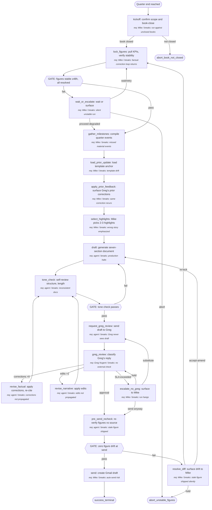

# GIX Quarterly Investor Update

A repeatable process for producing the quarterly written update sent to GIX investors. The process locks every cited figure against the source financial model **before** drafting, drafts against the locked numbers, runs a single named-reviewer pass with Greg Nugent on narrative only, and sends. Run by a Claude Code agent under Mike's supervision; Mike approves the highlight selection and the final send.

---

## Output (Working Backwards Anchor)

- **Concrete output**: A markdown document, ~1000–1500 words, addressed to GIX investors, containing seven named sections: (1) Executive summary (3–5 sentences), (2) KPI table (revenue, paying customers, cash, runway in months), (3) Milestones hit this quarter, (4) Challenges / risks, (5) Forward look (next-quarter focus), (6) Ask (if any), (7) Appendix with figure provenance (cell references back to the financial model). Delivered as a Gmail draft addressed to the GIX distribution list, with the markdown body inlined and the figure-provenance appendix attached.
- **Success criterion**: Greg Nugent's first review produces **zero factual corrections to numbers** and **≤2 narrative edits**. End-to-end cycle time (kickoff → send) **≤5 business days**. Update reaches investors within **15 business days of quarter-end**.
- **Failure modes**: (a) Greg returns ≥1 factual correction on a cited number (root cause: figure-lock gate failed or was skipped). (b) Greg returns >2 narrative edits (root cause: highlight selection or framing was wrong). (c) Cycle time >5 business days. (d) Sent later than 15 business days post-quarter-end. (e) Sent with a stale figure (figure changed in source between lock and send).
- **Consumers**: Greg Nugent (named reviewer, lead investor); other GIX LPs (read-only audience).

## Inputs

- **financial_model**: Google Sheet in Mike's Google Drive containing the canonical revenue, customer-count, cash-position, and runway figures.
  - Controllable: yes
  - Required: yes
  - Validation: sheet exists at the configured Drive path; "as-of date" cell ≥ quarter-end; named-range list `INVESTOR_FIGURES` resolves to ≥4 cells (one per KPI); figures have not changed in the last 48 hours (stability check).
  - Default if missing: abort with "financial_model unavailable or unstable" — do not draft against unstable numbers.
- **milestones_log**: Mike's running log of quarter events (Linglepedia note, Asana milestones, or markdown file).
  - Controllable: yes
  - Required: yes
  - Validation: at least one milestone entry per month of the quarter; each milestone has a dated entry.
  - Default if missing: surface to Mike, prompt for inline reconstruction; do not silently proceed.
- **prior_update**: The previous quarter's investor update document, used as a template anchor and consistency reference.
  - Controllable: yes
  - Required: yes
  - Validation: a prior update file exists in the configured Drive folder; same seven-section structure; sent date is one quarter before the current run.
  - Default if missing: use the template scaffold and flag to Mike that no prior anchor was found.
- **quarter_dates**: Start and end date of the quarter being reported on.
  - Controllable: no
  - Required: yes
  - Validation: ISO dates; end_date < today; end_date − start_date ≈ 90 days.
  - Default if missing: derive from current date (most recently completed calendar quarter).
- **greg_feedback_archive**: Greg's prior-quarter review comments, used to learn from prior corrections.
  - Controllable: yes
  - Required: no (process runs without it on first iteration)
  - Validation: thread or file exists; comments parseable.
  - Default if missing: skip prior-feedback step, log as input gap.

## Preconditions

- The financial model has been closed for the quarter (book-close complete).
- Mike is available to approve highlight selection and the final send.
- Greg Nugent is reachable for narrative review within the SLA window (3 business days from review request).
- Drive credentials and Gmail send permissions are configured for the Claude Code agent.

## Metrics Map

The process emits metrics in four categories. Each step in the procedure references which metrics it emits.

### Output Metrics (Lagging — Confirms Success)

| Metric | Definition | Captured at |
|---|---|---|
| greg_factual_corrections | Count of corrections Greg requests on cited numbers, first review only | greg_review |
| greg_narrative_edits | Count of narrative edits Greg requests, first review only | greg_review |
| cycle_time_days | Business days from kickoff to send | send |
| time_to_investors_days | Business days from quarter-end to send | send |
| stale_figure_count | Count of figures that changed in source between figure-lock and send | pre_send_recheck |
| send_completed | Boolean — did Mike click send within 24h of draft creation, or did the draft sit | send (post-send hook) |

### Controllable Input Metrics (Leading — The Levers)

For each controllable input, dimensions tracked. Over time the data reveals which inputs actually move the output. Expect these metrics to evolve.

| Input | Dimension | Definition | Captured at |
|---|---|---|---|
| financial_model | quality | All `INVESTOR_FIGURES` cells resolve to numeric values; no `#REF` or blanks | lock_figures |
| financial_model | recency | Hours since last edit to any cited cell | lock_figures |
| financial_model | source-traceability | % of cited figures with Drive URL + cell anchor + as-of date | lock_figures |
| milestones_log | quality | % of months in quarter with ≥1 milestone entry | gather_milestones |
| milestones_log | volume | Total milestone count for the quarter | gather_milestones |
| prior_update | template-fidelity | Section count and section names match canonical seven-section template | load_prior_update |
| greg_feedback_archive | recency | Hours since last comment from Greg referenced in current draft | apply_prior_feedback |
| quarter_dates | quality | Both start and end are valid ISO dates; end_date in the past; span ≈90 days | kickoff |

### Agent Performance Metrics (Per Step — Mandatory)

Every step in the procedure emits the standard performance metrics: latency, retry count, confidence/uncertainty signal, clarification requests, failure events, unexpected-path events. The procedure references this set as "standard performance metrics" rather than restating per step.

Step-specific additions beyond the standard set:

| Step ID | Additional metric | Definition |
|---|---|---|
| lock_figures | figure_lock_stability_hours | Hours of stability observed before the lock was accepted (target ≥48) |
| select_highlights | highlight_candidate_count | Number of candidate highlights presented to Mike for selection |
| greg_review | greg_review_response_hours | Wall-clock hours from review request to Greg's first reply |
| pre_send_recheck | figures_diff_count | Count of figures whose source value diverged between lock and send |

### Process Health Metrics

| Metric | Definition |
|---|---|
| End-to-end cycle time | Business days from kickoff to send |
| Cost per run | LLM tokens consumed + Mike's hands-on time + Greg's review time |
| Throughput | One run per quarter at steady state (target 4/year) |
| Parallelization efficiency | Not applicable — process is largely sequential; gather_milestones and load_prior_update may run in parallel after lock_figures |

### Anecdote and Exception Capture

Beyond aggregate metrics, the build agent captures:

- **Anecdotes**: Every Greg factual correction is logged with (a) the figure corrected, (b) the source cell the figure should have come from, (c) the actual value Greg cited as correct, (d) the path the agent took to derive the wrong value. These are reviewed before the next run.
- **Exceptions**: Trigger detailed logging when (a) figure_lock_stability_hours <48, (b) greg_review_response_hours >72, (c) cycle_time_days >5, (d) figures_diff_count >0, (e) any agent step records confidence below 0.7 or retries >1.

## Procedure (Canonical)

1. **kickoff**: Confirm scope of run.
   - Action: Determine quarter dates (input quarter_dates), confirm with Mike that book-close is complete.
   - Inputs: quarter_dates
   - Outputs: confirmed quarter window
   - Metrics: standard performance metrics
   - Successors:
     - if book-close confirmed: → lock_figures
     - if book-close not confirmed: → abort_book_not_closed

2. **lock_figures**: Pull KPIs from financial model, verify stability, snapshot.
   - Action: Read each cell in the `INVESTOR_FIGURES` named range; verify each cell is non-empty and numeric; verify last-edit timestamp is ≥48h old; record cell URL + value + as-of date for each figure into a locked-figures snapshot.
   - Inputs: financial_model
   - Outputs: locked_figures (a JSON object, one entry per KPI, with value + cell-URL + as-of date)
   - Metrics: standard performance metrics + figure_lock_stability_hours
   - Successors:
     - if all figures resolved and stable ≥48h: → gather_milestones
     - if any figure unstable or unresolved: → wait_or_escalate

3. **wait_or_escalate**: Decide whether to wait for stability or surface to Mike.
   - Action: If <24h to stability target, wait and retry once. Otherwise surface to Mike with the unstable cell list.
   - Inputs: locked_figures (partial)
   - Outputs: Mike decision (wait / proceed-degraded / abort)
   - Metrics: standard performance metrics
   - Successors:
     - if Mike says wait: → lock_figures (retry once)
     - if Mike says proceed-degraded: → gather_milestones (with degraded flag)
     - if Mike says abort: → abort_unstable_figures

4. **gather_milestones**: Compile quarter milestones from the milestones log.
   - Action: Extract dated milestone entries within the quarter window; group by month; format as bullet candidates.
   - Inputs: milestones_log, quarter_dates
   - Outputs: milestone_candidates (a structured list)
   - Metrics: standard performance metrics
   - Successors:
     - always: → load_prior_update

5. **load_prior_update**: Load and parse the previous quarter's update for template/consistency anchoring.
   - Action: Locate prior update in Drive; verify seven-section structure; extract section headers and any KPIs cited for trend comparison.
   - Inputs: prior_update
   - Outputs: prior_update_parsed (structured)
   - Metrics: standard performance metrics
   - Successors:
     - always: → apply_prior_feedback

6. **apply_prior_feedback**: Surface lessons from Greg's prior corrections.
   - Action: Read greg_feedback_archive (if present); produce a checklist of "things Greg flagged last time" for the agent to honor in this draft.
   - Inputs: greg_feedback_archive
   - Outputs: prior_feedback_checklist (may be empty on first run)
   - Metrics: standard performance metrics
   - Successors:
     - always: → select_highlights

7. **select_highlights**: Mike picks 2–3 highlights for the executive summary from a candidate list.
   - Action: Generate candidate highlights by combining locked_figures (largest deltas vs. prior quarter) with milestone_candidates (most material events). Present the candidate list to Mike. Mike selects 2–3.
   - Inputs: locked_figures, milestone_candidates, prior_update_parsed
   - Outputs: selected_highlights
   - Metrics: standard performance metrics + highlight_candidate_count
   - Successors:
     - always: → draft

8. **draft**: Generate the seven-section update against locked figures.
   - Action: Produce the seven sections, citing only locked_figures values; honor prior_feedback_checklist; match prior_update section structure; word count target 1000–1500.
   - Inputs: locked_figures, milestone_candidates, prior_update_parsed, prior_feedback_checklist, selected_highlights
   - Outputs: draft_v1 (markdown)
   - Metrics: standard performance metrics
   - Successors:
     - always: → tone_check

9. **tone_check**: Self-review for tone, length, and consistency with prior update.
   - Action: Diff section structure against prior_update; flag any section absent or out of order; flag word count outside 1000–1500; read for tone consistency with prior update.
   - Inputs: draft_v1, prior_update_parsed
   - Outputs: tone_check_report
   - Metrics: standard performance metrics
   - Successors:
     - if tone_check passes: → request_greg_review
     - if tone_check fails: → draft (one retry permitted)

10. **request_greg_review**: Send draft to Greg with explicit ask.
    - Action: Email Greg the draft as markdown with one explicit ask: "factual corrections on numbers and ≤2 narrative edits, please reply within 3 business days." Start SLA timer.
    - Inputs: draft_v1
    - Outputs: review_request_sent_at
    - Metrics: standard performance metrics
    - Successors:
     - always: → greg_review

11. **greg_review**: Wait for Greg's reply; classify response.
    - Action: Wait up to 3 business days for Greg's reply. Classify response into (a) factual corrections to numbers, (b) narrative edits, (c) approval. Log corrections with their source cells (anecdote capture).
    - Inputs: review_request_sent_at, draft_v1
    - Outputs: greg_response (structured: corrections, edits, approval)
    - Metrics: standard performance metrics + greg_review_response_hours
    - Successors:
     - if approval and corrections=0 and edits≤2: → pre_send_recheck
     - if corrections >0: → revise_factual
     - if edits >2: → revise_narrative
     - if SLA exceeded (>3 business days): → escalate_no_greg

12. **revise_factual**: Apply Greg's factual corrections, re-cite from source.
    - Action: For each correction, re-read the source cell. If the source value still equals the locked value (i.e., Greg's correction does not match the model), route to the "Greg cites a wrong number" edge case — do NOT silently apply Greg's value. Otherwise update the figure to the current source value and log the correction in anecdote capture. Loops back to figure verification, not redrafting.
    - Inputs: greg_response, locked_figures, financial_model
    - Outputs: draft_v2 (factually corrected)
    - Metrics: standard performance metrics
    - Successors:
     - always: → tone_check

13. **revise_narrative**: Apply Greg's narrative edits.
    - Action: Apply edits; do NOT re-pull figures (locked_figures is canonical at this stage).
    - Inputs: greg_response, draft_v1
    - Outputs: draft_v2 (narrative-revised)
    - Metrics: standard performance metrics
    - Successors:
     - always: → tone_check

14. **escalate_no_greg**: Surface Greg-unavailable to Mike for decision.
    - Action: Notify Mike that Greg has not responded within SLA. Mike chooses: (a) hold and wait, (b) send anyway with "reviewed by Mike only" footnote, (c) request a different reviewer.
    - Inputs: review_request_sent_at
    - Outputs: Mike decision
    - Metrics: standard performance metrics
    - Successors:
     - if Mike chooses hold: → greg_review (extended SLA)
     - if Mike chooses send anyway: → pre_send_recheck
     - if Mike chooses different reviewer: → request_greg_review (with substitute)

15. **pre_send_recheck**: Re-verify locked figures against current source state immediately before send.
    - Action: For each cell in locked_figures, re-read source value. Compare to locked value. If any differ, surface diff to Mike with options.
    - Inputs: locked_figures, financial_model
    - Outputs: figures_diff_report
    - Metrics: standard performance metrics + figures_diff_count
    - Successors:
     - if figures_diff_count = 0: → send
     - if figures_diff_count >0: → resolve_diff

16. **resolve_diff**: Surface figure drift to Mike, apply fix.
    - Action: Show Mike each figure that drifted with old/new values. Mike chooses: (a) re-lock and re-cite (loops back), (b) hold the run, (c) accept new figures and amend draft.
    - Inputs: figures_diff_report
    - Outputs: Mike decision
    - Metrics: standard performance metrics
    - Successors:
     - if re-lock: → lock_figures
     - if hold: → abort_unstable_figures
     - if accept and amend: → draft (with new figures)

17. **send**: Send the update as a Gmail draft to the GIX distribution list, attach the figure-provenance appendix.
    - Action: Convert markdown to Gmail-friendly format; attach appendix; create draft (do NOT auto-send — Mike clicks send).
    - Inputs: draft (final), locked_figures (for appendix)
    - Outputs: gmail_draft_id
    - Metrics: standard performance metrics + cycle_time_days + time_to_investors_days
    - Successors:
     - always: → terminal

18. **abort_book_not_closed**: Terminal — book close incomplete, run aborted.
    - Action: Log abort with reason; surface to Mike.
    - Inputs: -
    - Outputs: abort log entry
    - Metrics: standard performance metrics
    - Successors: → terminal

19. **abort_unstable_figures**: Terminal — figures unstable, run aborted.
    - Action: Log abort with the unstable cell list; surface to Mike.
    - Inputs: -
    - Outputs: abort log entry
    - Metrics: standard performance metrics
    - Successors: → terminal

## Gates (Verification Decisions in the Process)

Gates are explicit verification points within the executed process. They appear as decision nodes in the diagram. Each gate names what is verified, how, and what happens on failure.

| Gate ID | Location (between steps) | Verifies | Method | On failure |
|---|---|---|---|---|
| Gate1 | lock_figures → gather_milestones | Every figure resolved, all stability ≥48h, every figure has cell URL + as-of date | script | retry once via wait_or_escalate, then surface to Mike |
| Gate2 | tone_check → request_greg_review | Seven sections present and ordered; 1000–1500 words; tone diff against prior update within tolerance | agent | retry draft once, then surface to Mike |
| Gate3 | pre_send_recheck → send | Zero figure drift between lock and current source; Greg approval logged or Mike override logged | script | route to resolve_diff |

## Requirement Owners

| Step ID | Description | Decided by | Failure mode if removed |
|---|---|---|---|
| kickoff | Confirm scope and book-close | Mike Lingle | Run starts against unclosed books, all figures wrong |
| lock_figures | Pull and snapshot KPIs from model | Mike Lingle (owner of the model) | The factual-correction loop returns; this is the bug being fixed |
| wait_or_escalate | Decide whether to wait or surface | Mike Lingle | Run proceeds against unstable figures silently |
| gather_milestones | Compile milestones | Mike Lingle (owner of milestones log) | Update misses material events |
| load_prior_update | Load template anchor | Mike Lingle | Template drift quarter over quarter |
| apply_prior_feedback | Surface Greg's prior corrections | Mike Lingle | Same Greg correction recurs run after run |
| select_highlights | Pick 2–3 highlights | Mike Lingle (judgment, not automatable) | Wrong story emphasized |
| draft | Generate the document | Claude Code agent (under Mike) | -- (this IS the production step) |
| tone_check | Self-review for length and structure | Claude Code agent | Inconsistent docs quarter to quarter |
| request_greg_review | Send to Greg | Claude Code agent | Greg never sees draft |
| greg_review | Wait for and classify Greg's reply | Greg Nugent (the reviewer) | No external check on narrative |
| revise_factual | Apply factual corrections | Claude Code agent | Corrections not propagated |
| revise_narrative | Apply narrative edits | Claude Code agent | Edits not propagated |
| escalate_no_greg | Surface Greg-unavailable | Mike Lingle | Run hangs forever waiting for Greg |
| pre_send_recheck | Re-verify figures vs. source at send time | Claude Code agent (automated) | Stale figure shipped |
| resolve_diff | Surface figure drift | Mike Lingle | Stale figure shipped silently |
| send | Create Gmail draft | Mike Lingle (clicks send) | Auto-send risk; loss of human checkpoint |
| abort_book_not_closed | Abort terminal | Mike Lingle | Hidden abort, no surface |
| abort_unstable_figures | Abort terminal | Mike Lingle | Hidden abort, no surface |

## Decision Rules

**Book-close confirmed (kickoff)**
- Criterion: Mike confirms in chat or model has a "BOOK_CLOSED_<quarter>" cell set to TRUE.
- "Yes" branch conditions: Mike says yes, or named cell is TRUE.
- "No" branch conditions: Mike says no, or named cell is unset/FALSE.
- Edge case handling: ambiguity → ask Mike directly; do not infer.

**Figures stable (lock_figures → Gate1)**
- Criterion: For every cell in `INVESTOR_FIGURES`, last-edit timestamp ≥48 hours before now AND cell value is numeric AND cell is not blank/`#REF`.
- "Yes" branch conditions: all cells pass all three sub-criteria.
- "No" branch conditions: any cell fails any sub-criterion.
- Edge case handling: cell exists but value formula returns 0 — treated as valid (zero is a number); cell formula errors — treated as unstable.

**Tone check passes (tone_check → Gate2)**
- Criterion: seven named sections present in order; word count ∈ [1000, 1500]; section structure matches prior_update.
- "Yes" branch conditions: all three sub-criteria.
- "No" branch conditions: any sub-criterion fails.
- Edge case handling: word count exactly 999 or 1501 — fail (boundary is inclusive); section names differ in capitalization only — pass.

**Greg's response classification (greg_review)**
- Criterion: parse Greg's reply for (a) any number-shaped corrections referring to a cited figure, (b) narrative edit count, (c) explicit approval phrase ("looks good", "approved", "ship it", or equivalent).
- "Yes" branch (approval): explicit approval phrase AND zero number-corrections AND ≤2 narrative edits.
- "No" branches: corrections >0 → revise_factual; edits >2 → revise_narrative; SLA exceeded → escalate_no_greg.
- Edge case handling: Greg replies with both corrections and edits — corrections take priority (revise_factual first, then re-tone-check, which loops back through Greg). Greg replies "approved with one tiny tweak" — tweak counts as 1 narrative edit, classify as approval.

**Figures unchanged at send (pre_send_recheck → Gate3)**
- Criterion: For each cell in locked_figures, current source value equals locked value (exact numeric match).
- "Yes" branch: all cells match.
- "No" branch: any cell mismatches.
- Edge case handling: cell now blank/`#REF` — treat as mismatch.

## Edge Cases

| Edge case | Trigger | Handling |
|---|---|---|
| Financial model not closed for quarter | book_close cell unset OR Mike says "not yet" at kickoff | Abort via abort_book_not_closed; surface to Mike with "wait until close" |
| Cell value changed in last 48h | lock_figures stability check fails | Route through wait_or_escalate; let Mike choose wait / proceed-degraded / abort |
| Cell formula error (`#REF`, `#VALUE`) | Cell read at lock_figures returns non-numeric | Treat as unstable; surface specific cell to Mike |
| Milestones log empty for one or more months | gather_milestones finds <1 entry for a month in window | Surface gap to Mike inline; do NOT silently fill; Mike adds or accepts gap |
| Prior update missing | load_prior_update cannot find file at configured path | Use template scaffold; flag to Mike; degraded-mode warning in output |
| Greg unreachable >3 business days | greg_review SLA exceeded | escalate_no_greg → Mike chooses hold / send-anyway / substitute reviewer |
| Greg replies with both corrections and edits | classification finds both | Apply corrections first (revise_factual), re-tone-check, re-request review |
| Greg replies "approved with one tweak" | classification ambiguous | Tweak counts as 1 edit; classify as approval if total edits ≤2 |
| Figure changed between lock and send | pre_send_recheck finds drift | resolve_diff → Mike chooses re-lock / hold / accept-and-amend |
| Word count exactly at boundary (1000 or 1500) | tone_check measures | Inclusive boundary; pass |
| Word count off by 1 (999 or 1501) | tone_check measures | Fail; route to draft retry |
| GIX distribution list address invalid | send fails on Gmail draft creation | Log failure; surface to Mike; do not retry silently |
| Quarter ended, but mid-quarter event needs early surface | Run kicked off mid-quarter | Out of scope — this process is end-of-quarter only; reject at kickoff |
| Model has been refactored (named range moved) | `INVESTOR_FIGURES` named range not found | lock_figures fails fast with "named range missing"; surface to Mike for model fix |
| Drive credentials expired | Any Drive read fails | Surface auth error to Mike; do not partial-run |
| Greg cites a number that doesn't match the model | greg_review classifies a "correction" but re-reading the cited cell shows the original locked figure was correct | Surface to Mike with both values; Mike resolves out-of-band with Greg before re-drafting; do NOT silently change the figure to match Greg |
| Draft created but Mike never clicks send | send_completed metric remains FALSE >24h after draft creation | Notify Mike at 24h, 48h, 72h; at 5 business days, log run as "abandoned post-draft" and close cycle metrics with that label |

## Terminal States

- **success_terminal**: Gmail draft created, addressed to GIX distribution list, with markdown body and figure-provenance appendix attached. Mike clicks send when ready. Cycle metrics finalized.
- **abort_terminal**: Run aborted before send (book not closed, figures unstable past tolerance, or Mike-initiated abort). Reason logged to anecdote capture. Process re-runnable from kickoff once cause resolved.

## Parallelization

The process is mostly sequential. The only parallelizable section is between `lock_figures` (which must complete first) and `select_highlights` (which depends on both):

- **Parallel sections**: `gather_milestones` and `load_prior_update` and `apply_prior_feedback` may run in parallel after `lock_figures` completes.
- **Sequential sections**: lock_figures must precede; select_highlights and everything downstream must wait.
- **Join points**: `select_highlights` is the join — needs locked_figures, milestone_candidates, prior_update_parsed, prior_feedback_checklist.
- **Shared state**: Each parallel branch reads independent inputs (model already locked); no contention.
- **Coordination**: Trivial — three parallel reads, single join. Cycle-time savings are small (a few seconds to minutes). May not be worth the implementation complexity; build agent decides.

## Diagram (Derived, Human-Readable)

## Verification Suite

The checks the spec itself must pass before being handed to a build agent. Defined before drafting (TDD principle); run during the verification phase.

| Check | Type | Method |
|---|---|---|
| Every step ID in successors exists | structural | script |
| Every step has a requirement owner | structural | script |
| Every input has documented validation | structural | script |
| Mermaid block parses | structural | script |
| Metrics Map covers all four categories | structural | script |
| Every controllable input has ≥1 tracked dimension | cross-ref | script |
| Every step references the standard performance metrics block | cross-ref | script |
| At least one terminal state reachable | structural | script |
| No unreachable non-terminal nodes | structural | script |
| No unbounded loops | structural | script |
| Every gate has a named verification method | structural | script |
| Every Procedure step ID appears in the diagram | structural | script |
| Decision rules resolve on input alone (or name a human) | semantic | agent |
| Output is concrete (noun, not verb) | semantic | agent |
| Spec preserves the figure-lock-before-draft sequencing (the bug being fixed) | semantic | agent |
| Highlight selection is correctly attributed to Mike (judgment, not automatable) | semantic | agent |
| Greg's review SLA is testable (3 business days, not "soon") | semantic | agent |
| Figure-lock stability threshold (48h) is a single numeric criterion | semantic | agent |

## Metrics Review Plan (DMAIC Control Phase)

This process generates execution data; that data is reviewed periodically and feeds back into spec refinement.

To run a review session against the data this process emits, invoke the sibling `dmaic` skill (`Skill(dmaic)`). It walks Define → Measure → Analyze → Improve → Control over the metrics named above and writes back a refined spec when changes are warranted.

- **Cadence**: After every run (quarterly), and a deeper roll-up review after every 4 runs (yearly). Quarterly review is light (15 minutes); annual review is deep.
- **Trigger conditions**:
  - Greg returns ≥1 factual correction in any single run → trigger immediate review of lock_figures and pre_send_recheck logic; do not wait for cadence.
  - greg_narrative_edits >2 in any run → trigger review of select_highlights and tone_check.
  - cycle_time_days >5 in any single run → trigger review of where time was spent.
  - figures_diff_count >0 in any run → critical; investigate model edit patterns.
  - greg_review_response_hours >72 sustained over 2 runs → escalate to Mike for relationship-level conversation with Greg about review SLA.
  - Sustained agent confusion at any step (clarification requests in >50% of runs at the same step) → that step needs spec refinement.
- **Decision rights**: Mike Lingle reviews and decides on spec changes. Greg Nugent's feedback is data, not a vote on the spec.
- **Review artifact**: One markdown file per quarter at the spec's adjacent location, named `gix-investor-update.<YYYY-Qn>.review.md`.
- **Expected variation**: greg_factual_corrections target 0, but a single run with 1 correction is signal-worthy on its own (zero-tolerance metric). greg_narrative_edits expected variation 0–2; 3+ is signal. cycle_time_days expected 3–5 business days; <3 or >5 are both worth understanding. greg_review_response_hours expected variation 24–72.

## Build Notes

Architectural guidance for the implementer. The build agent decides implementation mechanisms based on target environment.

- **Honor strictly**: decision rules, edge case handling, success criterion, gates (with their named verification methods), metrics specifications, and the figure-lock-before-draft sequencing (this is the bug being fixed — do not regress to lookup-during-draft). Non-negotiable.
- **Use judgment on**: implementation language (Python recommended for the Drive/Sheets integration), library choice (gspread, google-api-python-client, etc.), file structure within the Claude Code project, telemetry storage backend, specific capture mechanism, the LLM prompt that produces the draft.
- **Ask before deviating**: anything else; default to asking rather than assuming. In particular, do not auto-send the Gmail message — Mike clicks send.
- **Telemetry capture**: Use Claude Code hooks (`PreToolUse`, `PostToolUse`, `Stop`) for deterministic per-step capture. Each step emits the standard performance metrics plus its named additions. The mechanism is your choice; the deterministic property is required.
- **Telemetry storage**: `$PROCESS_DESIGN_LOG_DIR/<YYYY-MM-DD>-gix-investor-update.jsonl` (env var configurable); fall back to `~/.claude/process-design-sessions/` if unset.
- **Graceful degradation**: If telemetry capture fails (storage unreachable, configuration missing), the process completes with output and logs a degraded-mode warning. Output correctness must not depend on telemetry working.
- **Known constraints**: Drive credentials must be configured for the agent (separate Google MCP account per the user's two-account split — see `project_google_mcp_split_in_progress.md`). Gmail send permission required for draft creation. The agent must NOT auto-send; Mike clicks send. Greg's review SLA timer is a wall-clock business-day timer (skip weekends and US federal holidays).
- **Out of scope**:
  - Producing live charts/graphics (text-only update for v1).
  - Automating Greg's review (Greg is human, intentionally).
  - Investor relationship management beyond this single artifact.
  - Mid-quarter updates (this process is end-of-quarter only).
  - Automated send (Mike clicks send — human checkpoint preserved by design).

## Assumptions and Open Questions

- **A1 (assumption)**: The financial model exists as a Google Sheet in Mike's Drive with a named range `INVESTOR_FIGURES` (or equivalent) listing the canonical KPI cells. If the model does not yet have this named range, the first build task is to add it. *Action: confirm with Mike at first run.*
- **A2 (assumption)**: A milestones log exists in some readable form (Linglepedia note, Asana milestones, or markdown file). The exact source is to be confirmed at first run; the spec treats it as a single named input regardless. *Action: confirm path with Mike.*
- **A3 (assumption)**: Prior quarter's update lives in Drive in a known investor-updates folder. *Action: confirm folder path with Mike.*
- **A4 (assumption)**: GIX distribution list address is configured in a stable place (Gmail group, contacts list). *Action: confirm with Mike.*
- **A5 (assumption)**: Greg's review SLA of 3 business days is acceptable to Greg. *Action: Mike confirms with Greg out of band before first run.*
- **A6 (open question)**: Does Mike want a "highlight-candidates pre-flight" review where the agent presents candidates and Mike picks, or should the agent pick provisionally and Mike override? Spec assumes the former. *Decision needed at first run.*
- **A7 (open question)**: How are dollar figures formatted (raw, $K, $M)? Spec defers to prior_update template. *Decision: pull from prior_update; if ambiguous, ask Mike.*
- **A8 (fallback note)**: This skill session ran Phase 4's MECE sub-agent fan-out **sequentially in a single context** rather than as parallel Task invocations, because the Task tool was not loaded in this run. Coverage of the four categories was preserved; parallelism was not.
- **A9 (fallback note)**: This skill session ran Phase 7's qa-agents pass **as a simulated Finder/Auditor/Referee in a single context** rather than via the bundled qa-agents Skill invocation, for the same reason as A8.
- **A10 (open question)**: Are there compliance / securities-law constraints on the language used in investor updates (forward-looking statements, performance claims) that need a legal review gate? Spec does not currently include one. *Decision needed before first production run.*

## Verification Record

- QA Agents pattern run: 2026-04-27 (simulated in-context per A9). First pass — Finder findings: 6 (3 low, 3 medium). Auditor disprovals: 3 (F1, F3, F6). Referee net: 3 confirmed real findings (F2 metric gap, F4 drafting, F5 edge-case gap). All routed per routing table and fixed: F2 → Phase 2 (added `send_completed`), F4 → Phase 6 redraft (replaced vague check with concrete one), F5 → Phase 4 (added two edge cases). Second pass after fixes: clean (Finder 0 medium+, Auditor confirmed clean, Referee confirmed). Promotion to `verified` granted.
- Path coverage: 17 procedure steps + 3 gates + 2 abort terminals + 1 success terminal enumerated; all reachable from kickoff.
- Issues resolved: 3 (see Change Log).
- Issues deferred to Assumptions: 0 (all confirmed findings were resolved inline).

## Change Log

- 2026-04-27: Created via `process-design` skill. Phase 4 + Phase 7 ran in fallback (in-context) mode per A8/A9. Status promoted from `draft` to `verified` after Phase 7 clean re-run.
