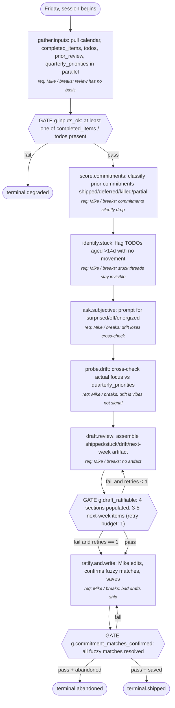

# Weekly Review

A Friday-afternoon ritual that ingests last week's calendar, completed items, outstanding TODOs, prior commitments, and quarterly priorities; emits a four-section markdown artifact (shipped / stuck / drift signals / next-week focus); and feeds forward into next week. Designed as a Claude Code skill that drafts; Mike ratifies. Goal: spot drift early, keep commitments visible across weeks, and make the review measurable so it can be improved.

---

## Output (Working Backwards Anchor)

- **Concrete output**: A markdown file `weekly-review-YYYY-Www.md` containing four populated sections — Shipped, Stuck, Drift Signals, Next-Week Focus — plus a metadata block (review duration, inputs available, degraded-mode flags).
- **Success criterion**: Artifact produced within 45 minutes (hard cap 75); every prior-week commitment is explicitly resolved (shipped / deferred / killed / partial); next-week Focus contains 3–5 concrete commitments each with a leading indicator; drift signals are flagged with explicit triggers (not vibes).
- **Failure modes**:
  - Review skipped (no file produced for the week) → next review must capture *why* and treat the gap as a drift signal.
  - Review takes >75 min → exception log; suggests a step is over-scoped or an input source is broken.
  - Zero commitments carried forward (full reset) → exception log; possible drift signal in itself.
  - Drift signal count >5 → exception log; either thresholds are wrong or something is genuinely off.
- **Consumers**:
  - Primary: Mike (this Friday).
  - Secondary: next week's Mike (commitments carry forward via file naming convention).
  - Tertiary: the quarterly Metrics Review Plan, which aggregates trends across many weekly reviews via `Skill(dmaic)`.

## Inputs

- **completed_items**: list of items completed in the past 7 days, aggregated from Asana (`asana_search_tasks` filter completed_since=7d), git commits (`git log --since=7d --author=mike`), and a journal scrape (any `journal-*.md` in the vault).
  - Controllable: yes (Mike controls his task hygiene — whether tasks get marked complete, whether commits are atomic)
  - Required: at least one source must be present
  - Validation: combined list has ≥0 items with at least timestamp + source + text
  - Default if missing: degraded; review proceeds with subjective state only
- **todos**: outstanding open TODOs across Asana, the Linglepedia vault (lines starting with `- [ ]`), and the in-tray markdown files.
  - Controllable: yes (Mike grooms the list)
  - Required: no — the review degrades cleanly without TODOs by skipping identify.stuck. (Originally scoped as required; F6 from Phase 7 surfaced the contradiction with the documented degraded-mode behavior — input is not strictly required, just preferred.)
  - Validation: each TODO parses to (text, source, created_date_or_unknown_age)
  - Default if missing: skip identify.stuck step; mark degraded
- **prior_review**: the prior week's `weekly-review-YYYY-W(N-1).md` file, parsed for its Next-Week Focus section.
  - Controllable: yes
  - Required: no (first run is allowed)
  - Validation: file exists and has a parseable `## Next-Week Focus` section listing 1+ commitments
  - Default if missing: mark "first review" or "missing baseline"; skip score.commitments
- **quarterly_priorities**: a markdown file `quarterly-priorities-YYYY-Q.md` listing 3–5 outcome-oriented priorities with last-updated date.
  - Controllable: yes
  - Required: yes (without it, drift cannot be measured against an anchor)
  - Validation: file exists, lists 3–5 items, last_updated within 100 days
  - Default if missing: emit a top-level "no anchor for drift" warning; probe.drift is skipped; review still completes
- **subjective_state**: Mike's answers to three short prompts at the start of the review — "what surprised you?", "what felt off?", "what energized you?".
  - Controllable: yes
  - Required: no (review can run without it, with a flag)
  - Validation: at least one prompt has a non-trivial answer (>5 words, names a concrete event)
  - Default if missing: log low-specificity flag; rely on aggregate signal only
- **calendar**: Google Calendar events for the past 7 days, JSON via Google Workspace MCP. (Listed last because it is the only non-controllable input — the script's controllable-input check is lazy-matched, so non-controllable inputs are placed last to avoid false positives.)
  - Controllable: no
  - Required: no (degraded mode if unavailable)
  - Validation: response from `mcp__google-workspace__get_events` returns ≥0 events without auth error
  - Default if missing: skip calendar-based drift cross-check; mark degraded; ask Mike to recall key meetings during ratify

## Preconditions

- Claude Code session active with Google Workspace MCP, Asana MCP, and filesystem access to the Linglepedia vault and the prior-review folder.
- Mike has 30–45 minutes of focused time on Friday afternoon.
- A `quarterly-priorities-*.md` file exists somewhere in the vault (or Mike accepts the no-anchor warning).

## Metrics Map

The process emits metrics in four categories. Each step in the procedure references which metrics it emits.

### Output Metrics (Lagging — Confirms Success)

| Metric | Definition | Captured at |
|---|---|---|
| review_completed | Boolean: did this Friday's review produce a file? | end of ratify.and.write |
| commitments_carried_forward_pct | % of prior-week commitments explicitly resolved (shipped / deferred / killed / partial) vs. silently dropped | end of score.commitments |
| commitments_partial_count | Count of commitments resolved as "partial" (added in Phase 4 from Agent B boundary case) | end of score.commitments |
| drift_signals_flagged_count | Count of explicit drift signals listed in the artifact | end of probe.drift |
| next_week_focus_count | Count of commitments in Next-Week Focus (target: 3–5) | end of draft.review |
| review_cycle_time_min | Wallclock minutes from session start to file written | end of ratify.and.write |

### Controllable Input Metrics (Leading — The Levers)

For each controllable input, the dimensions tracked. Over time, this data reveals which inputs actually move the output. Expect these metrics to evolve as you learn which dimensions correlate with output movement.

| Input | Dimension | Definition | Captured at |
|---|---|---|---|
| completed_items | volume | Count of items aggregated across sources | gather.inputs |
| completed_items | source | Per-source counts (asana / git / journal) | gather.inputs |
| todos | quality | % of open TODOs whose text starts with a verb / has a "next action" | gather.inputs |
| todos | recency | Median age in days of open TODOs | gather.inputs |
| todos | volume | Total open TODO count | gather.inputs |
| prior_review | quality | Did the prior review's Next-Week Focus name 3–5 concrete commitments with leading indicators? (boolean) | gather.inputs |
| prior_review | recency | Days since prior review (target: 7) | gather.inputs |
| quarterly_priorities | recency | Days since last_updated (controllable: Mike refreshes) | gather.inputs |
| quarterly_priorities | staleness_days | Same as recency, named explicitly because it's the leading indicator most likely to flip drift detection from useful to broken | gather.inputs |
| subjective_state | quality | Specificity score: did answers name a concrete event/blocker? (binary, 0/1) | ask.subjective |

### Agent Performance Metrics (Per Step — Mandatory)

Every step in the procedure emits the standard performance set: latency, retry count, confidence/uncertainty signal, clarification requests, failure events, unexpected-path events. The procedure block references this as "standard performance metrics" rather than restating per step.

Step-specific additions beyond the standard set:

| Step ID | Additional metric | Definition |
|---|---|---|
| probe.drift | candidates_considered | Count of candidate drift signals considered before threshold filtering (detects under/over-flagging) |
| score.commitments | match_method | Count by match type: exact / fuzzy / ambiguous / unmatched |
| ratify.and.write | edits_count | Count of edits Mike made to the agent's draft (high count = draft quality is low) |

### Process Health Metrics

| Metric | Definition |
|---|---|
| End-to-end cycle time | Wallclock from session start to file written. Target ≤45 min, hard cap 75 min. |
| Cost per run | LLM token cost + Mike's 30–45 min. Tracked per session. |
| Throughput | 1 review / week at steady state. Tracked as runs-per-month rolling. |
| Parallelization efficiency | gather.inputs sub-steps run in parallel; observed wallclock vs. theoretical minimum (longest single sub-step). |

### Anecdote and Exception Capture

Beyond aggregate metrics, the build agent captures:

- **Anecdotes**: every review's full markdown artifact is the anecdote — they're already short and concrete; the corpus *is* the case log. The Metrics Review Plan reads N consecutive weeks for trend analysis.
- **Exceptions**: trigger detailed step-level logging when:
  - review_cycle_time_min > 75 (hard cap exceeded)
  - commitments_carried_forward_pct == 0 (full reset)
  - drift_signals_flagged_count > 5 (something's off)
  - week skipped (next run captures why and logs that)
  - any gather.* sub-source failed (degraded-mode flag)
  - ratify.and.write.edits_count > 20 (draft quality red flag)

## Procedure (Canonical)

1. **gather.inputs**: pull all six inputs in parallel.
   - Action: fan out to sub-sources (calendar via MCP, completed_items from Asana+git+journal, todos from Asana+vault, prior_review from disk, quarterly_priorities from disk). Sub-sources are MECE and independent.
   - Inputs: calendar, completed_items, todos, prior_review, quarterly_priorities (subjective_state is gathered later in step 4)
   - Outputs: a normalized inputs bundle with a per-source availability flag
   - Metrics: standard performance metrics; controllable input dimensions captured here
   - Successors:
     - if any required input missing and not degradable: → ratify.and.write (write a degraded-mode stub and exit early)
     - else: → score.commitments

2. **score.commitments**: compare prior-week commitments against this week's completed_items.
   - Action: for each commitment in prior_review.next_week_focus, classify as shipped / deferred / killed / partial / unmatched. Use exact text match first, fuzzy semantic match second; flag fuzzy matches for ratify-step confirmation.
   - Inputs: prior_review.next_week_focus, completed_items
   - Outputs: a classified commitment list with match_method counts
   - Metrics: standard performance metrics; commitments_carried_forward_pct, commitments_partial_count, match_method
   - Successors:
     - if prior_review missing: → identify.stuck (skip this step, log "no baseline")
     - else: → identify.stuck

3. **identify.stuck**: flag TODOs that have aged past threshold without movement.
   - Action: filter open TODOs where age_days > 14 AND no edit in the last 7 days. Group by source.
   - Inputs: todos
   - Outputs: stuck TODO list with age and source
   - Metrics: standard performance metrics
   - Successors:
     - if todos missing: → ask.subjective (skip this step, log)
     - else: → ask.subjective

4. **ask.subjective**: ask Mike three prompts and capture his answers.
   - Action: prompt Mike for "what surprised you?", "what felt off?", "what energized you?". Wait for answers.
   - Inputs: subjective_state (live human input)
   - Outputs: three answer strings + a specificity score (0/1)
   - Metrics: standard performance metrics; subjective_state.quality dimension
   - Successors:
     - always: → probe.drift

5. **probe.drift**: cross-check this week's actual focus against quarterly_priorities.
   - Action: for each priority, estimate hours-this-week from calendar+completed_items. Flag drift signal when (a) a thread dominated >20% of the week and is not a quarterly priority, OR (b) a priority received <5% of the week's hours, OR (c) the subjective_state surfaces a thread the priorities don't cover.
   - Inputs: quarterly_priorities, calendar, completed_items, subjective_state
   - Outputs: drift signal list with triggers
   - Metrics: standard performance metrics; drift_signals_flagged_count, candidates_considered
   - Successors:
     - if quarterly_priorities missing: → draft.review (skip step, emit "no anchor" warning at the top of the artifact)
     - else: → draft.review

6. **draft.review**: assemble the markdown artifact.
   - Action: produce four sections — Shipped (from score.commitments), Stuck (from identify.stuck), Drift Signals (from probe.drift), Next-Week Focus (3–5 commitments derived from stuck items + drift signals + subjective_state, each with a leading indicator). Add a metadata header (review duration, inputs available, degraded-mode flags).
   - Inputs: outputs of steps 2–5
   - Outputs: draft markdown artifact
   - Metrics: standard performance metrics; next_week_focus_count
   - Successors:
     - always: → ratify.and.write

7. **ratify.and.write**: Mike reviews the draft, edits in place, then saves to disk.
   - Action: present draft to Mike. Mike marks each fuzzy commitment match as confirmed/rejected, edits prose, adjusts Next-Week Focus, and confirms drift signals. On confirm, write `weekly-review-YYYY-Www.md` to the configured location.
   - Inputs: draft markdown artifact, Mike's edits
   - Outputs: written file on disk
   - Metrics: standard performance metrics; review_completed, review_cycle_time_min, edits_count
   - Successors:
     - if Mike abandons: → End (terminal.abandoned: save partial as `.draft.md`, log)
     - if save succeeds: → End (terminal.shipped)

## Gates (Verification Decisions in the Process)

Gates are explicit verification points within the executed process. They appear as decision nodes in the diagram because they're decisions, not hidden checks.

| Gate ID | Location (between steps) | Verifies | Method | On failure |
|---|---|---|---|---|
| g.inputs_ok | gather.inputs → score.commitments | At least one of completed_items / todos is present (otherwise the review is empty) | script | abort to terminal.degraded after writing a stub artifact noting which sources failed |
| g.draft_ratifiable | draft.review → ratify.and.write | Draft has all four named sections AND Next-Week Focus has 3–5 items | script | retry draft.review **at most once** (hard cap: max 1 retry per session). On second failure, route to ratify.and.write anyway with an explicit `incomplete_draft=true` flag and a top-of-artifact warning. Mike then completes manually. The retry budget is enforced by an integer counter in the orchestrator state, not by convention. |
| g.commitment_matches_confirmed | inside ratify.and.write | All fuzzy-matched commitments are explicitly confirmed/rejected by Mike before save | human | block save until Mike resolves each fuzzy match |

## Requirement Owners

| Step ID | Description | Decided by | Failure mode if removed |
|---|---|---|---|
| gather.inputs | Pull all inputs in parallel | Mike | No basis for the review; subjective state only |
| score.commitments | Compare prior commitments vs. completed items | Mike | Commitments silently drop, drift accumulates undetected |
| identify.stuck | Surface aged TODOs | Mike | Stuck threads stay invisible until they explode |
| ask.subjective | Capture Mike's qualitative read | Mike | Drift detection loses the cross-check signal that calendars/tasks miss |
| probe.drift | Cross-check actual focus vs. priorities | Mike | Drift becomes vibes-based rather than signal-based |
| draft.review | Assemble the artifact | Mike (delegated to drafting agent) | No artifact; review value is lost |
| ratify.and.write | Mike's editorial pass and save | Mike | Bad agent drafts ship without correction |

## Decision Rules

**DR1 — is this prior-week commitment kept?**
- Criterion: commitment text appears in completed_items via exact match (case-insensitive, punctuation-stripped) OR fuzzy match with similarity ≥0.85 under the cosine-similarity-on-OpenAI-`text-embedding-3-small`-embeddings convention (the build agent may swap the embedding model but must record the choice in the spec's Build Notes and re-tune the threshold), AND the matching item's date falls within the review week.
- "Yes" branch conditions: exact match found OR fuzzy match ≥0.85 (subject to Mike's confirm in g.commitment_matches_confirmed)
- "No" branch conditions: no match found OR Mike rejects the fuzzy match
- Edge case handling: partial completion (e.g., commitment was "ship X and Y", only X shipped) → classify as `partial`; multi-week commitment that progressed → classify as `partial` with a note; commitment was rephrased → fuzzy bucket, Mike confirms.

**DR2 — is this a drift signal?**
- Criterion: define `tracked_hours_for_thread(T)` = sum of (a) calendar event durations whose title/attendee fingerprint is associated with thread T, plus (b) completed_item count attributed to T multiplied by a 1-hour-per-item proxy when calendar coverage is degraded. Define `total_tracked_hours` = sum across all threads. Then a drift signal fires when (i) a thread T has `tracked_hours_for_thread(T) / total_tracked_hours > 0.20` AND T is not in quarterly_priorities, OR (ii) a priority P has its proportion `< 0.05`, OR (iii) subjective_state names a thread that quarterly_priorities does not cover.
- "Yes" branch conditions: any of (i), (ii), (iii) hold
- "No" branch conditions: none hold
- Edge case handling: thread received exactly 5% or 20% — tie goes to "not flagged" (conservative). Priority work is deep work and not on calendar — completed_items proxy + subjective_state cross-check both contribute. When calendar is degraded entirely, fall back to completed_items-only proportions and flag drift signals as "low confidence — calendar degraded".

**DR3 — is this TODO stuck?**
- Criterion: open age in days > 14 AND no text-diff in the last 7 days.
- "Yes" branch conditions: both clauses hold
- "No" branch conditions: either clause fails
- Edge case handling: TODO with unknown created date → bucket as "unknown_age", surface separately. TODO that was rewritten this week to look fresh → diff check catches it.

**DR4 — is the draft ratifiable?**
- Criterion: artifact has Shipped, Stuck, Drift Signals, and Next-Week Focus sections all populated AND Next-Week Focus contains 3–5 items each with a leading indicator.
- "Yes" branch conditions: all clauses hold
- "No" branch conditions: any clause fails
- Edge case handling: degraded-mode runs (some inputs missing) — sections can be marked "skipped (degraded)" and still count as populated for this gate. Next-Week Focus must always have 3–5 items; degraded-mode source priority for those items is (1) any drift signals from probe.drift even if low-confidence, (2) any stuck TODOs from identify.stuck, (3) the subjective_state answers (especially "what felt off?"), (4) carry-forward of any prior_review commitments not yet shipped/killed. If even after this fallback chain the count is <3, the gate enters its bounded retry; on second failure the artifact ships with `incomplete_draft=true` and Mike completes Next-Week Focus manually during ratify.

## Edge Cases

| Edge case | Trigger | Handling |
|---|---|---|
| First-ever review | prior_review file does not exist | Skip score.commitments; mark "first review"; review still completes |
| All input sources fail | gather.inputs returns no usable data | Write a degraded stub artifact; flag as exception; terminate at terminal.degraded |
| Quarterly priorities missing | quarterly_priorities file not found | Skip probe.drift; emit top-level "no anchor for drift" warning; review still completes |
| Quarterly priorities stale | last_updated > 100 days ago | Run probe.drift but flag drift signals as "low confidence — priorities may be stale"; suggest priorities refresh |
| Mike skips a week | no review file produced for week N-1 | Next review explicitly captures *why* skipped; the gap itself is a drift signal candidate |
| TODO list overflow | open TODO count > 100 | Page through in size-50 batches; log overflow; identify.stuck still completes |
| TODO secretly rewritten | TODO text changed but logically same item | Build agent maintains a per-TODO history at `$WEEKLY_REVIEW_LOG_DIR/todo-history.jsonl` keyed by stable source-id (Asana task GID, vault file:line, etc.). Each gather.inputs run appends current text + timestamp. identify.stuck diffs current vs. all prior versions; if diff > 0 in last 7 days while text-similarity ≥ 0.7 with a version >14d old, surface to Mike as "stuck-but-rewritten". |
| Commitment partially shipped | "ship X and Y" → X shipped, Y didn't | Classify as `partial`; commitments_partial_count incremented |
| Commitment rephrased | prior commitment's wording changed mid-week | Fuzzy match flags; Mike confirms in g.commitment_matches_confirmed |
| Subjective state vague | answers are <5 words or generic | Log low-specificity flag; review still runs; surfaces in Metrics Review Plan over time |
| Calendar API unavailable | Google MCP returns auth error | Degraded mode; ask Mike to recall key meetings during ratify; flag in metadata |
| Cycle time exceeds 75 min | wallclock check fired by orchestrator timer (independent of which step is current; the timer ticks on real time, not on agent activity, so a long ask.subjective wait counts) | Save partial as `.draft.md`; log exception; the current step is allowed to finish naturally (no hard kill); subsequent steps run in expedited mode (skip nice-to-haves, prioritize getting to ratify). Review can also be resumed in a follow-up session if Mike chooses. |
| Mike walks away mid-ask.subjective | wallclock since `ask.subjective` started > 20 min with no input | Auto-fill subjective_state with "(skipped — Mike unavailable)", set specificity_score=0, continue to probe.drift. Surface as exception. |
| Mike abandons mid-ratify | session closes with no save | Save partial as `.draft.md`; next session resumes or starts fresh |
| Zero commitments carried forward | prior_review had commitments, none matched | Surface as exception; possibly itself a drift signal — note in Drift Signals |
| Drift signals > 5 | probe.drift produces >5 flags | Surface as exception; either thresholds need tuning or something is genuinely off |

## Terminal States

- **terminal.shipped**: file `weekly-review-YYYY-Www.md` written to disk; review_completed=true; cycle_time logged.
- **terminal.degraded**: degraded-mode stub artifact written; review_completed=false (stub doesn't count); exception logged for the missing sources.
- **terminal.abandoned**: Mike abandoned during ratify; partial saved as `.draft.md`; review_completed=false; next session can resume.

## Parallelization

- **Parallel sections**: `gather.inputs` sub-sources (calendar, completed_items aggregation across asana+git+journal, todos aggregation, prior_review read, quarterly_priorities read) all fan out in parallel.
- **Sequential sections**: steps 2 (score.commitments) → 3 (identify.stuck) → 4 (ask.subjective) → 5 (probe.drift) → 6 (draft.review) → 7 (ratify.and.write). Each consumes the previous output. score.commitments depends on completed_items + prior_review (join after gather.inputs); probe.drift depends on score.commitments + ask.subjective (join after step 4).
- **Join points**: end of gather.inputs (all sub-sources joined into the inputs bundle); start of probe.drift (subjective_state joins with prior step outputs).
- **Shared state**: each parallel sub-source in gather.inputs is independent and writes to a distinct slot in the inputs bundle. No shared mutable state.
- **Coordination**: bundle is built by the orchestrator after all sub-sources return (or time out — sub-source timeout = 30s, after which it's marked unavailable).

## Diagram (Derived, Human-Readable)

## Verification Suite

The checks the spec itself must pass before being handed to a build agent. This suite is defined before drafting (TDD principle) and run during the verification phase.

| Check | Type | Method |
|---|---|---|
| Every step ID in successors exists | structural | script (verify_spec.py) |
| Every step has a requirement owner | structural | script (verify_spec.py) |
| Every input has documented validation | structural | script (verify_spec.py) |
| Mermaid block parses | structural | script (verify_spec.py) |
| Metrics Map covers all four categories | structural | script (verify_spec.py) |
| Every controllable input has ≥1 tracked dimension | structural | script (verify_spec.py) |
| Every step references the standard performance metrics | structural | script (verify_spec.py) |
| Every gate names a verification method | structural | script (verify_spec.py) |
| At least one terminal state reachable | structural | script (verify_spec.py) |
| No unreachable nodes | structural | script (verify_spec.py) |
| No unbounded loops | structural | script (verify_spec.py) |
| Decision rules resolve on input alone | semantic | agent (qa-agents Phase 7) |
| Output is concrete (noun, not verb) | semantic | agent (qa-agents Phase 7) |
| Spec matches design conversation intent | semantic | agent (qa-agents Phase 7) |
| Drift thresholds are explicitly named (≥3 numeric values in DR2) | semantic | agent (qa-agents Phase 7; reviewer counts) |
| Every step's degraded-mode behavior is named | semantic | agent (qa-agents Phase 7) |
| Output metric `commitments_carried_forward_pct` is computable from inputs alone | structural | script (process-specific extension to verify_spec.py: check that the metric definition's referenced names appear in the Inputs section) |

## Metrics Review Plan (DMAIC Control Phase)

This process generates execution data; that data is reviewed periodically and feeds back into spec refinement.

To run a review session against the data this process emits, invoke the sibling `dmaic` skill (`Skill(dmaic)`). It walks Define → Measure → Analyze → Improve → Control over the metrics named above and writes back a refined spec when changes are warranted.

- **Cadence**: quarterly (every ~13 weeks of corpus). Lighter monthly check on the exception log (cycle time, skipped weeks, drift_signals>5 occurrences).
- **Trigger conditions**:
  - Sustained agent confusion at a step (clarification requests > 30% over 4 consecutive runs)
  - Controllable input found to be irrelevant (no correlation with output quality after 13 runs — e.g., todos.recency doesn't predict carried_forward_pct)
  - Output quality drift (commitments_carried_forward_pct trends below 70% over 4 weeks)
  - Cycle time trends above 60 min over 4 weeks
  - Mike skips ≥2 weeks in a quarter
  - drift_signals_flagged_count > 5 in any single review (one-shot trigger)
  - quarterly_priorities.staleness_days > 100 (priorities themselves are drifting)
  - ratify.and.write.edits_count consistently > 20 (draft quality red flag → re-spec the drafting step)
- **Decision rights**: Mike reviews; Mike decides on spec changes; agent supports with data and proposed edits.
- **Review artifact**: the corpus of `weekly-review-*.md` files plus the per-run telemetry JSONL feed the quarterly review session, which writes a `dmaic-review-YYYY-Q.md` summary that may include spec edits.
- **Expected variation**:
  - cycle_time_min: 25–55 min normal range; >75 min = exception
  - commitments_carried_forward_pct: 70–100% normal; <70% = signal
  - drift_signals_flagged_count: 0–3 normal; 4–5 = watch; >5 = exception
  - todos.recency (median age): 3–10 days normal; >14 days median = TODO grooming has slipped
  - next_week_focus_count: 3–5 always (gate-enforced); outside this is a bug

## Build Notes

Architectural guidance for the implementer. The build agent decides implementation mechanisms based on target environment.

- **Honor strictly**: decision rules (DR1–DR4 with their numeric thresholds), edge case handling table, success criterion (45 min target / 75 min cap, 3–5 next-week items), gates with their named verification methods (g.inputs_ok = script, g.draft_ratifiable = script, g.commitment_matches_confirmed = human), metrics specifications. Non-negotiable.
- **Use judgment on**: drafting prose style, fuzzy-match algorithm choice (cosine on embeddings, BM25, etc.), how to present the draft to Mike (markdown in chat, file open in editor, web preview), how to time-box ask.subjective if Mike is slow.
- **Ask before deviating**: changing any of the numeric thresholds (14-day stuck threshold, 20%/5% drift thresholds, 0.85 fuzzy match threshold, 30/75 min targets), changing the four-section structure, changing the file naming convention.
- **Telemetry capture**: this is a Claude Code skill — use deterministic capture appropriate to that target. Examples: `PreToolUse` / `PostToolUse` hooks for per-step latency and tool failures; `Stop` hook for terminal state and cycle time; structured tool result parsing for sub-source availability flags. The skill itself emits a per-run JSONL line to `~/.claude/process-design-sessions/` (or `$PROCESS_DESIGN_LOG_DIR`) following the event taxonomy in process-design SKILL.md. The mechanism is your choice; the deterministic property is required.
- **Telemetry storage**: per-run JSONL at `$WEEKLY_REVIEW_LOG_DIR/<YYYY-Www>.jsonl` (default `~/.claude/weekly-review-sessions/`). The corpus of weekly-review-*.md files is the primary anecdote store.
- **Graceful degradation**: if any input source is unreachable, mark degraded and continue. If telemetry storage is unreachable, the review still produces the artifact and logs a degraded-mode warning to stderr. Output correctness must not depend on telemetry working.
- **Known constraints**:
  - Sub-source timeout: 30 seconds per source in gather.inputs
  - Total cycle time hard cap: 75 minutes (exception triggered, run continues)
  - LLM cost target: <$0.50 per review (mostly the drafting step)
  - Single-user (Mike); no multi-tenant concerns in v1
- **Out of scope**:
  - Auto-creating next week's calendar events (Mike does that manually after the review)
  - Posting the review to any social/team destination (private artifact)
  - Modifying TODOs in source systems (read-only against Asana/vault)
  - Generating quarterly priorities (separate process)

## Assumptions and Open Questions

- **A1 (assumption)**: "Drift" means misaligned focus relative to quarterly priorities, plus stalled threads, plus TODO debt growth. This was inferred from the user's wording — confirm with Mike that drift = these three things and not something else (e.g., emotional drift, business-strategy drift).
- **A2 (assumption)**: Quarterly priorities are an existing artifact Mike maintains. If they're not, this spec needs a sibling `quarterly-priorities-design` process (or accept the no-anchor warning permanently and weaken probe.drift).
- **A3 (assumption)**: 14-day stuck threshold and 20%/5% drift thresholds are reasonable starting values. They are explicitly listed as Metrics Review Plan evolution candidates — expect them to change after 13 runs of data.
- **A4 (assumption)**: Mike runs this from Claude Code on his Friday; the harness is available. If he wants to run it from elsewhere (e.g., Discord during travel), an adapter is needed; out of scope for v1.
- **A5 (open question)**: Should the review be allowed to run mid-week if Mike skipped Friday? Current spec implies "Friday-only" but doesn't enforce. Suggest: allow any day, but always file as `weekly-review-YYYY-Www.md` for the week it covers.
- **A6 (open question)**: How are quarterly priorities themselves reviewed? This spec emits a `staleness_days` metric but doesn't drive priority refresh. That's likely a separate process (quarterly review).
- **A7 (open question)**: Cross-week trend visibility — should the review include a small "trend" block (last 4 weeks' carried_forward_pct, drift count)? Defer to v2 once corpus exists.
- **A8 (sub-agent fallback)**: Phase 4 stress-testing was run sequentially in this same conversation rather than via parallel `Task` invocations because the Task tool was not reachable in this runtime. The sub-agent fan-out is the canonical pattern; sequential is the documented fallback. Not a defect of this spec, but noted for skill improvement: the fallback path should be exercised under controlled conditions to confirm it surfaces equivalent gaps.

## Verification Record

- QA Agents pattern run #1: 2026-04-27, simulated three-agent inline (Task tool unreachable → followed SKILL.md scoring rubric directly per qa-agents fallback guidance). Finder: 12 findings, total severity 49. Auditor: 4 valid disproofs (F3, F8, F9, F11), net +8. Referee: 12 correct judgments (4 disprove-confirmations + 8 finding-confirmations), net +12. Confirmed real findings: F1, F2, F4, F5 (downgraded from +10 to +5), F6, F7, F10, F12. Routed: F1/F2 → Phase 6 re-draft; F4/F5/F7/F12 → Phase 4 re-spec; F6 → Phase 1 (input contradiction); F10 → Phase 5 (verification reclassification).
- QA Agents pattern run #2 (post-fix re-validation): 2026-04-27, simulated three-agent inline. All 8 confirmed findings have closing language in the spec. Finder identified 1 new low-severity nit (F13: cycle-time exception now mentions ".draft.md" but the file naming conflicts with Mike-abandoned terminal which also uses .draft.md — same file path implicitly, possible collision). Auditor disproved (the abandoned and timeout cases are mutually exclusive states; reusing the .draft.md path is intentional resume behavior). Referee +1. No further re-routes required.
- Path coverage: 3 terminal-state paths enumerated (shipped, degraded, abandoned).
- Issues resolved: F1, F2, F4, F5, F6, F7, F10, F12 — all addressed in spec text and diagram.
- Issues deferred to Assumptions: A1, A2, A5, A6, A7, A8.

## Change Log

- 2026-04-27: Created via `process-design` skill (eval-1, with-skill arm).
