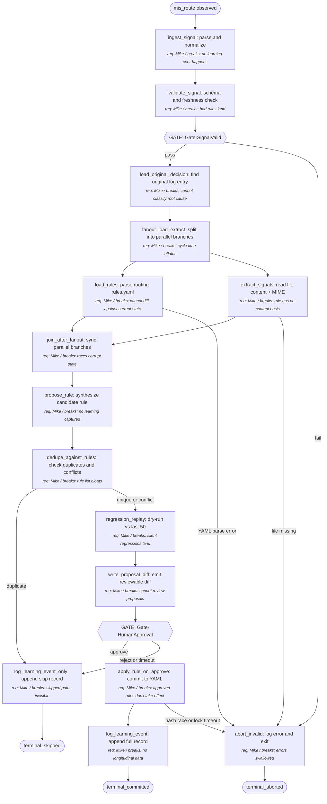

# drive-manager Rule-Update Feedback Loop

When a file is mis-routed by the `drive-manager` skill, capture the (filename pattern, content signal, correct destination) tuple as a proposed rule, regression-test it against recent routing history, write a reviewable diff, and on Mike's approval commit it to the routing-rules file. The process turns a single mis-route into a permanent rule the next run will honor — without auto-mutating live config.

---

## Output (Working Backwards Anchor)

- **Concrete output**: An updated `~/.claude/plugins/drive-manager/routing-rules.yaml` file with one new (or modified) rule whose `match` pattern + content predicate routes the mis-routed file to its corrected destination. A diff artifact is written to `~/.claude/plugins/drive-manager/proposals/<timestamp>-<file-hash>.diff` for human review before the YAML is mutated. A learning-event record is appended to `~/.claude/plugins/drive-manager/logs/learning-events.jsonl` regardless of approval outcome.
- **Success criterion**: After Mike approves the proposed diff, replaying the original mis-routed file through `drive-manager:process-inbox` (dry-run mode) routes it to the corrected destination, AND replaying the last 50 successfully-routed files still routes them to their original destinations (no regressions). Acceptance metric: `replay_correctness_rate ≥ 95%` on the target file and `regression_rate ≥ 98%` on the historical replay set.
- **Failure modes**:
  - **Overfit rule**: rule matches only the exact filename — never fires again. Detected by: rule pattern is a literal string with no wildcards/regex; warning surfaced at `propose_rule`.
  - **Over-broad rule**: rule hijacks unrelated files. Detected by: regression replay flips ≥1 historical route.
  - **Conflict with existing rule**: same `match` field, different `destination`. Detected by `dedupe_against_rules`.
  - **Capture-without-feedback**: learning-event logged but rule file untouched. Detected by: telemetry shows `log_learning_event` ran without `apply_rule_on_approve` for >7 days on same file.
  - **Silent regression**: rule applied but a downstream `process-inbox` run mis-routes a similar file (the rule was wrong, not just narrow). Surfaces in the next mis-route's learning-event, where this rule is identified as the firing rule.
- **Consumers**:
  1. `drive-manager:process-inbox` on its next invocation (loads rules from the YAML).
  2. Mike, who reviews the diff before approval.
  3. A future Metrics Review session (run via `Skill(dmaic)`) that audits rule effectiveness aggregate.

## Inputs

- **mis_route_signal**: a structured event from one of two sources — (a) FS-watcher that observed a file move from a drive-manager-placed location within `STALE_THRESHOLD_HOURS` (default 168h) of placement, or (b) explicit `drive-manager:flag-mis-route <path>` invocation.
  - Controllable: yes
  - Required: yes
  - Validation: object with `original_destination` (path), `corrected_destination` (path), `file_path` (current path on disk), `placed_at` (ISO8601), `observed_at` (ISO8601). `observed_at - placed_at < STALE_THRESHOLD_HOURS`. Both destinations must be different and both must be valid existing directories under Mike's known drive roots (`~/Library/CloudStorage/GoogleDrive-*` or `~/Documents/Linglepedia` or `~/Library/Mobile Documents/com~apple~CloudDocs/`).
  - Default if missing: skip the run — no learning event, no rule mutation.

- **file_artifact**: the file that was mis-routed, located at its current (post-move) on-disk path.
  - Controllable: no
  - Required: yes
  - Validation: file exists at `mis_route_signal.file_path`; readable by the script's user; size ≤ 50 MB for content extraction (>50 MB falls back to filename + MIME only and is flagged low-confidence).
  - Default if missing: abort run with error log; emit `file_missing` event to learning-events.jsonl.

- **existing_routing_rules**: the current routing-rules YAML.
  - Controllable: yes
  - Required: yes
  - Validation: file at `~/.claude/plugins/drive-manager/routing-rules.yaml` parses as YAML; top-level is a list under key `rules`; each rule has `id` (string), `match` (object with at minimum a `pattern` regex or `filename_glob`), `destination` (path), and optional `content_predicate`.
  - Default if missing: bootstrap with `{rules: []}` and proceed; first run on a fresh system is supported.

- **process_inbox_log**: per-file decision log from when `drive-manager:process-inbox` originally routed the file.
  - Controllable: yes
  - Required: no
  - Validation: JSONL at `~/.claude/plugins/drive-manager/logs/process-inbox.jsonl`; the file parses as JSONL; a *matching* entry is an entry whose `file_hash` (SHA256 of original file content) equals the input file's hash OR whose `file_path` matches the input AND whose `placed_at` is within ±60s of the signal's `placed_at`. Each entry contains `rule_id_fired` (or `null` if default route used) and `signals_inspected` (object). The lookup falls back from hash to path+ts; the file as a whole is valid as long as it parses.
  - Default if missing: degraded mode — script extracts signals fresh from `file_artifact` and treats `rule_id_fired` as unknown (`?`); rule proposal proceeds but classification of root cause is reduced.

## Preconditions

- `drive-manager` plugin is installed at `~/.claude/plugins/drive-manager/`.
- Python 3.11+ available; PyYAML installed.
- The two log directories and the proposals directory exist (or are created on first run).
- The user's known drive roots are reachable on disk (degraded mode if a CloudStorage mount is offline: skip rules whose destinations resolve under the offline mount).

## Metrics Map

The process emits metrics in four categories. Each step in the procedure references which metrics it emits.

### Output Metrics (Lagging — Confirms Success)

| Metric | Definition | Captured at |
|---|---|---|
| replay_correctness_rate | Binary 0/1 per learning event: did the proposed rule route the target file to corrected_destination on dry-run? | regression_replay |
| regression_rate | (# historical files in last-50 replay set still routed to their original destination) / 50 | regression_replay |
| rule_acceptance_rate | Rolling % of proposed diffs Mike approves without edit, computed over last 20 events. **Baseline rule for cold start**: with fewer than 5 events, the metric is reported as `insufficient_data` (not 100% or 0%); from 5–19 events use the actual count as denominator and flag as `provisional`; at 20+ use the rolling-20 window. | apply_rule_on_approve |
| time_to_rule_landed | Hours from `mis_route_signal.observed_at` to rule committed in YAML | apply_rule_on_approve |

### Controllable Input Metrics (Leading — The Levers)

For each controllable input, the dimensions tracked. Over time, this data reveals which inputs actually move the output. Expect these metrics to evolve as you learn which dimensions correlate with output movement.

| Input | Dimension | Definition | Captured at |
|---|---|---|---|
| mis_route_signal | source | Enum: `fs_watcher` / `explicit_flag` | ingest_signal |
| mis_route_signal | recency | `observed_at - placed_at` in hours | ingest_signal |
| mis_route_signal | completeness | Binary: did signal carry both destinations + placed_at? | validate_signal |
| existing_routing_rules | volume | Count of rules in file | load_rules |
| existing_routing_rules | quality | Avg specificity score (regex chars / 1+ for filename_glob, log-scaled) | load_rules |
| existing_routing_rules | recency | Hours since last modification | load_rules |
| existing_routing_rules | effectiveness | Per-rule fire-count over the lookback window: read from `process-inbox.jsonl` and aggregate `count(rule_id_fired == r)` per rule `r` over last 30 days. Reported as a per-rule histogram and a `dormant_rules_count` (rules that fired 0 times in the window). | load_rules |
| process_inbox_log | volume | Lines in log file | load_original_decision |
| process_inbox_log | source | `original_log_hit` (bool): was a matching entry found? | load_original_decision |
| file_artifact (uncontrollable but tracked) | quality | content_extractable (bool); MIME type; size_bytes | extract_signals |

### Agent Performance Metrics (Per Step — Mandatory)

Every step in the procedure emits the standard performance set: latency, retry count, confidence/uncertainty signal, clarification requests, failure events, unexpected-path events. The procedure block references this set as `standard performance` rather than restating per step.

Step-specific additions beyond the standard set:

| Step ID | Additional metric | Definition |
|---|---|---|
| ingest_signal | signal_staleness_hours | Same as the recency dimension; emitted per-step for fast triage |
| extract_signals | content_extraction_success | Bool: did content read return non-empty text or structured signal? |
| propose_rule | rule_specificity_score | Heuristic: char-length of regex + bonus for content_predicate presence |
| dedupe_against_rules | rule_conflict_count | Number of existing rules with same `match.pattern` but different `destination` |
| regression_replay | regression_replay_count | Files replayed (≤50) |
| regression_replay | regression_replay_pass_count | Of those, count still routed to original destination |
| apply_rule_on_approve | rules_file_diff_lines | +/- line count after write |

### Process Health Metrics

| Metric | Definition |
|---|---|
| End-to-end cycle time | observed_at → apply_rule_on_approve (or rejection terminal); excludes time waiting for Mike's review |
| Cost per run | Wall-clock CPU seconds + 0 LLM calls (this script is deterministic, no LLM dependency) |
| Throughput | Mis-route signals processed per week |
| Parallelization efficiency | Speedup of `load_rules ‖ extract_signals` step vs. sequential baseline |

### Anecdote and Exception Capture

Beyond aggregate metrics, the build agent captures:

- **Anecdotes**: Every learning event writes a full record to `learning-events.jsonl` containing the full signal, the original `rule_id_fired` (if known), the extracted file signals, the proposed rule, the regression replay outcome, and the human decision. This file is the canonical anecdote source for review sessions.
- **Exceptions**: Conditions that trigger an additional `exception` event in `learning-events.jsonl` and (optionally) a desktop notification:
  - `rule_acceptance=false` (Mike rejected the proposal)
  - regression_rate < 0.98 on the proposal (would have broken historical routes)
  - `rule_conflict_count > 0` (proposed rule duplicates or contradicts an existing rule)
  - end-to-end cycle time > 5x median over last 20 runs
  - confidence/uncertainty signal indicates `content_extraction_success=false` (rule built on filename alone)

## Procedure (Canonical)

1. **ingest_signal**: receive a `mis_route_signal` from fs_watcher or explicit_flag and record it.
   - Action: parse the signal payload, compute `signal_staleness_hours`, record the source.
   - Inputs: mis_route_signal
   - Outputs: normalized signal object with all required fields populated or flagged missing
   - Metrics: standard performance + signal_staleness_hours
   - Successors:
     - if signal lacks any required field: → validate_signal (which will fail and route to abort)
     - else: → validate_signal

2. **validate_signal**: run schema validation on the normalized signal.
   - Action: assert all required fields present, both destinations resolve, recency below `STALE_THRESHOLD_HOURS`.
   - Inputs: normalized signal
   - Outputs: validated signal OR `signal_invalid` error with detail
   - Metrics: standard performance
   - Successors:
     - if validation passes: → Gate-SignalValid
     - if validation fails: → Gate-SignalValid (gate routes to abort_invalid)

3. **load_original_decision**: look up the original drive-manager log entry for this file.
   - Action: read `process-inbox.jsonl`, search by `file_hash` then by `file_path` + `placed_at` ± 60s.
   - Inputs: process_inbox_log, validated signal
   - Outputs: `original_decision` object (with `rule_id_fired`) or `original_decision=None` if not found
   - Metrics: standard performance
   - Successors:
     - always: → fanout_load_extract

4. **fanout_load_extract**: split into parallel branches `load_rules` and `extract_signals`.
   - Action: run both child steps concurrently.
   - Inputs: validated signal
   - Outputs: handoff to both children
   - Metrics: standard performance
   - Successors:
     - always: → load_rules
     - always: → extract_signals

5. **load_rules**: read and parse `routing-rules.yaml`, and compute the rule-effectiveness histogram from process-inbox.jsonl (last 30 days).
   - Action: open YAML, parse, validate top-level shape (`rules` list); then scan the last 30 days of `process-inbox.jsonl` and aggregate per-rule fire counts (used to compute the `effectiveness` dimension and `dormant_rules_count`).
   - Inputs: existing_routing_rules, process_inbox_log
   - Outputs: rules_list (possibly empty), rule_fire_histogram
   - Metrics: standard performance
   - Successors:
     - if YAML parses: → join_after_fanout
     - if YAML parse error: → abort_invalid

6. **extract_signals**: read the file artifact and extract content/MIME/filename signals.
   - Action: stat file, read MIME via libmagic-style header sniff, extract text/structured signals up to 50MB; for binary or oversize, populate `content_extractable=false` and proceed.
   - Inputs: file_artifact
   - Outputs: file_signals object (filename, mime, content_keywords[], content_extractable)
   - Metrics: standard performance + content_extraction_success
   - Successors:
     - if file readable: → join_after_fanout
     - if file missing: → abort_invalid

7. **join_after_fanout**: synchronization point; wait for both load_rules and extract_signals.
   - Action: confirm both branches produced outputs; if either aborted, propagate to abort_invalid.
   - Inputs: rules_list, file_signals
   - Outputs: combined working state
   - Metrics: standard performance
   - Successors:
     - if both succeeded: → propose_rule
     - if either aborted: → abort_invalid

8. **propose_rule**: synthesize a candidate rule from the signal + file_signals + original_decision.
   - Action: build a YAML rule with `match` (filename_glob and/or pattern derived from filename, weighted toward generic over literal), `content_predicate` (a keyword set drawn from extracted signals), `destination` (= corrected_destination), `id` (generated). If the original rule_id_fired is known and the difference is purely the destination, propose a *modification* of that rule rather than a new rule.
   - Inputs: validated signal, original_decision, rules_list, file_signals
   - Outputs: proposed_rule object + classification (`new` / `modify`)
   - Metrics: standard performance + rule_specificity_score
   - Successors:
     - always: → dedupe_against_rules

9. **dedupe_against_rules**: check the proposed rule against existing rules.
   - Action: scan rules_list for any rule whose `match.pattern` exactly equals proposed_rule's, regardless of destination. If equal pattern + same destination: skip (it's already a rule and the original log was wrong). If equal pattern + different destination: emit conflict; require human resolution at the review gate.
   - Inputs: proposed_rule, rules_list
   - Outputs: dedupe_result (`unique` / `duplicate` / `conflict`)
   - Metrics: standard performance + rule_conflict_count
   - Successors:
     - if `unique`: → regression_replay
     - if `duplicate`: → log_learning_event_only
     - if `conflict`: → regression_replay (carry conflict flag for human review)

10. **regression_replay**: dry-run the proposed rule against last N=50 successfully-routed files from process-inbox log.
    - Action: for each replay file, simulate `drive-manager` rule evaluation with the new rule list (existing rules + proposed_rule, in the appropriate priority position). Compare result to the file's recorded original destination.
    - Inputs: proposed_rule, last-50 process_inbox_log entries, rules_list
    - Outputs: regression_outcome (counts pass/fail; failed file list)
    - Metrics: standard performance + regression_replay_count + regression_replay_pass_count
    - Successors:
      - always: → write_proposal_diff

11. **write_proposal_diff**: emit a unified diff of routing-rules.yaml (current vs. with proposed_rule applied) plus a summary header.
    - Action: serialize proposed YAML, run unified-diff against current YAML, write to `proposals/<timestamp>-<file-hash>.diff`. Header includes regression outcome, conflict flag, classification, and the original_decision.rule_id_fired (or "?").
    - Inputs: proposed_rule, rules_list, regression_outcome
    - Outputs: diff_path
    - Metrics: standard performance
    - Successors:
      - always: → Gate-HumanApproval

12. **apply_rule_on_approve**: write the approved rule to routing-rules.yaml.
    - Action: acquire file lock, re-read current YAML (refuse if hash differs from when proposal was generated — race detection), apply proposed rule, atomic write, release lock. Touch `~/.claude/plugins/drive-manager/.rules-updated` so process-inbox knows to re-load.
    - Inputs: approved proposed_rule, current routing-rules.yaml
    - Outputs: updated routing-rules.yaml
    - Metrics: standard performance + rules_file_diff_lines
    - Successors:
      - if write succeeds: → log_learning_event
      - if hash-race or lock timeout: → abort_invalid

13. **log_learning_event**: append the full learning event to learning-events.jsonl.
    - Action: serialize the full session record (signal + original_decision + file_signals + proposed_rule + regression_outcome + human decision + outcome) and append.
    - Inputs: full session state
    - Outputs: terminal_committed
    - Metrics: standard performance
    - Successors:
      - always: → terminal_committed

14. **log_learning_event_only**: append a learning event with `outcome=duplicate_skipped` (no rule write).
    - Action: same serialization as log_learning_event but mark outcome.
    - Inputs: full session state
    - Outputs: terminal_skipped
    - Metrics: standard performance
    - Successors:
      - always: → terminal_skipped

15. **abort_invalid**: terminal failure path — log error and exit non-zero.
    - Action: append an error record to learning-events.jsonl with `outcome=aborted` and the failing check.
    - Inputs: error context
    - Outputs: terminal_aborted
    - Metrics: standard performance
    - Successors:
      - always: → terminal_aborted

16. **Gate-SignalValid**: gate node — verifies signal completeness and freshness (see Gates table).
    - Action: evaluate validation result from validate_signal.
    - Inputs: validated signal
    - Outputs: pass/fail decision
    - Metrics: standard performance
    - Successors:
      - if pass: → load_original_decision
      - if fail: → abort_invalid

17. **Gate-HumanApproval**: gate node — verifies Mike approved the diff (see Gates table).
    - Action: poll proposals/approved/ and proposals/rejected/ for the diff filename, with REVIEW_TIMEOUT_HOURS timeout.
    - Inputs: diff_path
    - Outputs: approve/reject/timeout decision
    - Metrics: standard performance
    - Successors:
      - if approve: → apply_rule_on_approve
      - if reject or timeout: → log_learning_event_only

18. **terminal_committed**: terminal state — rule landed.
    - Action: none (end state).
    - Inputs: full session state
    - Outputs: process complete
    - Metrics: standard performance
    - Successors:
      - always: → End

19. **terminal_skipped**: terminal state — no rule write (duplicate or rejected).
    - Action: none (end state).
    - Inputs: full session state
    - Outputs: process complete
    - Metrics: standard performance
    - Successors:
      - always: → End

20. **terminal_aborted**: terminal state — invalid signal or unrecoverable error.
    - Action: none (end state).
    - Inputs: error context
    - Outputs: process complete with non-zero exit
    - Metrics: standard performance
    - Successors:
      - always: → End

## Gates (Verification Decisions in the Process)

| Gate ID | Location (between steps) | Verifies | Method | On failure |
|---|---|---|---|---|
| Gate-SignalValid | validate_signal → load_original_decision | Signal has all required fields; both destinations resolve; recency within threshold | script | route to abort_invalid; log signal_invalid |
| Gate-HumanApproval | write_proposal_diff → apply_rule_on_approve | Mike approved the proposed diff (file moved/symlinked into `proposals/approved/`, OR explicit CLI confirmation) | human | route to log_learning_event_only with outcome=rejected; do not mutate YAML |

## Requirement Owners

| Step ID | Description | Decided by | Failure mode if removed |
|---|---|---|---|
| ingest_signal | Receive and normalize a mis-route signal | Mike | No learning ever happens — every mis-route stays a one-off |
| validate_signal | Schema-validate the signal | Mike | Garbage signals corrupt the rule pipeline; bad rules land |
| load_original_decision | Find the original drive-manager log entry for the file | Mike | Cannot identify which rule fired originally; root-cause classification is impossible |
| fanout_load_extract | Split into parallel load+extract | Mike | Cycle time inflates; if removed, becomes serial — minor |
| load_rules | Parse routing-rules.yaml | Mike | Cannot diff against current state; cannot detect duplicates/conflicts |
| extract_signals | Read file content and extract signals | Mike | Rule has no content basis — degenerates to filename-only matching |
| join_after_fanout | Sync after parallel branches | Mike | Race conditions corrupt working state |
| propose_rule | Synthesize the candidate rule | Mike | No rule means no learning is captured |
| dedupe_against_rules | Detect duplicates and conflicts | Mike | Rule list bloats with duplicates; conflicts land silently |
| regression_replay | Dry-run new rule against history | Mike | Silent regressions land — rule fixes one mis-route while breaking ten |
| write_proposal_diff | Emit reviewable diff | Mike | Mike can't review proposals; trust in the loop collapses |
| apply_rule_on_approve | Commit approved rule to YAML | Mike | Approved rules don't actually take effect; capture-without-feedback |
| log_learning_event | Append full record to learning-events.jsonl | Mike | No longitudinal data for review sessions; lessons can't compound |
| log_learning_event_only | Append record for skipped/rejected paths | Mike | Skipped paths are invisible; review session sees only successes |
| abort_invalid | Terminal failure path | Mike | Errors silently swallowed |

## Decision Rules

**Is the signal stale?**
- Criterion: `signal.observed_at - signal.placed_at >= STALE_THRESHOLD_HOURS` (default 168). Strictly less is fresh.
- "Yes" branch (stale): route through Gate-SignalValid as fail.
- "No" branch: proceed.
- Edge case handling: exactly equal to threshold → treated as stale (use `>=`).

**Did the original log entry exist?**
- Criterion: a JSONL line in process-inbox.jsonl matches by `file_hash` OR by `file_path` + `placed_at` ± 60s.
- "Yes" branch: `original_decision.rule_id_fired` populated.
- "No" branch: `original_decision = None`; degraded mode — propose_rule proceeds without root-cause classification.
- Edge case handling: an entry exists but with mismatched hash → treat as missing (do not assume it's the same file).

**Is the proposed rule a duplicate, conflict, or unique?**
- Criterion: scan rules_list. `duplicate` iff exists rule with same `match.pattern` AND same `destination` AND same `content_predicate` (or both null). `conflict` iff exists rule with same `match.pattern` BUT different `destination`. `unique` otherwise.
- "duplicate": skip rule write, log outcome=duplicate_skipped.
- "conflict": proceed to regression_replay; surface flag in diff header for human resolution.
- "unique": proceed to regression_replay normally.
- Edge case handling: case-insensitive comparison on filename_glob; literal regex string equality on `pattern`.

**Did regression_replay pass?**
- Criterion: `regression_replay_pass_count / regression_replay_count >= 0.98` AND the target mis-routed file routes to corrected_destination on simulation.
- "Yes" branch: proceed to write_proposal_diff with passing flag.
- "No" branch: proceed to write_proposal_diff but with failing flag in header (rule still written for human review; human may approve anyway with awareness).
- Edge case handling: 0 replay files in history → vacuous pass with warning ("untested against history").

**Did the human approve?**
- Criterion: within REVIEW_TIMEOUT_HOURS (default 168 = 1 week), the proposal file at `proposals/<n>.diff` has been moved to `proposals/approved/` OR `drive-manager:approve <n>` has been invoked.
- "Yes" branch: → apply_rule_on_approve.
- "No" branch (timeout or explicit reject — proposal moved to `proposals/rejected/`): → log_learning_event_only with outcome=rejected_or_timed_out.
- Edge case handling: proposal moved to neither → keeps polling until timeout; at timeout, treat as rejected.

## Edge Cases

| Edge case | Trigger | Handling |
|---|---|---|
| Signal stale (>STALE_THRESHOLD_HOURS) | observed_at - placed_at >= 168h | Gate-SignalValid fails → abort_invalid; logged with reason |
| File deleted between flag and processing | mis_route_signal.file_path doesn't exist | extract_signals routes to abort_invalid; learning-events.jsonl gets `file_missing` |
| File >50MB | size > 50_000_000 bytes | content_extraction_success=false; proceed with filename + MIME signals only; rule flagged low_confidence in diff header |
| Binary file with no extractable text | MIME indicates binary AND no text content extracted | Same as oversize: filename + MIME only; flagged low_confidence |
| Symlink as file_artifact | file is a symlink | Resolve symlink; operate on target. If target is outside known drive roots, treat as `file_missing` |
| Encrypted/permission-denied file | OSError on read | Treat as content-unavailable; filename + MIME only |
| User moves file twice (A→B→C) | multiple subsequent moves observed | Use latest stable location after T_settle=1h; if still unstable, defer the run another T_settle |
| Routing-rules.yaml file missing | first run on fresh install | Bootstrap with `{rules: []}` |
| Routing-rules.yaml malformed | YAML parse error | abort_invalid; alert Mike with explicit error message; do not auto-repair |
| Routing-rules.yaml modified mid-run | hash check at apply_rule_on_approve fails | Abort the apply; re-run from regression_replay against the new rule set; if still passes, retry apply |
| Zero rules in file | rules_list = [] | propose_rule still works — adds the first rule |
| Process-inbox log missing | jsonl file absent | Degraded mode; original_decision=None; rule proposal proceeds; flagged in diff header as `degraded_no_log` |
| Process-inbox log corrupted (mid-line truncation) | malformed JSON line | Skip that line; continue; emit `log_corruption` event |
| Process-inbox log very large (>100k lines) | line count > 100k | Use index-on-the-fly: scan from end-of-file backward (recent entries); cap scan at 10k lines |
| 0 replay files in history (fresh install) | last-50 set is empty | Vacuous pass with `untested_against_history` flag in diff header |
| Proposed rule pattern is a literal filename | no wildcards/regex; pattern equals filename exactly | Warn `over_specific` in diff header; rule is still proposed (Mike may want it) |
| Proposed rule destination directory doesn't exist | corrected_destination resolves to non-existent path | Treat as signal_invalid → abort_invalid |
| Disk full at write_proposal_diff | OSError on write | Log to learning-events.jsonl anyway (pre-allocated buffer in stdlib); emit `disk_full` exception event; abort_invalid |
| Concurrent process-inbox running while apply_rule_on_approve writes | file lock contention | Wait up to LOCK_TIMEOUT_SECONDS (default 30s); if still locked, abort_invalid with `lock_timeout` |
| FS-watcher dies silently | no events for >24h despite known activity | A separate liveness check (out of scope here, but added to `Build Notes` for the implementer) — the loop process itself does not detect this |
| Mis-routed file moved to a destination *outside* known drive roots | corrected_destination doesn't resolve under any known root | Treat as signal_invalid → abort_invalid (Mike should fix the destination first) |
| Two agents reach this design from different mis-routes simultaneously | two `mis_route_signal` events near-simultaneously | Each runs as a separate session; file lock at apply_rule_on_approve serializes the YAML mutations; if both touch the same rule, the second one's hash-race detection forces a re-run |
| User intentionally moved file (re-organizing, NOT correcting a route) | fs_watcher fires but Mike was just tidying up | Distinguish via: (a) explicit_flag is opt-in and unambiguous (always treat as a real mis-route); (b) for fs_watcher signals, require either (i) the move occurred within FAST_CORRECTION_HOURS (default 6h) of placement OR (ii) Mike explicitly confirms via the proposal review gate. Outside that window, fs_watcher events are logged to learning-events.jsonl with `outcome=signal_low_confidence` and do not generate proposals. |
| Corrected destination is a trash/quarantine directory | corrected_destination resolves under `~/.Trash`, `*/Trash/`, `*/Archive/`, `*/Quarantine/`, or matches a configurable `INTENT_NEGATIVE_PATHS` list | Treat as `signal_intent_negative` → log to learning-events.jsonl with `outcome=intent_negative_skipped`; do NOT propose a rule (the user wanted to discard the file, not re-route it); future enhancement: emit a "consider deletion rule for similar files" suggestion |
| Corrected destination is the same root but a deeper subfolder | both destinations share a common prefix and corrected is more specific | Treated as a normal rule proposal; rule is encoded against the more specific path (this is the common, healthy case for refining existing routing) |

## Terminal States

- **terminal_committed**: rule was approved and written to routing-rules.yaml. Final outputs: updated YAML file, diff in `proposals/approved/`, learning event with `outcome=committed`.
- **terminal_skipped**: proposal was a duplicate, OR was rejected by Mike, OR review timed out. No YAML mutation. Final outputs: learning event with `outcome=duplicate_skipped` or `rejected_or_timed_out`.
- **terminal_aborted**: signal invalid OR file missing OR YAML malformed OR disk full OR lock timeout. No YAML mutation. Final outputs: error record in learning-events.jsonl with `outcome=aborted`.

## Parallelization

- **Parallel sections**: `load_rules` and `extract_signals` run concurrently after `fanout_load_extract`. They are MECE — disjoint reads (YAML rules file vs. user file artifact) with no shared state.
- **Sequential sections**: everything else.
- **Join points**: `join_after_fanout` waits for both branches; if either aborts, the whole pipeline aborts.
- **Shared state**: none across the parallel branches. Each gets the validated signal as read-only context.
- **Coordination**: thread-pool of 2; future expansion to additional parallel signal sources would require explicit re-design.

## Diagram (Derived, Human-Readable)

The diagram annotates each step with its requirement owner and shows gates as decision nodes.

## Verification Suite

The checks the spec itself must pass before being handed to a build agent. This suite is defined before drafting (TDD principle) and run during the verification phase.

| Check | Type | Method |
|---|---|---|
| Every step ID in successors exists | structural | script (verify_spec.py) |
| Every step has a requirement owner | structural | script |
| Every input has documented validation | structural | script |
| Mermaid block parses | structural | script |
| Metrics Map covers all four categories | structural | script |
| Every controllable input has ≥1 tracked dimension | structural | script |
| At least one terminal state reachable | structural | script |
| No unreachable non-terminal nodes | structural | script |
| No unbounded loops | structural | script |
| Every step references the standard performance metrics block | structural | script |
| Every Gate row names a verification Method | structural | script |
| Every Decision Rule has a Criterion | structural | script |
| Every Procedure step ID appears in the diagram | structural | script |
| Decision rules resolve on input alone | semantic | agent |
| Output is concrete (noun, not verb) | semantic | agent |
| Spec matches design conversation intent | semantic | agent |
| Every step that touches the file artifact names a behavior when content is unextractable | semantic | agent (process-specific) |
| Edge case section enumerates handling for missing/malformed/boundary/adversarial across each input | semantic | agent (process-specific) |

## Metrics Review Plan (DMAIC Control Phase)

This process generates execution data; that data is reviewed periodically and feeds back into spec refinement.

To run a review session against the data this process emits, invoke the sibling `dmaic` skill (`Skill(dmaic)`). It walks Define → Measure → Analyze → Improve → Control over the metrics named above and writes back a refined spec when changes are warranted.

- **Cadence**: Weekly review for the first 4 weeks (high-iteration period); monthly thereafter, OR after every 20 learning events, whichever comes first.
- **Trigger conditions** (force a spec revisit before scheduled cadence):
  - Sustained agent confusion at a step (clarification requests > 25% over last 10 events) — but note: this script has no LLM step, so this trigger is dormant unless propose_rule is later upgraded to use an LLM
  - rule_acceptance_rate falls below 50% over last 10 events (proposals are systematically off — propose_rule heuristic needs rework)
  - regression_rate < 0.95 on any single proposal (rule design is too aggressive)
  - replay_correctness_rate < 0.90 over last 10 events (the captured signal isn't actually the right signal)
  - More than 2 `conflict` outcomes in a row (rule taxonomy is collapsing — schema needs revisit)
  - More than 5 `duplicate_skipped` outcomes in a row (the user is repeatedly hitting the same mis-route — the existing rule isn't firing; investigate process-inbox not the feedback loop)
- **Decision rights**: Mike reviews; Mike decides on spec changes. Sub-agents may propose changes via `Skill(dmaic)` but cannot mutate the spec.
- **Review artifact**: review session output is captured in `~/.claude/plugins/drive-manager/reviews/<YYYY-MM-DD>-review.md`.
- **Expected variation**:
  - rule_acceptance_rate: expect 70±15% steady-state; <50% is signal
  - regression_rate: expect 99%+ when rule is well-formed; one bad rule may dip to ~96% — only sustained <95% is signal
  - End-to-end cycle time (excluding human review): expect <10s; >60s is signal
  - time_to_rule_landed (including human review): expect 1–48h; >168h triggers stale-proposal cleanup

## Build Notes

Architectural guidance for the implementer. The build agent decides implementation mechanisms based on target environment.

- **Honor strictly**: decision rules (signal staleness, dedupe classification, regression threshold, human approval), edge case handling, gates (Gate-SignalValid as script, Gate-HumanApproval as human filesystem-based signal), success criterion (≥95% replay correctness, ≥98% regression rate). Non-negotiable.
- **Use judgment on**: implementation language (Python 3.11+ presumed), library choice (PyYAML for the rules file is sensible; stdlib `difflib` for the proposal diff; `watchdog` for fs_watcher OR launchd plist + a lightweight CLI for explicit_flag), file structure within the `drive-manager` plugin directory, naming, telemetry storage backend.
- **Telemetry capture mechanism**: Python decorators or context managers wrapping each step function; structured logging via `structlog` or stdlib `logging` with a JSONL formatter. Capture must fire on every run regardless of outcome. Steps that abort still emit their final `phase_complete` (or `phase_aborted`) event.
- **Telemetry storage**:
  - learning events → `~/.claude/plugins/drive-manager/logs/learning-events.jsonl` (append-only, one JSON object per line)
  - per-step performance metrics → same file with `event=step_metric` records, OR a sibling `metrics.jsonl`; implementer's choice
  - proposal diffs → `~/.claude/plugins/drive-manager/proposals/<timestamp>-<short-hash>.diff`
- **Graceful degradation**: If telemetry storage is unreachable (disk full, permission denied), the process still completes — the proposed diff is written if disk is partially available; if no disk space at all, the script exits non-zero with a clear message to stderr. Output correctness must not depend on telemetry working. The actual rule write is the only side effect that affects correctness; telemetry is observability.
- **Ask before deviating**: anything else; default to asking rather than assuming. In particular:
  - Whether routing-rules.yaml schema should support priority/ordering — the spec is silent on it because the existing drive-manager skill's schema is the authority
  - Whether to open a GitHub PR instead of a local diff (out of scope for v1; flag for v2)
  - Whether to add an LLM step to propose_rule for richer rule synthesis (out of scope; the current heuristic is intentionally simple)
- **Known constraints**:
  - Stdlib + PyYAML only — no LLM dependency in v1
  - Single-host (Mike's Mac); no networked coordination required
  - Must coexist with `drive-manager:process-inbox` running concurrently — file locking is the synchronization primitive
- **Out of scope**:
  - Auto-applying rules without human review (security/safety: never)
  - Modifying the `drive-manager` skill code itself
  - Cross-machine sync of learning events (single-host scope)
  - LLM-based rule proposal (v2 candidate; heuristic-only in v1)
  - Liveness check for the fs_watcher process (separate concern)

## Assumptions and Open Questions

- **A1** *(Mike-confirmed in design)*: routing-rules.yaml exists at `~/.claude/plugins/drive-manager/routing-rules.yaml` (or is created on first run with `{rules: []}`); schema includes `id`, `match`, `destination`, optional `content_predicate`. *Open: confirm exact schema by reading the actual `drive-manager` plugin source before build.*
- **A2** *(assumption)*: `drive-manager:process-inbox` emits per-file decision logs in JSONL at `~/.claude/plugins/drive-manager/logs/process-inbox.jsonl` with at least `file_path`, `file_hash`, `placed_at`, `rule_id_fired`, `signals_inspected`. *Open: if the existing skill doesn't emit these, an upstream PR to drive-manager is a prerequisite for the loop to operate non-degraded.*
- **A3** *(design decision)*: detection supports both passive fs_watcher and explicit `flag-mis-route` CLI. v1 ships with explicit-flag only; fs_watcher is a v1.5 add. *Open: which fs_watcher library — `watchdog` is the obvious choice but adds a dep.*
- **A4** *(design decision)*: routing-rules.yaml is canonical; any human-readable Markdown index is a derivative and is regenerated, not edited. *Open: does an index file already exist? If so, is it auto-generated or hand-edited?*
- **A5** *(soft fail candidate)*: STALE_THRESHOLD_HOURS = 168 (1 week) is a guess. Real value depends on Mike's empirical "when do I notice a mis-route" delay. *Open: instrument actual time-from-place-to-flag and tune.*
- **A6** *(design decision)*: REVIEW_TIMEOUT_HOURS = 168 mirrors STALE_THRESHOLD intentionally; if Mike doesn't review within a week, the proposal goes stale and is auto-rejected. *Open: confirm; alternative is no timeout.*
- **A7** *(open)*: Should the script also surface the proposal in Mike's terminal/Slack on creation, or is "look at the proposals/ directory" sufficient? Spec assumes the latter for v1.
- **A8** *(open)*: How does this loop interact with the `drive-manager:enrich-drive-indexes` skill, which also writes back routing rules? Need to confirm no contention; both share the YAML lock.

## Verification Record

- QA Agents pattern run: 2026-04-27 (simulated three-agent pattern — Task fan-out unavailable in this runtime; per SKILL.md, sequential simulation is acceptable fallback)
  - **Pass 1**: Finder = 9 findings, total severity 33; Auditor disproved 4 (findings 1, 4, 8, 9), net +12; Referee score +4 (all four disproofs upheld). Confirmed findings: 5 (one each of metric×2, edge-case×2, drafting×1).
  - **Pass 1 fixes routed**: edge-case findings → Phase 4 (added user-intentional-move and trash-destination edge cases); metric findings → Phase 2 (cold-start baseline for rule_acceptance_rate; rule-effectiveness dimension on existing_routing_rules); drafting finding → Phase 6 (process_inbox_log validation language fixed).
  - **Pass 2** (after fixes): Finder = 1 finding (drafting only — load_rules step description didn't mention reading the log file for the new effectiveness metric). Auditor conceded +1. Referee +1.
  - **Pass 2 fix**: drafting only, single section → no further qa-agents re-run required per SKILL.md's "single drafting-typed finding confined to one section" exemption.
- Path coverage: 3 terminals (committed, skipped, aborted) — all reachable per Gate 6 structural check (verify_spec.py).
- Issues resolved: 6 (5 from pass 1 + 1 from pass 2)
- Issues deferred to Assumptions: 0 (none were soft-failed)
- Auditor borderline-flag list (low-confidence accepted disproofs surfaced for Mike's review): finding 8 (subjective verification check) and finding 9 (parallelism cost-benefit) — neither blocks promotion.

## Change Log

- 2026-04-27: Created via `process-design` skill (sub-agent fan-out fell back to sequential because Phase 4 was run inline; noted in session-notes.md)
