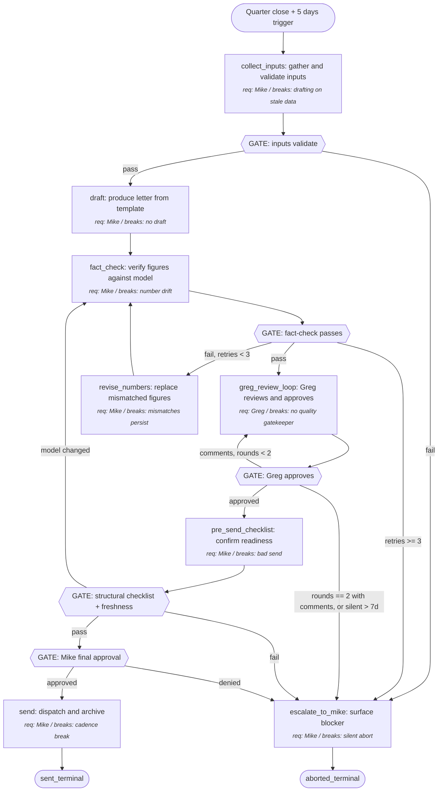

# GIX Quarterly Investor Update

This process produces a quarterly investor update document for GIX (Gigabit Internet Xchange / gixfiber.com) covering the prior quarter's operating, financial, and strategic results. A Claude Code agent collects inputs, drafts against a template, fact-checks figures against the canonical financial model, routes through a single Greg-review cycle, revises, and sends. Mike's role becomes review and final approval, not drafting from scratch.

---

## Output (Working Backwards Anchor)

- **Concrete output**: A finalized quarterly investor update — published as a Google Doc and an email-ready text version — sent to the GIX investor distribution list.
- **Success criterion**: All three must hold. (1) Greg Nugent (lead investor reviewer) approves with no more than 2 rounds of edits. (2) 100% of cited financial figures match the canonical financial model in Linglepedia. (3) Send date falls within 30 days of quarter close (hard ceiling 45 days).
- **Failure modes**: Greg requires 3+ rounds of edits — draft was thin; spec-revision triggered. Numbers mismatch model post-send — trust loss with investors; immediate corrigendum required. Send slips past 45 days — investor cadence violated; reputation cost.
- **Consumers**: GIX investors. Greg Nugent is the gatekeeper reviewer; the remaining ~6 investors are downstream readers who never edit.

## Inputs

- **financial_model**: structured data from the Linglepedia financial model note (or its linked spreadsheet)
  - Controllable: no
  - Required: yes
  - Validation: latest as-of date is within the closing quarter; every line item the letter cites is populated; freshness ≤ 7 days from quarter-close date
  - Default if missing: abort with a degraded-mode message; do NOT proceed without numbers
- **operating_highlights**: bullet list of operational events and metrics for the quarter
  - Controllable: yes
  - Required: yes
  - Validation: ≥3 highlights; each names a specific number or named milestone; sources cited (Slack thread, ops dashboard, etc.)
  - Default if missing: surface to Mike for input; do not auto-generate
- **strategic_narrative**: the through-line for the quarter (what changed strategically, why it matters)
  - Controllable: yes
  - Required: yes
  - Validation: one through-line stated explicitly; cites at least one operating or financial fact from the other inputs
  - Default if missing: surface to Mike; do not auto-generate
- **prior_letter**: the previous quarter's investor letter
  - Controllable: yes
  - Required: no
  - Validation: file exists; sent date within last 100 days; original (not post-edited) version
  - Default if missing: omit comparative references; flag in draft as first-letter or gap
- **greg_prior_feedback**: comments Greg made on the prior letter (email, doc comments, Slack)
  - Controllable: yes
  - Required: no
  - Validation: captured in writing somewhere re-readable; pairs each comment with the section it referred to
  - Default if missing: omit; flag in draft

## Preconditions

- Quarter has formally closed (last day of quarter is past).
- Financial model has been updated for the closing quarter.
- Mike is reachable for review during the run.
- Greg is reachable (or Mike escalation path is available).

## Metrics Map

The process emits metrics in four categories. Each step references which metrics it emits.

### Output Metrics (Lagging — Confirms Success)

| Metric | Definition | Captured at |
|---|---|---|
| letter.greg_edit_rounds | Count of revision cycles before Greg approves | greg_review_loop |
| letter.numbers_match_model_pct | % of cited financial figures matching the model exactly | fact_check |
| letter.days_from_quarter_close | Days between quarter-close date and send date | send |
| letter.greg_approval_received | Boolean — did Greg approve? | greg_review_loop |

### Controllable Input Metrics (Leading — The Levers)

For each controllable input, the dimensions tracked. These will evolve as we learn which dimensions correlate with output quality.

| Input | Dimension | Definition | Captured at |
|---|---|---|---|
| operating_highlights | quality | % of highlights with specific numbers vs. vague claims | collect_inputs |
| operating_highlights | volume | count of highlights provided | collect_inputs |
| operating_highlights | recency | mean age of highlights in days | collect_inputs |
| strategic_narrative | quality | through-line stated explicitly (boolean) | collect_inputs |
| strategic_narrative | volume | paragraph count | collect_inputs |
| prior_letter | source | used vs. not used vs. missing | collect_inputs |
| prior_letter | recency | days since prior letter sent | collect_inputs |
| greg_prior_feedback | volume | count of prior comments incorporated into this draft | draft |
| greg_prior_feedback | source | which prior letter the feedback was on | collect_inputs |
| financial_model | recency | days since model last updated (freshness check) | collect_inputs |

### Agent Performance Metrics (Per Step — Mandatory)

Every step emits the standard performance metrics block: latency, retry count, confidence/uncertainty signal, clarification requests, failure events, unexpected-path events. The procedure references this set as "standard performance" rather than restating per step.

Step-specific additions beyond the standard set:

| Step ID | Additional metric | Definition |
|---|---|---|
| fact_check | mismatch_count | number of figures that did not match the model on the first pass |
| fact_check | model_lookup_count | number of times the model was queried during this fact-check pass |
| greg_review_loop | comments_received | count of distinct comments Greg returned |
| greg_review_loop | comments_accepted_pct | % of Greg's comments incorporated into the next revision |
| draft | template_sections_filled | count of template sections populated from inputs |

### Process Health Metrics

| Metric | Definition |
|---|---|
| End-to-end cycle time | Time from collect_inputs start to send terminal state |
| Cost per run | Agent token cost + Mike's review-time minutes + Greg's review-time minutes |
| Throughput | Runs per year (target: 4) |
| Parallelization efficiency | Observed input-collection wall time vs. theoretical parallel max |

### Anecdote and Exception Capture

- **Anecdotes**: every quarter's full pre-Greg draft and final-sent version are archived as a diff plus Greg's verbatim comments to `<vault>/gix/investor-updates/<YYYY-Qn>/anecdotes/`.
- **Exceptions**: any of the following triggers a detailed event log: any figure mismatch (per occurrence), cycle time >45 days, edit_rounds >2, financial model freshness >7 days at draft start, fact-check retry budget exhausted.

## Procedure (Canonical)

1. **collect_inputs**: gather all five named inputs from their sources.
   - Action: in parallel — read financial_model from Linglepedia, prompt Mike for operating_highlights and strategic_narrative, locate prior_letter, locate greg_prior_feedback.
   - Inputs: financial_model, operating_highlights, strategic_narrative, prior_letter, greg_prior_feedback
   - Outputs: input bundle with validation status per input
   - Metrics: standard performance + controllable input metrics emitted here
   - Successors:
     - if all required inputs validate: → draft
     - if any required input fails validation: → escalate_to_mike

2. **draft**: produce the first-pass investor letter from the template using the validated inputs.
   - Action: fill the investor-letter template — opening narrative, operating highlights section, financials section, strategic outlook, sign-off — using the strategic_narrative as the through-line.
   - Inputs: collect_inputs output
   - Outputs: draft markdown + Google Doc
   - Metrics: standard performance + template_sections_filled
   - Successors:
     - always: → fact_check

3. **fact_check**: verify every cited financial figure against the canonical model.
   - Action: extract each numeric claim from the draft; for each, query the financial model; compare with consistent rounding (1 decimal in letter, full-precision compare in model); record mismatches.
   - Inputs: draft, financial_model
   - Outputs: pass / fail with mismatch list
   - Metrics: standard performance + mismatch_count, model_lookup_count
   - Successors:
     - if mismatch_count == 0: → greg_review_loop
     - if mismatch_count > 0 AND fact_check retries < 3: → revise_numbers
     - if fact_check retries >= 3: → escalate_to_mike

4. **revise_numbers**: re-pull and re-insert the mismatched figures into the draft.
   - Action: for each mismatched figure, fetch the canonical value, replace in the draft, re-run consistency check.
   - Inputs: fact_check mismatch list, financial_model
   - Outputs: revised draft
   - Metrics: standard performance
   - Successors:
     - always: → fact_check

5. **greg_review_loop**: send draft to Greg, receive feedback, revise.
   - Action: share the Google Doc with Greg with a 5-business-day SLA; on receipt of comments, increment edit_rounds and revise; the success criterion permits up to 2 rounds, so escalate only when a 3rd round would be required.
   - Inputs: fact-checked draft, greg_prior_feedback patterns
   - Outputs: Greg-approved draft OR escalation
   - Metrics: standard performance + comments_received, comments_accepted_pct, greg_edit_rounds
   - Successors:
     - if Greg approves AND edit_rounds <= 2: → pre_send_checklist
     - if Greg has more comments AND edit_rounds < 2: → greg_review_loop (next round)
     - if Greg has more comments AND edit_rounds == 2: → escalate_to_mike (would exceed success criterion)
     - if Greg unresponsive >7 days: → escalate_to_mike

6. **pre_send_checklist**: confirm everything is ready before send.
   - Action: verify subject line, recipient list, attachments (or doc link), send-window timing; re-check financial-model freshness (final guard against late-stage model amendments after fact_check passed); then route to Mike for explicit final approval.
   - Inputs: Greg-approved draft, investor distribution list, financial_model
   - Outputs: send-ready package
   - Metrics: standard performance
   - Successors:
     - if all structural checks pass AND days_from_close <= 45 AND model unchanged since fact_check: → send (after human gate clears)
     - if model changed since fact_check: → fact_check (re-verify; not a retry of mismatches but a re-pull)
     - if any structural check fails OR days_from_close > 45: → escalate_to_mike

7. **send**: dispatch the letter to the investor distribution list and archive.
   - Action: send the email with the doc link or attached PDF; archive the final version to Linglepedia and Drive; log all metrics. Standard performance metrics emitted on completion.
   - Inputs: send-ready package
   - Outputs: confirmation of send + archive
   - Metrics: standard performance
   - Successors:
     - always: → sent_terminal

8. **escalate_to_mike**: surface a blocker and pause for human decision.
   - Action: write a structured escalation note (which step triggered, why, what the agent tried) and notify Mike; wait for instruction. Standard performance metrics emitted including escalation reason.
   - Inputs: escalation context
   - Outputs: human-decision input
   - Metrics: standard performance
   - Successors (Mike's resume target MUST be one of the enumerated legal targets below; any other instruction is rejected and Mike is re-prompted):
     - if Mike directs resume to collect_inputs: → collect_inputs
     - if Mike directs resume to draft: → draft
     - if Mike directs resume to fact_check: → fact_check
     - if Mike directs resume to greg_review_loop: → greg_review_loop
     - if Mike directs resume to pre_send_checklist: → pre_send_checklist
     - if Mike aborts: → aborted_terminal

9. **sent_terminal**: process completed successfully — letter is in investor inboxes and archived.
   - Action: terminal state; no further action.
   - Inputs: send confirmation
   - Outputs: final metrics record
   - Metrics: standard performance
   - Successors:
     - (none — terminal state)

10. **aborted_terminal**: process aborted by Mike via escalation. Partial state preserved.
    - Action: terminal state; no further action.
    - Inputs: Mike's abort instruction
    - Outputs: partial-state archive
    - Metrics: standard performance
    - Successors:
      - (none — terminal state)

## Gates (Verification Decisions in the Process)

| Gate ID | Location (between steps) | Verifies | Method | On failure | Notes |
|---|---|---|---|---|---|
| gate_inputs_valid | collect_inputs → draft | All required inputs validate per their Validation criteria | script | route to escalate_to_mike | Deterministic field/freshness check |
| gate_fact_check | fact_check → greg_review_loop | mismatch_count == 0 against the financial model | script | route to revise_numbers (≤3 retries) | The structural fix to the chaos |
| gate_greg_approval | greg_review_loop → pre_send_checklist | Greg has explicitly approved AND edit_rounds <= 2 | human | route to escalate_to_mike | Greg is the named human reviewer |
| gate_pre_send_agent | pre_send_checklist → gate_pre_send_human | Subject line + recipients + attachments + within 45 days are all set | agent | route to escalate_to_mike | Deterministic structural checks the agent runs first |
| gate_pre_send_human | gate_pre_send_agent → send | Mike has explicitly approved the final draft for send | human | route to escalate_to_mike | Hard human checkpoint; agent must NOT auto-clear |

## Requirement Owners

| Step ID | Description | Decided by | Failure mode if removed |
|---|---|---|---|
| collect_inputs | Gather and validate all required inputs | Mike Lingle | Drafting starts on missing/stale data; outputs are wrong |
| draft | Produce first-pass letter from template | Mike Lingle | No draft to review; process never produces output |
| fact_check | Verify every cited figure against the model | Mike Lingle | Numbers in letter drift from model; trust loss with investors |
| revise_numbers | Replace mismatched figures with canonical values | Mike Lingle | Mismatches persist; fact-check loop never converges |
| greg_review_loop | Greg reviews and approves the draft | Greg Nugent | No qualitative gatekeeper; weak letters ship |
| pre_send_checklist | Confirm send readiness, including model freshness re-check | Mike Lingle | Send happens with wrong recipients, missing attachments, past-window, or stale figures |
| send | Dispatch and archive the letter | Mike Lingle | Letter never reaches investors; cadence breaks |
| escalate_to_mike | Surface blockers requiring human decision; resume only to enumerated legal targets | Mike Lingle | Agent silently aborts, proceeds incorrectly, or resumes to an illegal state when stuck |
| sent_terminal | Successful end state | Mike Lingle | No way to mark the run complete |
| aborted_terminal | Aborted end state preserving partial work | Mike Lingle | Aborted runs leak state with no closure |

## Decision Rules

**Inputs validate**
- Criterion: every Required input passes its Validation rule (boolean AND across required inputs).
- "Yes" branch conditions: financial_model present and fresh; ≥3 operating_highlights with numbers; strategic_narrative has explicit through-line.
- "No" branch conditions: any required input missing, malformed, or stale.
- Edge case handling: financial model freshness exactly 7 days → treat as pass (boundary inclusive).

**Fact-check pass**
- Criterion: mismatch_count == 0 after rounding-normalized comparison.
- "Yes" branch conditions: every cited figure equals model value to declared precision.
- "No" branch conditions: any cited figure differs from model.
- Edge case handling: rounding causes apparent mismatch — resolve by rounding consistently (1 decimal in letter, full-precision in model); units differ ($1.2M vs 1,200,000) — normalize to letter format before compare.

**Greg approves**
- Criterion: Greg's most recent response contains at least one of the enumerated approval tokens AND there are no unresolved open comments on the doc. Approval token set (case-insensitive substring match): `approved`, `approve`, `send it`, `lgtm`, `looks good`, `ship it`, `go ahead`, `all good`. Anything else is treated as "not approved" by default.
- "Yes" branch conditions: Greg's response matches the token set AND open-comment count == 0.
- "No" branch conditions: response does not match the token set OR open-comment count > 0 OR no response within SLA.
- Edge case handling: Greg sends partial feedback ("more later") — token absent → no; Greg silent >7 days — escalate; Greg approves with conditions ("fix X then send") — token present but open comments remain → no, do another round; ambiguous response that the agent cannot classify with the token set — surface to Mike for human classification.

**Send-window check**
- Criterion: days_from_quarter_close <= 45.
- "Yes" branch conditions: today is within 45 days of last day of closing quarter.
- "No" branch conditions: more than 45 days.
- Edge case handling: day 44 with partial Greg approval — escalate to Mike for go/no-go.

## Edge Cases

| Edge case | Trigger | Handling |
|---|---|---|
| Financial model not yet updated | collect_inputs runs before quarter close + 7 days | Block at gate_inputs_valid; surface freshness violation; route to escalate_to_mike |
| Operating highlights vague (no numbers) | Mike provides bullets without specific metrics | Validation fails; agent prompts Mike for one concrete number per bullet |
| First-ever letter (no prior letter) | prior_letter input missing on first run | Skip comparative references; note in draft body that this is the inaugural letter |
| Numbers updated mid-draft | Financial model is updated between collect_inputs and fact_check | At fact_check, re-pull all cited figures from the live model; if any drifted, route to revise_numbers |
| Rounding ambiguity | Letter rounds to 1 decimal, model has 3 | Normalize: letter precision is 1 decimal; compare full-precision model value rounded to 1 decimal |
| Greg unresponsive | No response for >7 days after share | Escalate to Mike; Mike decides to extend SLA, send anyway, or push to next quarter |
| Greg requires 3+ rounds | edit_rounds reaches 2 with comments still open | Escalate to Mike; do not silently continue looping |
| Send fails (bounce / permission error) | Email rejected or Drive permissions wrong | Retry once; on second failure, route to escalate_to_mike |
| Conflicting highlights | Slack thread says X happened, ops dashboard says Y | Surface conflict at draft step; ask Mike to reconcile before drafting that section |
| Financial model unreachable | Cannot read the model file | Log degraded-mode; abort with explicit message; do NOT draft without numbers |
| Sparse but legitimately quiet quarter | <3 operating highlights AND Mike attests "this was actually a quiet quarter" via escalate_to_mike | Treat as valid input; relax the ≥3 highlights validation for this run only; record `quiet_quarter: true` in metrics so the input metric can distinguish "thin highlights from sparse reality" from "thin highlights from missed inputs" |
| Financial model amended after fact_check passes | Model freshness check at pre_send_checklist detects newer model timestamp than at fact_check | Route back to fact_check (re-pull all cited figures); on a clean re-pull, continue to pre_send_checklist; this prevents the post-fact-check window from leaking stale numbers |

## Terminal States

- **sent_terminal**: letter sent to all investors; archive complete; metrics logged. Process ends successfully.
- **aborted_terminal**: Mike aborted the run via escalate_to_mike. Process ends; partial state preserved for next attempt.

## Parallelization

- **Parallel sections**: collect_inputs reads its five inputs in parallel (financial_model, operating_highlights prompt, strategic_narrative prompt, prior_letter, greg_prior_feedback are all independent fetches/prompts).
- **Sequential sections**: draft → fact_check → greg_review_loop → pre_send_checklist → send must run in order; each depends on the prior's output.
- **Join points**: collect_inputs converges all five inputs before draft; fact_check converges revision attempts before greg_review_loop.
- **Shared state**: input bundle is shared read-only across draft and fact_check. Draft text is mutated through revise_numbers and greg_review_loop revisions; latest version is canonical.
- **Coordination**: races avoided because mutations happen sequentially after collect_inputs completes.

## Diagram (Derived, Human-Readable)

## Verification Suite

The checks the spec must pass before being handed to a build agent. Defined before drafting (TDD).

| Check | Type | Method |
|---|---|---|
| Every step ID in successors exists | structural | script |
| Every step has a requirement owner | structural | script |
| Every input has documented validation | structural | script |
| Mermaid block parses | structural | script |
| Metrics Map covers all four categories | structural | script |
| Every controllable input has ≥1 tracked dimension | structural | script |
| Every step node displays owner annotation | structural | script |
| Every gate names a verification method | structural | script |
| At least one terminal state reachable | structural | script |
| No unreachable non-terminal nodes | structural | script |
| No unbounded loops | structural | script |
| Every step references standard performance metrics | structural | script |
| Decision rules resolve on input alone | semantic | agent |
| Output is concrete (noun, not verb) | semantic | agent |
| Spec matches design conversation intent | semantic | agent |
| Fact-check gate appears before Greg-review | semantic | agent |
| Send step has pre-send checklist criteria | semantic | agent |
| Bounded retry on fact-check loop | structural | script (covered by no-unbounded-loop check) |

## Metrics Review Plan (DMAIC Control Phase)

This process generates execution data; that data is reviewed periodically and feeds back into spec refinement. To run a review session, invoke the sibling `dmaic` skill (`Skill(dmaic)`) — it walks Define → Measure → Analyze → Improve → Control over the metrics named above and writes back a refined spec when changes are warranted.

- **Cadence**: after every run (quarterly), with a deeper review every 4 runs (annually).
- **Trigger conditions**: any of the following force a spec revisit before scheduled cadence:
  - Sustained agent confusion at a step (clarification requests >20% of executions on a step over 4 runs)
  - Controllable input found to be irrelevant (no correlation between operating_highlights.quality and greg_edit_rounds after 4 runs)
  - Output quality drift (greg_edit_rounds trending up across runs)
  - Fact-check retry budget exhausted on any run
  - Cycle time exceeds 45 days
- **Decision rights**: Mike Lingle reviews; Mike decides on spec changes. Greg may be consulted on review-loop metrics.
- **Review artifact**: `<vault>/gix/investor-updates/review-<YYYY-Qn>.md` — created by the `dmaic` skill.
- **Expected variation**: greg_edit_rounds normal range 1–2; cycle time 14–30 days; mismatch_count normal range 0 (any non-zero is signal, not noise).

## Build Notes

Architectural guidance for the implementer. The build agent decides implementation mechanisms.

- **Honor strictly**: decision rules, edge case handling, success criterion, gates with their named verification methods, metrics specifications, the fact-check-before-Greg ordering. Non-negotiable.
- **Use judgment on**: implementation language (Python likely), library choice, file structure, naming within reason, telemetry storage backend, specific capture mechanism, exact prompt wording for Mike-input collection.
- **Ask before deviating**: anything else; default to asking rather than assuming. Specifically ask before changing any gate's verification method (script vs. agent vs. human).
- **Telemetry capture**: deterministic capture appropriate to Claude Code — hooks (`PreToolUse`, `PostToolUse`, `Stop`), MCP servers, structured tool result parsing. Capture must fire on every run regardless of agent state.
- **Telemetry storage**: `<vault>/gix/investor-updates/<YYYY-Qn>/metrics.jsonl` (one event per line). Anecdotes and exceptions go to sibling files in the same directory.
- **Graceful degradation**: if telemetry storage is unreachable, the process completes with output and logs a degraded-mode warning. Output correctness must not depend on telemetry working.
- **Known constraints**: Linglepedia path varies by environment; agent should accept it as a config parameter or env var, not hardcode. Greg's email/Slack handles must come from a config, not be inferred. Run timing (5 days post quarter-close) should be a calendar trigger or scheduled task, not a manual kick.
- **Out of scope**: do NOT auto-send without Mike's final approval at pre_send_checklist. Do NOT modify the canonical financial model. Do NOT alter Greg's distribution-list membership.

## Assumptions and Open Questions

- Greg = Greg Nugent, the GIX lead investor reviewer. (Assumed from user prompt.)
- Financial model lives in Linglepedia. Exact note path or linked spreadsheet location to be specified by Mike at build time.
- Investor distribution list is maintained somewhere (Drive doc, contact group). Build agent should ask Mike where on first run, then cache the location.
- "Quarter close" = end of calendar quarter (Mar 31, Jun 30, Sep 30, Dec 31). If GIX runs on a different fiscal calendar, Mike confirms at build time.
- The 30-day target / 45-day hard ceiling are starting heuristics; they may be tightened or relaxed after several runs based on cycle-time data.
- **Watch-item (Phase 7 borderline finding F3):** `comments_accepted_pct` is not strictly a vanity metric, but it is borderline. After 4 runs, review whether it correlates with `letter.greg_edit_rounds` or with letter quality independently judged. If it's not signal-bearing, replace with a paired metric (e.g., comments_accepted_that_reduced_next_round).
- The qa-agents Phase 7 pass ran in inline simulation (Task tool unavailable). Re-run Phase 7 against this spec from a runtime with subagent capability before treating the spec as production-grade.

## Verification Record

- **QA Agents pattern run:** 2026-04-27 — Finder total 32 (8 findings: 1 critical=0, some-impact=6, low-impact=2). Auditor disprovals attempted: 2. Referee rulings: 1 UPHOLD-DISPROOF (F2), 1 UPHOLD-FINDING (F5), 1 weak_flag WEAK (F3).
- **Path coverage:** all 8 named procedure steps and 4 gates appear in the diagram and resolve via successors.
- **Issues resolved:** 6 (F1 untestable Greg-approval rule → enumerated token set; F4 post-fact-check model amendment → freshness re-check at pre_send_checklist; F5 sparse-quarter handling → new edge-case row + quiet_quarter metric; F6 internal contradiction on edit_rounds boundary → reconciled to allow exactly 2 rounds per success criterion; F7 gate_pre_send method mismatch → split into gate_pre_send_agent (script) + gate_pre_send_human (human); F8 open-ended escalate resume → enumerated legal resume targets).
- **Issues deferred to Assumptions:** 1 (F3 — comments_accepted_pct watch-item; review after 4 runs).
- **Issues disputed (no spec change):** 1 (F2 — day-44 partial-approval case is caught one gate earlier; spec is internally consistent).
- **Phase 4 mode:** inline_simulation — Task tool unavailable; sub-types 4.1–4.4 run sequentially in this context. Adversarial isolation between sub-types is partial; treat 4.5 integration as lower-confidence than a fan-out pass.
- **Phase 7 simulation note:** qa-agents skill not reachable (Task tool unavailable in this runtime; the qa-agents internal pattern requires three isolated Task subagents). Finder/auditor/referee simulated inline. Adversarial isolation collapsed. Treat findings as lower-confidence than a real qa-agents pass; re-run Phase 7 against this spec from a runtime with subagent capability before treating the spec as production-grade.

## Change Log

- 2026-04-27: Created via `process-design` skill (iteration-2 / eval-0-investor-update)
