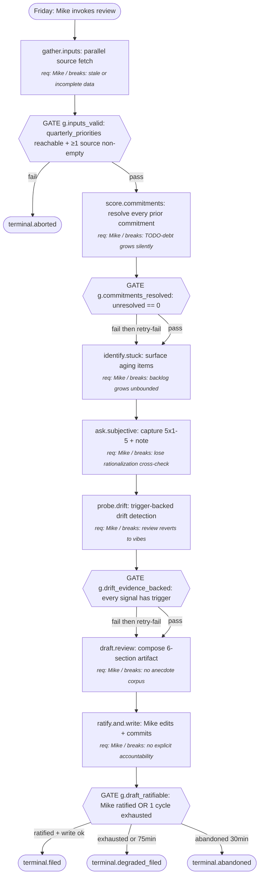

# Weekly Review (Friday Reflection → Next-Week Focus)

This process produces a structured weekly-review markdown artifact every Friday. Mike runs it at the end of his work week across multiple businesses (GIX, Wasson Enterprise, Linglepedia, skills work). The artifact resolves prior-week commitments, surfaces drift signals against quarterly priorities from concrete triggers, and sets 3–5 focus commitments for the next week — each tied to at least one leading indicator. Replaces a 30–60 min intuitive practice that produced uneven quality and no measurement of drift.

---

## Output (Working Backwards Anchor)

- **Concrete output**: A markdown file `weekly-review-YYYY-Www.md` (ISO week numbering — e.g., `weekly-review-2026-W17.md`) committed to a known location, containing six fixed sections: `## Header` (week, prior-review link, generated-at), `## Shipped`, `## Stuck`, `## Drift Signals`, `## Subjective State`, `## Next-Week Focus`. YAML frontmatter holds structured fields (review_id, prior_review_id, week_iso, cycle_time_min, drift_count, carry_forward_count, focus_count, status).
- **Success criterion**:
  - Produced in ≤45 min wall-clock (cap 75; >75 min = degraded).
  - Every prior-week commitment from `prior_review.md` is resolved as exactly one of `kept | missed | partial | rolled` in the Shipped/Stuck sections — zero unresolved.
  - At least one Drift Signals row is present, each with a named trigger (numeric threshold or named pattern), each marked `flagged | not-flagged-justified`. No vibes-only rows.
  - 3–5 commitments in Next-Week Focus, each with: business tag, named leading indicator (controllable input metric), and an explicit success/failure condition.
  - Quarterly priorities re-evaluated for staleness at least once.
- **Failure modes**:
  - Skipped week (no artifact produced) → tracked as `review_skipped`, prior commitments roll forward with debt counter ++.
  - Vibes-only drift (Drift Signals row without trigger) → blocks promotion of artifact to `status: filed`; row must be revised or dropped.
  - >5 commitments → blocks promotion (deletion-discipline violation).
  - <3 commitments → allowed but logged as `under-committed=true`.
  - Cycle time >75 min → artifact still completes, but logged as degraded; review-of-the-review next week is mandatory.
  - Prior commitments unresolved → blocks promotion; loop back to Score step.
- **Consumers**:
  1. Mike, deciding next week's focus on Monday morning.
  2. Next Friday's review (which reads this one as `prior_review`).
  3. Monthly DMAIC review (run via `Skill(dmaic)`) over the corpus of weekly artifacts to detect process drift.
  4. Future Mike re-grounding context after a vacation, illness, or leadership pivot.

## Inputs

For each input the process consumes:

- **completed_items**: list of items completed in the past 7 days. Source: GitHub commits + PR merges, Asana/Linear task closes, Linglepedia note creation events, Drive file landings.
  - Controllable: yes
  - Required: yes
  - Validation: list with ≥1 item where each row has `{id, source, business_tag, completed_at}`; reject if no source field.
  - Default if missing: surface as `gather.degraded=true`; require Mike to confirm whether the week was empty or the source query failed.
- **todos**: open commitments and TODO-debt across all systems (Asana, Linear, Linglepedia inbox, code TODOs scoped to active branches).
  - Controllable: yes
  - Required: no
  - Validation: each item has `{id, source, business_tag, opened_at, last_touched_at}`; allow empty list.
  - Default if missing: empty-list fallback; flag `todos.degraded=true` if a source was queried and returned an error (so this is distinct from a clean empty list).
- **prior_review**: last week's `weekly-review-*.md` file.
  - Controllable: yes
  - Required: yes (if exists)
  - Validation: file exists and has a Next-Week Focus section parseable into commitments. If the file exists but is unparseable, treat as schema break — do not silently fall back to empty.
  - Default if missing: first-run mode (week 1 of the practice or post-skipped-week); commitments_carried_forward_pct = 0/0 (vacuous).
- **quarterly_priorities**: the 3–5 explicit quarterly priorities Mike committed to at the start of the quarter, with their leading indicators.
  - Controllable: yes
  - Required: yes
  - Validation: at least 3 priorities, each with at least one named leading indicator metric and a target.
  - Default if missing: block process at gather step with explicit error — quarterly priorities are the drift-detection ground truth and the process is meaningless without them.
- **subjective_state**: Mike's self-assessment for the week along five 1-5 scales: energy, focus, alignment-to-priorities, agentic-leverage, decision-quality. Captured via interactive prompt at process runtime.
  - Controllable: yes
  - Required: yes
  - Validation: five integer scores 1-5 plus a free-text 1-3 sentence note.
  - Default if missing: 20-min wait-then-default; if Mike walks away, scores recorded as `null` and `subjective.degraded=true` flag set.
- **calendar**: Google Calendar events (past 7 days), used to compute time-spent-by-business and to detect spoken commitments made in meetings that didn't make it to a TODO list.
  - Controllable: no
  - Required: no
  - Validation: list of events with `{start, end, attendees, title, business_tag_inferred}`.
  - Default if missing: skip the calendar-cross-check sub-step in probe.drift; flag `calendar.degraded=true`.

## Preconditions

- It is Friday (or Mike has explicitly chosen to run a deferred review on Sat/Sun — flagged as deferred).
- The `weekly-review-YYYY-Www.md` file for the current ISO week does not already exist (otherwise: resume mode, not new run).
- `quarterly_priorities` source is reachable. If not, abort with explicit error — see Inputs.

## Metrics Map

The process emits metrics in four categories. Each step in the procedure references which metrics it emits.

### Output Metrics (Lagging — Confirms Success)

| Metric | Definition | Captured at |
|---|---|---|
| review_completed | Boolean: artifact reached terminal.filed | terminal.filed |
| commitments_resolved_pct | % of prior-week commitments resolved (kept+missed+partial+rolled) / total | score.commitments |
| commitments_kept_pct | % of prior-week commitments resolved as `kept` (partial counts as 0.5; missed and rolled count as 0) | score.commitments |
| drift_signals_flagged_count | Number of drift signals raised this week (flagged rows only) | probe.drift |
| next_week_focus_count | Number of commitments in Next-Week Focus (target 3-5) | draft.review |
| review_cycle_time_min | Wall-clock minutes from gather.inputs start to ratify.and.write end | terminal.filed |
| review_skipped | Boolean: did Friday pass with no review run? | external (cron / weekly health check) |

### Controllable Input Metrics (Leading — The Levers)

For each controllable input, the dimensions tracked. Over time, this data reveals which inputs actually move the output. Expect these metrics to evolve as the Metrics Review Plan refines them.

| Input | Dimension | Definition | Captured at |
|---|---|---|---|
| completed_items | volume | count of items in the input list | gather.inputs |
| completed_items | source | distribution by source (github/asana/linear/vault/drive) | gather.inputs |
| completed_items | business_tag | distribution by business (GIX/WE/Linglepedia/skills/personal) | gather.inputs |
| todos | volume | count of open todos at review start | gather.inputs |
| todos | recency | median days since last_touched_at | gather.inputs |
| todos | growth_delta | volume change vs. prior_review.todos.volume (TODO-debt direction) | gather.inputs |
| prior_review | parseability | parsed_commitment_count vs. textual commitment lines (parser sanity) | gather.inputs |
| prior_review | recency | days between prior_review.created and now | gather.inputs |
| quarterly_priorities | staleness_days | days since quarterly_priorities last updated | gather.inputs |
| quarterly_priorities | leading_indicator_coverage | % of priorities with ≥1 named leading indicator | gather.inputs |
| subjective_state | alignment_score | self-reported alignment-to-priorities (1-5) | ask.subjective |
| subjective_state | rationalization_flag | does subjective alignment score conflict with drift signal count? | probe.drift |

### Agent Performance Metrics (Per Step — Mandatory)

Every step in the procedure emits the standard performance metrics: latency, retry count, confidence/uncertainty signal, clarification requests, failure events, unexpected-path events.

Step-specific additions beyond the standard set:

| Step ID | Additional metric | Definition |
|---|---|---|
| score.commitments | match_method | exact-id / fuzzy-text / human-judged — distribution per run |
| probe.drift | candidates_considered | count of potential drift signals evaluated (raised + not-flagged-justified) |
| probe.drift | trigger_type_distribution | breakdown of triggers used (numeric_threshold / pattern / quarterly_indicator) |
| ratify.and.write | edits_count | edits Mike made between draft and ratified version |
| ratify.and.write | rejection_count | drift signals or focus items removed during ratify |

### Process Health Metrics

| Metric | Definition |
|---|---|
| End-to-end cycle time | Wall-clock minutes from gather.inputs start to terminal.filed (degraded threshold: >75 min) |
| Cost per run | API calls, agent compute, Mike's elapsed time |
| Throughput | weekly-review.completed_count / weeks_elapsed (target: ≥0.9 over a quarter) |
| Parallelization efficiency | gather.inputs sub-fetches: observed wall-clock vs. sum of source-query times |
| Streak | consecutive Fridays where the review reached terminal.filed OR terminal.degraded_filed (artifact written counts; abandoned and aborted break the streak; skipped weeks break the streak) |

### Anecdote and Exception Capture

Beyond aggregate metrics:

- **Anecdotes**: Each weekly artifact IS the anecdote — full prose lives in the markdown file. The Metrics Review Plan reads the corpus, not just the aggregates. Notable individual reviews (drift_count >5, cycle_time >75, week-skipped, ratify.edits_count >20) are pinned in a `notable-reviews.md` index for monthly DMAIC review.
- **Exceptions**: triggers that produce a detail log beyond standard metrics:
  - cycle_time > 75 min → log all step latencies + Mike-elapsed (interactive wait time) breakdown
  - drift_signals_flagged_count > 5 → log full candidates_considered list + trigger evidence per signal
  - commitments_carried_forward_pct > 50% → log per-commitment reasons + flag for monthly review
  - todos.growth_delta > 20% → log TODO source distribution and oldest-touched samples
  - subjective_state alignment_score ≤ 2 AND drift_signals_flagged_count = 0 → log as potential rationalization (subjective says aligned, no concrete drift; or subjective says unaligned, no concrete signals — both directions)
  - review_skipped → log next Friday with reason captured

## Procedure (Canonical)

1. **gather.inputs**: Pull all inputs concurrently from their sources.
   - Action: fan-out fetch — completed_items, todos, prior_review, quarterly_priorities, calendar pulled in parallel; subjective_state deferred to ask.subjective step.
   - Inputs: completed_items, todos, prior_review, quarterly_priorities, calendar (subjective_state captured later)
   - Outputs: validated input bundle with per-input degraded-flags
   - Metrics: standard performance metrics + all controllable input metrics named in Metrics Map above
   - Successors:
     - if quarterly_priorities missing or unparseable: → Terminal (terminal.aborted)
     - if all required inputs validated: → score.commitments

2. **score.commitments**: Resolve every prior-week commitment from prior_review against this week's completed_items + todos + calendar.
   - Action: for each commitment in prior_review.next_week_focus, classify as kept / missed / partial / rolled. Match by stable ID first; fall back to fuzzy text match against completed_items.title (≥0.78 cosine sim, model: sentence-transformers/all-MiniLM-L6-v2 or equivalent — record model used); if neither resolves, ask Mike (human-judged).
   - Inputs: prior_review.next_week_focus, completed_items, todos, calendar
   - Outputs: classified_commitments[], unresolved_count
   - Metrics: standard performance metrics + score.commitments.match_method
   - Successors:
     - if unresolved_count == 0: → identify.stuck
     - if unresolved_count > 0 after one human-judgment pass: → identify.stuck (Gate g.commitments_resolved fires; one retry of human-judgment, then soft-fail with `unresolved=N` and proceed)

3. **identify.stuck**: From the todos input, identify items that are stuck (open >14 days OR opened-then-untouched-for-14-days OR re-described in prior_review without progress).
   - Action: filter todos by stuck criteria; cross-check against classified_commitments[partial+missed]; produce stuck_list with per-item reason and proposed disposition (continue / kill / defer).
   - Inputs: todos, classified_commitments, prior_review
   - Outputs: stuck_list[]
   - Metrics: standard performance metrics
   - Successors:
     - always: → ask.subjective

4. **ask.subjective**: Capture Mike's subjective state via interactive prompt.
   - Action: prompt for the five 1-5 scores + 1-3 sentence note. Validate input format. Wait up to 20 min; if no response, record nulls + subjective.degraded=true + continue.
   - Inputs: (interactive)
   - Outputs: subjective_state record
   - Metrics: standard performance metrics + interactive_wait_ms
   - Successors:
     - always: → probe.drift

5. **probe.drift**: Probe for drift signals against quarterly_priorities — evidence-based, not vibes.
   - Action: for each quarterly priority, evaluate ≥3 candidate signals from this week's data. Each candidate must be backed by a numeric threshold OR named pattern OR quarterly_indicator gap. Produce drift_signals[] each marked flagged | not-flagged-justified. Cross-check subjective.alignment_score: if score ≤2 with zero flagged signals, OR score ≥4 with ≥3 flagged signals, mark probe.rationalization_suspected=true and surface to Mike.
   - Inputs: quarterly_priorities, completed_items, calendar, todos, subjective_state
   - Outputs: drift_signals[], rationalization_suspected
   - Metrics: standard performance metrics + probe.drift.candidates_considered + probe.drift.trigger_type_distribution
   - Successors:
     - always: → draft.review

6. **draft.review**: Compose the markdown draft.
   - Action: assemble the six sections from prior step outputs. Generate Next-Week Focus as 3-5 commitments, each tied to ≥1 leading indicator drawn from quarterly_priorities or carry-forward from stuck_list. If <3 candidates exist, source from a fallback chain: (a) carry-forward stuck items, (b) quarterly_priorities with weakest indicator-coverage, (c) explicit slack/recovery commitment, (d) ask Mike. Apply deletion bias — propose ≤5 hard cap; surface candidates beyond 5 as deferred to next-next-week.
   - Inputs: classified_commitments, stuck_list, subjective_state, drift_signals, quarterly_priorities
   - Outputs: draft markdown text
   - Metrics: standard performance metrics
   - Successors:
     - always: → ratify.and.write

7. **ratify.and.write**: Mike reviews the draft, edits as needed, ratifies; agent writes final to disk.
   - Action: present draft to Mike; he edits (especially Next-Week Focus and drift signals); on ratify, write final artifact + frontmatter + commit/file. Bounded edit pass: exactly one full review cycle. If after one pass Mike is not satisfied, write artifact with frontmatter `incomplete_draft=true` and surface as carry-into-next-week.
   - Inputs: draft text, Mike (interactive)
   - Outputs: weekly-review-YYYY-Www.md on disk
   - Metrics: standard performance metrics + ratify.and.write.edits_count + ratify.and.write.rejection_count
   - Successors:
     - if Mike ratifies and write succeeds: → Terminal (terminal.filed)
     - if Mike abandons (>30 min idle in ratify): → Terminal (terminal.abandoned)
     - if cycle_time exceeds 75 min cap during ratify: → Terminal (terminal.degraded_filed — artifact still written, marked degraded)

## Gates (Verification Decisions in the Process)

| Gate ID | Location (between steps) | Verifies | Method | On failure |
|---|---|---|---|---|
| g.inputs_valid | gather.inputs → score.commitments | quarterly_priorities reachable + parseable; ≥1 of (completed_items OR todos) non-empty | script | abort to terminal.aborted with reason |
| g.commitments_resolved | score.commitments → identify.stuck | unresolved_count == 0 after human-judgment pass | script | one retry through human-judgment; on second fail soft-fail with `unresolved=N` flag and proceed to identify.stuck |
| g.drift_evidence_backed | probe.drift → draft.review | every drift_signals row has trigger field non-empty | script | loop back to probe.drift to add trigger; max 1 retry then write row as not-flagged-justified |
| g.draft_ratifiable | ratify.and.write internal | Mike ratified OR exactly one edit cycle exhausted | human | on second non-ratify: write with incomplete_draft=true and exit to terminal.degraded_filed |
| g.cycle_time | continuous | wall-clock ≤ 75 min | script | log degraded_mode=true; do NOT abort — continue to terminal.degraded_filed |

## Requirement Owners

| Step ID | Description | Decided by | Failure mode if removed |
|---|---|---|---|
| gather.inputs | Pull all source data concurrently | Mike | Review runs on stale or incomplete data; metrics on input dimensions are unobservable; controllable-input lever map collapses |
| score.commitments | Resolve every prior commitment | Mike | TODO-debt grows silently; commitments_kept_pct undefined; the practice loses its accountability loop |
| identify.stuck | Surface items aging silently | Mike | Stuck items hide; no kill/defer discipline; backlog grows unbounded |
| ask.subjective | Capture Mike's self-assessment | Mike | Loses the rationalization cross-check signal; loses anecdotal context for monthly DMAIC review |
| probe.drift | Trigger-backed drift detection | Mike | The whole point of this redesign disappears — review reverts to vibes |
| draft.review | Compose structured artifact | Mike | No artifact = no anecdote corpus = monthly DMAIC review has no input |
| ratify.and.write | Mike reviews and commits | Mike | Draft might encode wrong understanding; no explicit accountability for what gets shipped |

## Decision Rules

**DR1 — Commitment match method (in score.commitments)**
- Criterion: a commitment from prior_review is matched against completed_items by progressive fallback — (1) stable ID match, (2) fuzzy text match against title with cosine similarity ≥ 0.78 using sentence-transformers/all-MiniLM-L6-v2 (or named substitute, recorded per run), (3) human judgment.
- "Yes" branch conditions: ID match found OR similarity ≥ 0.78 OR Mike confirms.
- "No" branch conditions: no ID match AND similarity < 0.78 AND Mike does not confirm → classify as `missed` and add note.
- Edge case handling: similarity == 0.78 exactly → tie goes to MATCH (yes branch); record `boundary_match=true` for metrics review.

**DR2 — Stuck classification (in identify.stuck)**
- Criterion: a TODO is `stuck` if (opened > 14 days ago) OR (last_touched > 14 days ago AND not in current week's completed_items). The two conditions are evaluated against the TODO's own metadata + this week's completed_items only — DR2 does not pull historical reviews. Re-titled-TODO continuity is handled by the per-TODO history store (see Edge Cases) at score.commitments time, not here.
- "Yes" branch conditions: either of the two conditions is true.
- "No" branch conditions: both are false.
- Edge case handling: exactly 14 days = NOT stuck (strict `>` boundary). Tie goes to NOT flagged. Record `boundary_age=14d` if surfaced in metrics.

**DR3 — Drift signal flag (in probe.drift)**
- Criterion: a candidate drift signal is `flagged` if it has both (a) a numeric trigger that exceeded threshold this week OR (b) a named pattern observed in completed_items/calendar AND (c) a named affected quarterly_priority. Without (a/b) AND (c), the candidate is recorded as `not-flagged-justified` with the missing element named.
- "Yes" branch conditions: trigger condition met AND priority named.
- "No" branch conditions: candidate recorded with explicit "no flag because X" justification.
- Edge case handling: subjective rationalization mismatch (DR4) cross-check runs after this rule completes.

**DR4 — Subjective rationalization mismatch (in probe.drift)**
- Criterion: `rationalization_suspected = true` if (subjective.alignment_score ≤ 2 AND flagged_drift_signals == 0) OR (subjective.alignment_score ≥ 4 AND flagged_drift_signals ≥ 3).
- "Yes" branch conditions: either combination above is true.
- "No" branch conditions: subjective and drift signals are coherent.
- Edge case handling: when triggered, surface to Mike as a probe question — does the subjective rating reflect a signal not yet captured, OR is the drift rating missing context, OR is one of them rationalization? Record his answer as `rationalization_resolution` for monthly review.

**DR5 — Next-Week Focus count (in draft.review)**
- Criterion: select 3-5 commitments. Hard cap at 5; soft floor at 3.
- "Yes" branch conditions: 3 ≤ count ≤ 5 with each commitment carrying ≥1 leading indicator.
- "No" branch conditions: <3 → use fallback source priority chain (carry-forward stuck → weakest-indicator-coverage priority → recovery commitment → ask Mike). >5 → mark excess as deferred-to-next-next-week, do not include in this week's artifact.
- Edge case handling: exactly 5 → ok; exactly 3 → ok; 0 candidates after fallback chain exhausted → block draft.review and surface as `no_focus_possible` to Mike (likely indicates a quarterly_priorities crisis, not a process bug).

## Edge Cases

| Edge case | Trigger | Handling |
|---|---|---|
| First-run (no prior_review) | prior_review file does not exist | Skip score.commitments; commitments_resolved_pct = vacuous; mark `first_run=true` in artifact frontmatter |
| Skipped week (last week's review missing but week before exists) | prior_review_id timestamp >7 days back | Pull commitments from oldest available review, log `skipped_weeks_count`, force probe.drift to evaluate the entire skipped period |
| Calendar API unreachable | calendar source returns error | Skip calendar cross-check in probe.drift; flag `calendar.degraded=true`; do not abort |
| GitHub API rate-limited mid-fetch | partial completed_items | Log `gather.degraded=true` with which sources succeeded; surface to Mike before scoring; allow proceed-with-partial or abort decision |
| Mike walks away during ask.subjective | no response in 20 min | Record nulls, subjective.degraded=true, continue; rationalization cross-check skipped; flag in artifact |
| Mike walks away during ratify (>30 min idle) | no ratify input | Save draft as `weekly-review-YYYY-Www.draft.md`, log terminal.abandoned, surface on Monday morning to either complete-late or skip-week |
| TODO secretly rewritten (same item, edited title) | id-match fails, fuzzy-match below threshold against item that's actually the same | Per-TODO history store at `$WEEKLY_REVIEW_LOG_DIR/todo-history.jsonl` records `{id, title_history[], last_seen_at}`; score.commitments consults history for re-titled items before falling back to human-judged |
| Quarterly priorities updated mid-week | quarterly_priorities.last_updated falls within the review window | Use the version current at gather.inputs time; record the update in artifact metadata; flag `mid_quarter_priority_change=true` |
| TODOs >100 (overflow) | todos.volume > 100 | Sample-and-summarize: surface top-20-oldest + top-20-most-recent; record `todos.overflow=true`; do not block |
| Drift signal candidate count = 0 | probe.drift produces empty candidate list across all priorities | Record `probe.drift.empty=true` (likely indicates a measurement gap, not a healthy week); surface to Mike as a probe — what would a drift signal even look like for these priorities? — and capture his answer as candidate trigger for next week's monitoring |
| Friday is a holiday / Mike traveling | review-day deferred to Sat/Sun | Allow run with `deferred=true` flag; cycle-time clock starts when Mike actually invokes (not Friday calendar date); same gates apply |
| Cycle time exceeds 75 min during ratify | wall-clock breach mid-step | Process completes with `degraded=true`; mandatory review-of-the-review next Friday surfaces "what made this week's review long"; metrics_review next month picks up the pattern if it recurs |
| prior_review file exists but is unparseable | file present at expected path; Next-Week Focus section absent or schema-broken | Abort gather.inputs with explicit error (`prior_review.unparseable=true`); do NOT silently fall back to empty. Surface the path to Mike; he repairs or marks last-week as `skipped` and the process resumes in skipped-week mode. |
| Re-run in same ISO week (resume mode) | weekly-review-YYYY-Www.md already exists when process starts | Detect at preconditions; load existing file; restore captured input snapshots if present in `<review_id>.jsonl`; resume from the latest completed step. Gates already-passed do not re-fire. Record `resume=true` in frontmatter. If existing file is `terminal.filed`, refuse to re-run without explicit Mike override (avoid silent overwrite of a filed artifact). |
| quarterly_priorities exists but has fewer than 3 priorities or any priority lacks a leading indicator | validation rule fails at gather.inputs | Abort to terminal.aborted with `quarterly_priorities.underspecified=true`. Mike treats this as a forcing function to fix the priorities source. Same handling as missing — the v1 design treats malformed = missing for this input. |

## Terminal States

- **terminal.filed**: weekly-review artifact written to disk with `status: filed`, frontmatter complete, all gates passed cleanly. Standard happy path.
- **terminal.degraded_filed**: artifact written with `degraded=true` (cycle exceeded 75min, OR `incomplete_draft=true`, OR one or more `*.degraded` source flags). Counted toward streak (review happened) but flagged for next-week review-of-review.
- **terminal.aborted**: process aborted at gather.inputs (quarterly_priorities unreachable). No artifact written. Mike notified to fix priorities source.
- **terminal.abandoned**: Mike walked away during ratify; draft saved as `*.draft.md`, surfaced Monday morning. Not counted as completed; counts as `review_skipped` for the streak metric if not resumed within 48h.

## Parallelization

- **Parallel sections**: gather.inputs sub-fetches (completed_items, todos, prior_review, quarterly_priorities, calendar) — independent sources, MECE.
- **Sequential sections**: score.commitments → identify.stuck → ask.subjective → probe.drift → draft.review → ratify.and.write — each depends on prior step outputs.
- **Join points**: end of gather.inputs (all source results aggregated and validated before proceeding).
- **Shared state**: each parallel sub-fetch receives only its source credentials and date range; no cross-source state needed.
- **Coordination**: any source failure does not block other sources; per-source `degraded` flag captured; aggregate degraded-mode decision made at the join.

## Diagram (Derived, Human-Readable)

## Verification Suite

The checks the spec itself must pass before being handed to a build agent. This suite is defined before drafting (TDD principle) and run during the verification phase.

| Check | Type | Method |
|---|---|---|
| Every step ID in successors exists | structural | script |
| Every step has a requirement owner | structural | script |
| Every step has a documented failure mode | structural | script |
| Every input has documented validation | structural | script |
| Every controllable input has ≥1 tracked dimension | structural | script |
| Mermaid block parses without errors | structural | script |
| Every step node displays owner annotation | structural | script |
| Metrics Map covers all four categories | structural | script |
| At least one terminal state reachable | structural | script |
| No unreachable non-terminal nodes | structural | script |
| No unbounded loops | structural | script |
| Every step references the standard performance metrics block | structural | script |
| Every gate names a verification method | structural | script |
| Every decision rule has a Criterion line | structural | script |
| Every Procedure step ID appears in the diagram | structural | script |
| Each decision rule resolves on input alone OR escalates explicitly to a named evaluator with a documented question | semantic | agent |
| Output is a noun, concrete and specific | semantic | agent |
| Edge cases cover missing/malformed/boundary/adversarial for each input | semantic | agent |
| No drift signal in produced artifact will be vibes-only | semantic | agent (Phase 7 will probe) |
| Every step has degraded-mode behavior named | semantic | agent (process-specific) |
| ≥3 numeric thresholds explicitly stated in DR2 / DR3 | semantic | agent (process-specific) |
| Output metrics computable from inputs alone | semantic | agent (process-specific) |

## Metrics Review Plan (DMAIC Control Phase)

This process generates execution data; that data is reviewed periodically and feeds back into spec refinement.

To run a review session against the data this process emits, invoke the sibling `dmaic` skill (`Skill(dmaic)`). It walks Define → Measure → Analyze → Improve → Control over the metrics named above and writes back a refined spec when changes are warranted.

- **Cadence**: monthly (4 weekly artifacts as a cohort), and quarterly (12 weekly artifacts plus quarterly priorities reset).
- **Trigger conditions** that force an off-cadence revisit:
  - Sustained agent confusion at a step (clarification requests > 30% over 4 runs)
  - Controllable input found to be irrelevant (no correlation with output quality after 12 runs of monthly review)
  - Output quality drift: commitments_kept_pct trending below 50% for 3 weeks
  - Streak break (review_skipped=true) — surface in next week's review-of-the-review
  - cycle_time_min p50 exceeding 60 min for 2 consecutive weeks
  - drift_signals_flagged_count = 0 for 4+ consecutive weeks (likely a measurement gap, not zen)
  - rationalization_suspected = true for 3+ consecutive weeks (subjective and metrics persistently misaligned)
- **Decision rights**: Mike reviews monthly; spec changes ratified by Mike; major changes (deletion of a step, change of a metric definition) require a full DMAIC pass via `Skill(dmaic)`.
- **Review artifact**: monthly review captured at `$WEEKLY_REVIEW_LOG_DIR/monthly-YYYY-MM.md`; quarterly at `$WEEKLY_REVIEW_LOG_DIR/quarterly-YYYY-Qn.md`.
- **Expected variation**: cycle_time_min ±15 min around p50 is noise; drift_count ±2 is noise; commitments_kept_pct ±10pp week-to-week is noise. Movements outside these bands are signal worth investigating.

## Build Notes

Architectural guidance for the implementer (claude-code build target).

- **Honor strictly**: the six-section artifact shape, the gate methods (script vs human as named), the trigger-backed drift discipline (DR3), the bounded ratify cycle (one pass), the 3-5 hard-cap on Next-Week Focus, terminal-state semantics, and metric capture at the named step IDs.
- **Use judgment on**: implementation language (Python preferred for parsers), library choice (any sentence-transformers-equivalent for fuzzy match — record which), file organization (suggested: `~/Linglepedia/weekly-reviews/` or `$WEEKLY_REVIEW_DIR`), telemetry storage backend, prompt engineering for the interactive ask.subjective step, the precise UI/UX of ratify (CLI prompt vs. Claude Code session — your choice).
- **Ask before deviating**: anything else; default to asking. Especially: do not silently change the cycle-time thresholds, the stuck-age threshold (14d), the fuzzy-match threshold (0.78), or the focus count range (3-5) — these are calibrated metric-review parameters.
- **Telemetry capture**: claude-code build target → use Claude Code hooks (`PreToolUse`, `PostToolUse`, `Stop`) to capture per-step latency and clarification requests, plus a structured-logging library (e.g., `structlog`) for explicit metric emission at the step IDs named in the Metrics Map. The mechanism is your choice; the deterministic property is required — capture must fire on every run, not on the agent remembering.
- **Telemetry storage**: default `$WEEKLY_REVIEW_LOG_DIR` (env var; suggest `~/.claude/weekly-review/` if unset). Per-run JSONL: `<review_id>.jsonl`; aggregate metrics in `metrics.jsonl`; notable-reviews index in `notable-reviews.md`; per-todo history in `todo-history.jsonl`.
- **Graceful degradation**: if telemetry storage is unreachable at runtime, the process completes with output and logs a degraded-mode warning. Output correctness must not depend on telemetry working. The artifact itself is the primary output; metrics are a useful secondary signal.
- **Known constraints**: must run in <75 min wall-clock to avoid degraded; ask.subjective requires Mike's interactive presence; quarterly_priorities source must be reachable.
- **Out of scope**: actually generating the next-week's commitments without Mike's ratification; auto-resolving commitments without his confirmation on fuzzy-match boundary cases; modifying quarterly_priorities (read-only from this process).

## Assumptions and Open Questions

- **A1**: Mike runs this solo (single-user process). If WE team members later adopt it, gating may need a multi-user variant — out of scope for v1.
- **A2**: A reasonable embedding model is available locally (sentence-transformers/all-MiniLM-L6-v2 or equivalent). If not, fuzzy match falls back to character-level Levenshtein with threshold 0.85 — recorded per run.
- **A3**: Calibrated thresholds (14d stuck, 0.78 fuzzy, 75 min cap, 3-5 focus, 0.78 cosine) are starting heuristics. Expected to evolve via the Metrics Review Plan; logged here as deliberate v1 guesses, not rigorously derived.
- **A4**: Quarterly priorities live in a known location with named leading indicators. If they don't yet, the process aborts at gather.inputs — Mike treats this as a forcing function to define them, which is a feature not a bug.
- **A5**: TODO sources (Asana, Linear, Linglepedia, GitHub) are queryable programmatically. Where any source is not queryable, the corresponding controllable-input metric is degraded but the process still runs.
- **A6 — open question**: should drift_signals also accept a "structural" trigger type (e.g., "I haven't written code in 7 days but the priority is shipping a feature") in addition to numeric / pattern / quarterly_indicator? Deferred to first month's metrics review.
- **A7 — open question**: should the artifact be auto-committed to a vault/repo, or only saved locally pending Mike's review? Deferred to build agent decision; default is local-only with explicit commit step Mike can take.
- **A8 — Phase 4 sub-agent fallback**: this design ran Phase 4 sub-types 4.1-4.4 sequentially in the same context (Task tool unreachable in this runtime). Adversarial isolation between sub-types is partial; treat 4.5 integration as lower-confidence than a fan-out pass. See Verification Record.
- **A9 — open question**: parallelization efficiency in gather.inputs depends on source latency dispersion. Worth confirming during first month whether the parallel fan-out actually saves wall-clock vs. sequential — possible the sources are fast enough that the join overhead dominates.

## Verification Record

- **Phase 4 mode**: inline_simulation — Task tool unavailable; sub-types 4.1-4.4 run sequentially in this context. Adversarial isolation between sub-types is partial; treat 4.5 integration as lower-confidence than a fan-out pass.
- **Phase 7 mode**: inline_simulation. **Phase 7 simulation note:** qa-agents skill was reachable via the Skill tool, but its core mechanism — three isolated Task subagents — was unavailable in this runtime (only TaskStop was loadable, no Task launcher). Per process-design SKILL.md fallback guidance, finder/auditor/referee were simulated inline using the document rubric (no `process-spec` rubric exists in qa-agents). Adversarial isolation collapsed: the same agent that drafted the spec also did the finding, auditing, and refereeing. Treat findings as lower-confidence than a real qa-agents pass; re-run Phase 7 against this spec from a runtime with subagent capability before treating the spec as production-grade.
- QA Agents pattern run (run #1, inline simulation): Finder 11 findings totaling +47 severity. Auditor 4 disproves attempted (F5, F6, F9, F11), all 4 valid → Auditor +8 net. Referee 5 rulings (4 disprove + 1 weak-flag) all correct → Referee +5 net. Confirmed real findings: F1, F2, F3, F4, F7, F8, F10 (7).
- QA Agents pattern run (run #2, inline simulation, post-fix re-validation): Finder 1 new low-severity nit (F12). Auditor disproved. Referee UPHOLD-DISPROOF. Net: clean.
- Routing of confirmed findings: F1/F4/F8 → Phase 4 (edge-case); F2 → Phase 1+6 (internal-contradiction, fixed in DR2 wording); F3/F7 → Phase 2 (metric); F10 → Phase 5 (verification-check).
- Path coverage: 4 terminals enumerated (filed, degraded_filed, aborted, abandoned), all reachable from start by inspection of the diagram.
- Issues resolved: 7 (all real findings fixed in spec text; verify_spec.py re-run clean post-fix).
- Issues deferred to Assumptions: 9 (A1-A9 above; only A8 documents a runtime constraint, not a design gap).

## Change Log

- 2026-04-27: Created via `process-design` skill (iteration-2 eval-1)
