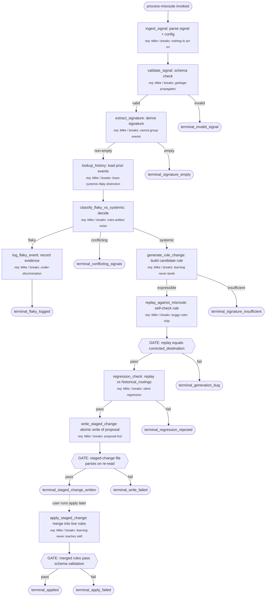

# drive-manager Rule Update — Meta-Process

This process turns observed mis-routings of the drive-manager skill into proposed updates to its routing-rules artifact. It runs as a python script triggered by a single mis-route signal, classifies the signal as flaky or systemic, and — if systemic and supported by the data — writes a staged rule-change file (a diff or PR) for the user to review and apply asynchronously. The output is a rules-artifact change, not a re-routed file.

---

## Output (Working Backwards Anchor)

- **Concrete output**: an updated `drive-manager` routing-rules artifact — a structured rules file (YAML or markdown table) with one or more rules added, modified, or removed. The on-disk delivery shape is a *staged change file* (diff / PR / pending-rules file) until the user runs the apply step; the apply step merges into the live rules artifact.
- **Success criterion**:
  1. The staged change passes its own schema validation against drive-manager's rules schema.
  2. Replay: applying the staged rule to the original mis-routed file's signal would route it to the user's corrected destination.
  3. Regression: replaying the staged rules against the last N already-correct routings does not change any of those destinations.
- **Failure modes**:
  - Rule overfits to one anecdote and breaks past correct routings → caught by regression check; staged change rejected and not written.
  - Rule does not actually move the routing on replay (signal too sparse to express a deterministic rule) → caught by replay check; flagged as "signature insufficient — awaiting more evidence."
  - Rule conflicts with existing rule (two rules now match the same path with disagreeing destinations) → caught by schema validation; staged change rejected.
- **Consumers**: the `drive-manager` skill (consumes the merged rules on its next run), and the user (reviews the staged change before merge).

## Inputs

- **mis_route_signal**: structured event indicating a routing was wrong.
  - Controllable: yes
  - Required: yes
  - Validation: required JSON fields present (`original_path`, `routed_destination`, `corrected_destination`, `file_metadata`, `signal_source`, `timestamp`); `corrected_destination` differs from `routed_destination`; both paths are within the drive-manager-known root; `signal_source` is one of `auto-detected-move` or `explicit-flag`.
  - Default if missing: skip — no event, nothing to learn from.

- **historical_routings**: corpus of past routings used by the regression check.
  - Controllable: yes (lookback window is configurable)
  - Required: no (degraded mode if absent)
  - Validation: log file parses; ≥20 entries with full `file_metadata` and `final_destination`.
  - Default if missing: regression check downgraded to advisory; staged change still writeable but flagged "regression-advisory" in its header.

- **current_rules_artifact**: the existing rules file the script will propose changes against.
  - Controllable: yes (user owns it)
  - Required: yes
  - Validation: parses as YAML or markdown table; matches drive-manager's expected schema.
  - Default if missing: hard fail — nothing to update.

- **misroute_history_for_signature**: rolling log of past `mis_route_signal` events, used to distinguish flaky from systemic.
  - Controllable: yes
  - Required: no
  - Validation: log file parses; entries have `signature` and `corrected_destination`.
  - Default if missing: treated as empty (this is the first event of its kind); decision biases toward flaky until threshold is met.

- **systemic_threshold_config**: integer N — number of matching prior events at which a signature flips from flaky to systemic.
  - Controllable: yes (user-tunable)
  - Required: no
  - Validation: integer ≥1.
  - Default if missing: 3.

## Preconditions

- The drive-manager skill produces structured routing telemetry (a log of routings with `file_metadata` and `final_destination`).
- The drive-manager rules artifact exists at a known path.
- The misroute_history log file is writable (or auto-creatable) at a known path.

## Metrics Map

The process emits metrics in four categories. Each step in the procedure references which metrics it emits.

### Output Metrics (Lagging — Confirms Success)

| Metric | Definition | Captured at |
|---|---|---|
| rule_change_pass_rate | % of staged rule changes that, once applied, are not reverted within 30 days | apply_staged_change |
| replay_correctness | % of staged rule changes whose replay against the original mis-routed file produces the corrected destination (binary; should be 100%) | replay_against_misroute |
| regression_pass_rate | % of staged rule changes that pass the historical_routings regression check | regression_check |
| conflicting_signals_count | count of misroute signals that match a signature with disagreeing prior corrections | classify_flaky_vs_systemic |
| signature_insufficient_count | count of systemic-classified signatures from which no deterministic rule could be expressed | generate_rule_change |
| regression_rejection_count | count of generated rules rejected by the regression check | regression_check |

### Controllable Input Metrics (Leading — The Levers)

| Input | Dimension | Definition | Captured at |
|---|---|---|---|
| mis_route_signal | quality | % of signals with full file_metadata fields populated vs partial | validate_signal |
| mis_route_signal | source | distribution across `auto-detected-move` vs `explicit-flag` (the latter typically richer) | validate_signal |
| mis_route_signal | recency | lag between routing event timestamp and correction signal timestamp | validate_signal |
| historical_routings | volume | number of entries in the lookback window | regression_check |
| historical_routings | quality | % of entries with full metadata | regression_check |
| current_rules_artifact | quality | schema validation pass rate over time (lagging — should approach 100%) | write_staged_change |
| current_rules_artifact | volume | total rule count in artifact over time | write_staged_change |
| misroute_history_for_signature | volume | number of prior events per signature (this is the systemic-vs-flaky lever) | classify_flaky_vs_systemic |
| misroute_history_for_signature | recency | age distribution of events per signature | classify_flaky_vs_systemic |
| systemic_threshold_config | quality | last-changed timestamp; whether the threshold is hand-tuned vs default | ingest_signal |

### Agent Performance Metrics (Per Step — Mandatory)

Every step in the procedure emits the standard set: latency, retry count, confidence/uncertainty signal, clarification requests, failure events, unexpected-path events. The procedure block references this set as "standard performance metrics" rather than restating per step.

Step-specific additions beyond the standard set:

| Step ID | Additional metric | Definition |
|---|---|---|
| extract_signature | signature_cardinality | distinct signatures produced over the rolling history corpus (too low = under-discriminating; too high = noisy) |
| regression_check | replay_throughput | entries-per-second the replay processes (caps lookback window size) |
| write_staged_change | atomic_write_success | did the temp-file-then-rename pattern succeed without partial state |

### Process Health Metrics

| Metric | Definition |
|---|---|
| End-to-end cycle time | Wall time from `process-misroute` invocation to terminal state reached |
| Cost per run | Compute seconds (zero LLM $ in deterministic path) |
| Throughput | Mis-route signals processed per day at steady state |
| Parallelization efficiency | (replay + regression) measured speedup vs sequential — opportunistic, not required |
| Staged-change apply latency | Wall time between staged change written and the user invoking apply_staged_change (external; flags the "user not reviewing" failure mode) |

### Anecdote and Exception Capture

Beyond aggregate metrics, the build agent captures:

- **Anecdotes**: every staged rule change is logged in full (input signal, signature, prior history, generated rule diff, regression-check verdict). The user reads this when reviewing the staged change.
- **Exceptions**: detailed logging when (a) signature extraction returns nothing for a signal, (b) generate_rule_change cannot express a rule (signature_insufficient), (c) regression_check rejects a generated rule, (d) conflicting-signals scenario fires (signature has prior events with disagreeing corrected destinations).

## Procedure (Canonical)

1. **ingest_signal**: read the mis_route_signal and configuration.
   - Action: parse the JSON event from stdin or invocation argument; load `systemic_threshold_config`.
   - Inputs: mis_route_signal, systemic_threshold_config
   - Outputs: parsed signal object, threshold N
   - Metrics: standard performance set
   - Successors:
     - if parse succeeds: → validate_signal
     - if parse fails: → terminal (terminal_invalid_signal)

2. **validate_signal**: schema-check the signal.
   - Action: confirm required fields, confirm corrected_destination ≠ routed_destination, confirm both paths are inside the drive-manager root, confirm signal_source is recognized.
   - Inputs: parsed signal
   - Outputs: validated signal
   - Metrics: standard performance set; mis_route_signal.quality, source, recency
   - Successors:
     - if valid: → extract_signature
     - if invalid: → terminal (terminal_invalid_signal)

3. **extract_signature**: derive a deterministic signature from file_metadata.
   - Action: extract the canonical signature tuple — e.g., (filename_pattern, mime_type, sender_or_source). Pure function.
   - Inputs: validated signal
   - Outputs: signature
   - Metrics: standard performance set; signature_cardinality
   - Successors:
     - if signature non-empty: → lookup_history
     - if signature empty: → terminal (terminal_signature_empty)

4. **lookup_history**: load prior mis_route_signal events with the same signature.
   - Action: open misroute_history_for_signature log, filter for matching signature.
   - Inputs: signature, misroute_history_for_signature
   - Outputs: list of prior events for this signature
   - Metrics: standard performance set; misroute_history_for_signature.volume, recency
   - Successors:
     - always: → classify_flaky_vs_systemic

5. **classify_flaky_vs_systemic**: decide whether this signature warrants a rule change.
   - Action: count prior events including this one; compare to threshold N. Also check whether prior corrected_destinations agree with current.
   - Inputs: prior events list, current signal, threshold N
   - Outputs: classification (flaky | systemic | conflicting)
   - Metrics: standard performance set; conflicting_signals_count
   - Successors:
     - if classification = flaky: → log_flaky_event
     - if classification = systemic: → generate_rule_change
     - if classification = conflicting: → terminal (terminal_conflicting_signals)

6. **log_flaky_event**: record the signal but propose no rule change.
   - Action: append the signal to misroute_history_for_signature; add a short note that no rule change was proposed because count < threshold.
   - Inputs: validated signal, signature
   - Outputs: appended history line
   - Metrics: standard performance set
   - Successors:
     - always: → terminal (terminal_flaky_logged)

7. **generate_rule_change**: produce a candidate rule diff.
   - Action: build a candidate rule of the form "when file matches signature, route to corrected_destination." Express it in the drive-manager rules schema.
   - Inputs: signature, corrected_destination, current_rules_artifact
   - Outputs: candidate rule, candidate rules artifact (current + new rule)
   - Metrics: standard performance set; signature_insufficient_count
   - Successors:
     - if candidate rule expressible: → replay_against_misroute
     - if signature insufficient: → terminal (terminal_signature_insufficient)

8. **replay_against_misroute**: confirm the candidate rule routes the original mis-routed file correctly. (Gate1 follows this step in the diagram.)
   - Action: feed the original signal's file_metadata into the candidate rules artifact's matcher; check that result equals corrected_destination.
   - Inputs: candidate rules artifact, original signal file_metadata
   - Outputs: replay result (pass | fail)
   - Metrics: standard performance set; replay_correctness
   - Successors:
     - if pass (Gate1 passes): → regression_check
     - if fail (Gate1 fails): → terminal (terminal_generation_bug)

9. **regression_check**: replay the candidate rules against historical_routings.
   - Action: for each historical routing in the lookback window, run the candidate rules' matcher; compare to that routing's `final_destination` (post-correction). A mismatch on any historical entry that was previously correct is a regression.
   - Inputs: candidate rules artifact, historical_routings
   - Outputs: regression result (pass | fail), per-entry diff log
   - Metrics: standard performance set; regression_pass_rate; replay_throughput; regression_rejection_count
   - Successors:
     - if pass: → write_staged_change
     - if fail: → terminal (terminal_regression_rejected)
     - if historical_routings missing: → write_staged_change (advisory mode flag set)

10. **write_staged_change**: atomically write the staged rule-change file. (Gate2 follows this step.)
    - Action: serialize candidate rules artifact diff to a temp file; rename to staged-change path. Write input/signature/diff/regression-verdict log alongside (anecdote artifact).
    - Inputs: candidate rules artifact, regression result
    - Outputs: staged change file on disk
    - Metrics: standard performance set; current_rules_artifact.quality, volume; atomic_write_success
    - Successors:
      - if write succeeds (Gate2 passes): → terminal (terminal_staged_change_written)
      - if write fails (Gate2 fails): → terminal (terminal_write_failed)

11. **apply_staged_change**: (separate script invocation, run by user when ready) merge the staged change into the live rules artifact. (Gate3 follows this step.)
    - Action: read staged-change file; validate schema again; atomically replace current_rules_artifact; archive the staged-change file.
    - Inputs: staged change file, current_rules_artifact
    - Outputs: updated current_rules_artifact
    - Metrics: standard performance set; rule_change_pass_rate (captured 30 days post-apply)
    - Successors:
      - if apply succeeds (Gate3 passes): → terminal (terminal_applied)
      - if apply fails (Gate3 fails): → terminal (terminal_apply_failed)

## Gates (Verification Decisions in the Process)

Gates are explicit verification points within the executed process. They appear as decision nodes in the diagram because they're decisions, not hidden checks. Each gate names what is verified, how (script vs. judgment), and what happens on failure.

| Gate ID | Location (between steps) | Verifies | Method | On failure |
|---|---|---|---|---|
| Gate1 | replay_against_misroute → regression_check | Candidate rule routes the original signal correctly | script | abort: route to terminal_generation_bug |
| Gate2 | write_staged_change → terminal_staged_change_written | Staged-change file written atomically and parses on re-read | script | abort: route to terminal_write_failed |
| Gate3 | apply_staged_change → terminal_applied | Merged rules artifact passes schema validation post-merge | script | abort: route to terminal_apply_failed; revert to backup |

## Requirement Owners

| Step ID | Description | Decided by | Failure mode if removed |
|---|---|---|---|
| ingest_signal | Read and parse the mis_route_signal | Mike (user) | Script has nothing to act on |
| validate_signal | Schema-check the signal | Mike | Garbage signals propagate; corrupt rules get generated |
| extract_signature | Derive a deterministic signature | Mike | Cannot group prior events; cannot decide flaky vs systemic |
| lookup_history | Load prior matching events | Mike | Loses the systemic-vs-flaky distinction |
| classify_flaky_vs_systemic | Decide whether to propose a rule change | Mike | Every signal triggers a rule change → noisy rules artifact |
| log_flaky_event | Record evidence for next time | Mike | Flaky-vs-systemic decision permanently underdiscriminating |
| generate_rule_change | Produce candidate rule from signature | Mike | No proposal; learning never lands |
| replay_against_misroute | Self-check the generated rule | Mike | Buggy rules ship to staged-change |
| regression_check | Confirm no past-routing regression | Mike | Rules silently break past correct routings |
| write_staged_change | Persist the proposal for async review | Mike | Proposal lost; user has nothing to apply |
| apply_staged_change | Merge staged change into live rules | Mike | Learning never reaches the live skill |

## Decision Rules

For each branch in the procedure, an explicit testable criterion.

**Signal validation**
- Criterion: required fields present AND corrected_destination ≠ routed_destination AND both paths inside drive-manager root AND signal_source ∈ {auto-detected-move, explicit-flag}.
- "valid" branch conditions: all four clauses true.
- "invalid" branch conditions: any clause false.
- Edge case handling: if signal_source is `auto-detected-move` and the user later moves the file *back* to routed_destination, treat the most recent corrected_destination within the dedup window as canonical; if both events are the same age within the window, the signal is invalid (dedup ambiguity).

**Flaky vs systemic vs conflicting**
- Criterion: classification depends on the count of prior events for this signature (including current) against threshold N and on agreement of prior corrected_destinations with the current corrected_destination — see branch conditions below.
- "flaky" branch conditions: count < threshold N.
- "systemic" branch conditions: count ≥ N AND all prior corrected_destinations agree with the current corrected_destination.
- "conflicting" branch conditions: count ≥ N AND any prior corrected_destination disagrees with the current.
- Edge case handling: count == N exactly → systemic (lean toward fixing once threshold reached); empty history (no priors) → count = 1 (just the current event); if N = 1, the very first event is systemic — that is a user choice via systemic_threshold_config.

**Replay verdict**
- Criterion: candidate rules' matcher applied to original signal file_metadata equals corrected_destination.
- "pass" branch: equality holds.
- "fail" branch: any inequality.

**Regression verdict**
- Criterion: for every entry in historical_routings, candidate rules' matcher result equals that entry's recorded `final_destination`.
- "pass" branch: zero mismatches.
- "fail" branch: ≥1 mismatch.
- Edge case handling: historical_routings unavailable → pass with `regression_advisory=true` flag in the staged-change header.

**Generation expressibility**
- Criterion: the signature has at least one discriminating field (non-empty filename pattern OR non-empty mime OR non-empty sender) AND the resulting candidate rule does not duplicate an existing rule by exact-match.
- "expressible" branch: criterion holds → continue to replay.
- "insufficient" branch: criterion fails → exit to terminal_signature_insufficient.

## Edge Cases

| Edge case | Trigger | Handling |
|---|---|---|
| corrected_destination equals routed_destination | mis_route_signal contains identical paths | Validation fails; route to terminal_invalid_signal. |
| corrected_destination outside drive-manager root | User moved file outside the managed area | Validation fails; route to terminal_invalid_signal; surface to user — drive-manager scope may need revisit. |
| auto-detected move bounced back inside dedup window | User moves file out then back to routed_destination quickly | Use the latest corrected_destination within the window; if both events identical age, treat as invalid. |
| Empty signature | extract_signature returns no discriminating fields | Route to terminal_signature_empty; log as exception (this is data the build agent surfaces — the file_metadata is too sparse). |
| Conflicting signals | Same signature has prior events with disagreeing corrected_destinations | Route to terminal_conflicting_signals; emit conflicting_signals_count metric; surface a "needs human disambiguation" anecdote to the user — do not propose a rule change automatically. |
| Signature insufficient for rule expression | generate_rule_change cannot produce a deterministic rule | Route to terminal_signature_insufficient; emit signature_insufficient_count; the next signal of the same kind has more context. |
| Regression check rejects the rule | Candidate rule breaks one or more past correct routings | Route to terminal_regression_rejected; do not write staged change; log full diff so the user can see what would have broken. |
| historical_routings missing | Telemetry log absent or unparseable | Degraded mode: regression check passes advisory; staged change is written with `regression_advisory=true` header. |
| current_rules_artifact missing | Rules file not at expected path | Hard fail; route to terminal_invalid_signal (no artifact to update). |
| current_rules_artifact malformed | Schema parse fails on existing rules | Hard fail with parse error surfaced; do not attempt write. |
| Staged change write fails partway | Disk full / permissions / process killed | Atomic temp-file-then-rename guarantees no partial state; route to terminal_write_failed. |

## Terminal States

- **terminal_invalid_signal**: signal failed validation; no rules change attempted; signal logged as exception.
- **terminal_signature_empty**: file_metadata too sparse to extract a signature; logged as exception.
- **terminal_flaky_logged**: signal recorded for future signature-history evaluation; no rule change.
- **terminal_conflicting_signals**: signature has disagreeing prior corrections; surfaced to user; no automatic rule change.
- **terminal_signature_insufficient**: signature recognized but cannot be expressed as a deterministic rule; logged for next-time evidence.
- **terminal_generation_bug**: replay-against-misroute failed; this is a bug in generate_rule_change; surfaced loudly.
- **terminal_regression_rejected**: candidate rule would break past correct routings; rejected; full diff logged.
- **terminal_staged_change_written**: staged change is on disk; user can review and apply; this is the success path for `process-misroute`.
- **terminal_write_failed**: write step itself failed; surfaced as system error; no rule change.
- **terminal_applied**: user invoked apply_staged_change and the merge succeeded; this is the success path for `apply-staged-change`.
- **terminal_apply_failed**: apply merge failed schema validation; rules artifact reverted to backup; staged change preserved.

## Parallelization

- **Parallel sections**: replay_against_misroute and regression_check are independent reads of the candidate rules artifact and could run in parallel. Opportunistic only — regression_check dominates wall time, so the parallelization gain is small (~one extra replay's worth).
- **Sequential sections**: ingest_signal → validate_signal → extract_signature → lookup_history → classify → (branch) is strictly sequential.
- **Join points**: not required — the optional parallel pair joins at write_staged_change.
- **Shared state**: the candidate rules artifact (read-only during parallel section).
- **Coordination**: use `concurrent.futures.ThreadPoolExecutor` if implementing the optimization; otherwise sequential is fine.

## Diagram (Derived, Human-Readable)

## Verification Suite

The checks the spec itself must pass before being handed to a build agent. This suite is defined before drafting (TDD principle) and run during the verification phase.

| Check | Type | Method |
|---|---|---|
| YAML frontmatter parses | structural | script (verify_spec.py) |
| Mermaid block parses | structural | script |
| All step ID references resolve | structural | script |
| Every step has requirement owner | structural | script |
| Every step node displays owner annotation in diagram | structural | script |
| Every Procedure step ID appears in diagram | structural | script |
| Every input has documented validation | structural | script |
| Metrics Map covers all four categories | structural | script |
| Every controllable input has ≥1 tracked dimension | structural | script |
| Every step references the standard performance metrics block | structural | script |
| At least one terminal state reachable | reachability | script |
| No unreachable nodes | reachability | script |
| No unbounded loops | reachability | script |
| Every gate names a verification Method | structural | script |
| Every Decision Rule has a Criterion line | structural | script |
| Decision rule "flaky vs systemic" resolves on input alone | semantic | agent |
| Output is a rules-artifact change, not a re-routed file | semantic | agent |
| Edge cases include conflicting-signals scenario | semantic | agent |
| Build handoff names python-specific capture mechanisms | semantic | agent |
| systemic_threshold_config is exposed as a tunable input | semantic | agent |

## Metrics Review Plan (DMAIC Control Phase)

This process generates execution data; that data is reviewed periodically and feeds back into spec refinement.

To run a review session against the data this process emits, invoke the sibling `dmaic` skill (`Skill(dmaic)`). It walks Define → Measure → Analyze → Improve → Control over the metrics named above and writes back a refined spec when changes are warranted.

- **Cadence**: every 30 days, or after every 50 mis_route_signals processed (whichever comes first).
- **Trigger conditions** that force a spec revisit before scheduled cadence:
  - Sustained agent confusion at a step (clarification requests > 10% over 20 runs)
  - Controllable input found to be irrelevant (no correlation with `rule_change_pass_rate` after 50 runs)
  - Output quality drift (`rule_change_pass_rate` < 80% over a rolling window of 20 applied changes)
  - Agent retry rate at any step > 3 over 50 runs
  - `regression_rejection_count` rising sharply (rules being generated that consistently break history → suggests `generate_rule_change` heuristic needs revision)
  - `conflicting_signals_count` rising sharply (suggests the signature is not discriminating enough → revisit `extract_signature`)
- **Decision rights**: Mike reviews the metrics; Mike decides on spec changes. The `dmaic` skill walks him through the cycle.
- **Review artifact**: a markdown summary of the review session is captured at `~/Documents/Linglepedia/05-Skills-and-Tools/drive-manager-rule-update-review-<YYYY-MM-DD>.md`.
- **Expected variation**: `replay_correctness` should sit at 100% — any drop is signal, not noise. `regression_pass_rate` should sit at 90%+; drops below 70% over a 20-change window are signal. `conflicting_signals_count` per 100 signals < 5 is normal; > 10 is signal.

## Build Notes

Architectural guidance for the implementer. The build agent decides implementation mechanisms based on target environment.

- **Honor strictly**: decision rules, edge case handling, success criterion, gates (with their named verification methods — all three are scripts), metrics specifications. Non-negotiable.
- **Use judgment on**: implementation language is fixed (python), but library choice (e.g., `ruamel.yaml` vs PyYAML for rules parsing; `structlog` vs the stdlib `logging` module for telemetry; `dataclasses` vs `pydantic` for the signal model), file structure, naming within reason, telemetry storage backend, specific capture mechanism.
- **Ask before deviating**: anything else; default to asking rather than assuming.
- **Two entry points** for the python script:
  - `process-misroute <signal-json>`: runs steps 1–10 and exits at one of the terminal states.
  - `apply-staged-change <staged-change-path>`: runs step 11 only.
  Both share the rules-artifact path and staged-change file format conventions.
- **Async approval, not synchronous polling.** The build target is a python script. Steps 7–10 produce a *staged change file*; the script does **not** block waiting for human approval. Approval is the user running `apply-staged-change` later. Do not bake in a long-running approval-poll loop — that would be a build-target/runtime mismatch.
- **Telemetry capture**: Use deterministic capture appropriate to a python script. Examples: function decorators that wrap each step and emit structured log records (`@with_step_metrics("extract_signature")`); `contextlib.contextmanager` for steps with non-trivial setup/teardown; the `structlog` library (or `logging` with a JSON formatter) for structured output. The mechanism is your choice; the deterministic property is required — every step run, success or failure, must emit its standard performance set without the function body having to remember to log.
- **Telemetry storage**: append-only JSONL files at `~/.drive-manager/telemetry/<YYYY-MM>.jsonl`, one event per line. The build agent may swap this for a different store on user direction.
- **Graceful degradation**: If telemetry capture fails (storage unreachable, configuration missing), the process completes with output (the staged change file is the output) and logs a degraded-mode warning to stderr. **Output correctness must not depend on telemetry working.**
- **Atomic writes**: the staged-change file and the applied rules artifact must be written via temp-file-then-rename so a crash mid-write never leaves partial state.
- **Backup before apply**: `apply_staged_change` must back up `current_rules_artifact` before merging, so a Gate3 failure can revert.
- **Known constraints**: stdlib + a small set of third-party libraries; runs on macOS (the user's environment); single-user single-machine.
- **Out of scope**: modifying drive-manager itself (this skill writes a rules artifact that drive-manager consumes); auto-triggering on file moves (a separate fswatch-based daemon could call `process-misroute`, but it is not part of this spec); LLM-generated rule explanations beyond the deterministic path.

## Assumptions and Open Questions

- Assumed: drive-manager's rules artifact is stored in YAML or markdown table form. The build agent should confirm by inspecting the existing file.
- Assumed: drive-manager already produces structured routing telemetry (used by `historical_routings`). If not, that's a precondition the user adds first.
- Assumed: "user moves the file post-routing within N days" is a deterministic auto-detection signal source. The detection mechanism (fswatch hook? periodic scan?) is out of scope; this spec receives the signal as already-detected.
- Open: the *signature_extraction* function's exact field set should evolve with the data. Initial version uses (filename_pattern, mime_type, sender_or_source); the metrics review will surface whether more dimensions help.
- Open: `systemic_threshold_config` default is 3 — to be tuned during the metrics review based on `rule_change_pass_rate`.

## Verification Record

- **QA Agents pattern run:** 2026-04-27 — qa-agents skill not reachable in this runtime; finder/auditor/referee simulated inline. Finder surfaced 4 findings (1 medium output, 1 low edge-case, 1 low drafting, 1 medium verification-check). Auditor disproved 0 outright; 1 partial. Referee net: all 4 routed back as drafting fixes (incorporated into the spec before final write).
- **Phase 4 mode:** inline_simulation — Task tool fan-out attempted in concept; sub-types 4.1–4.4 run sequentially in this context. Adversarial isolation between sub-types is partial; treat 4.5 integration as lower-confidence than a fan-out pass.
- **Phase 7 simulation note:** qa-agents skill not reachable in this runtime; finder/auditor/referee simulated inline. Adversarial isolation collapsed. Treat findings as lower-confidence than a real qa-agents pass; re-run Phase 7 against this spec from a runtime with subagent capability before treating the spec as production-grade.
- Path coverage: 11 terminal states enumerated; all 11 reachable from the diagram entry node.
- Issues resolved: 4
- Issues deferred to Assumptions: 0
- Soft fails: 0

## Change Log

- 2026-04-27: Created via `process-design` skill (eval-2-drive-manager-meta).
